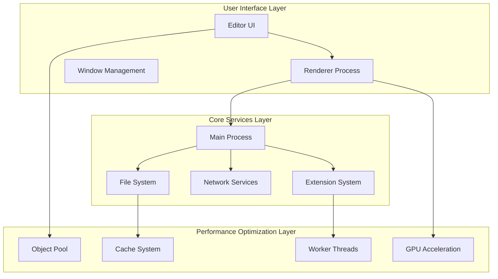
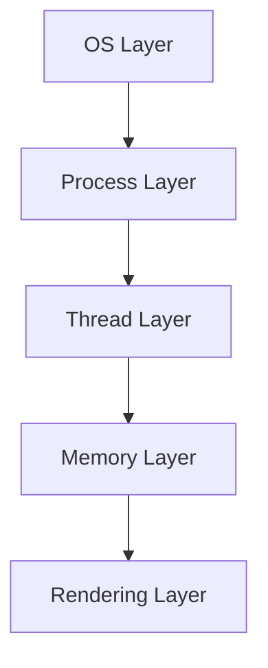
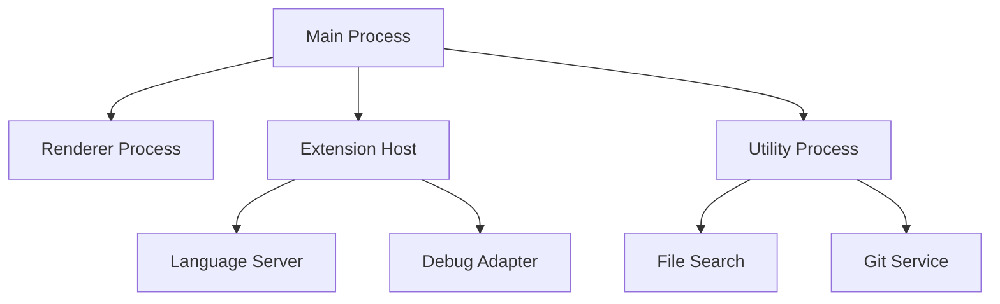
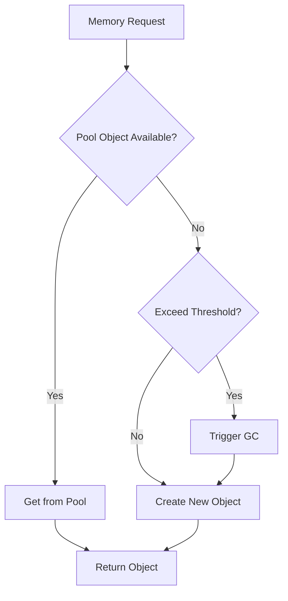
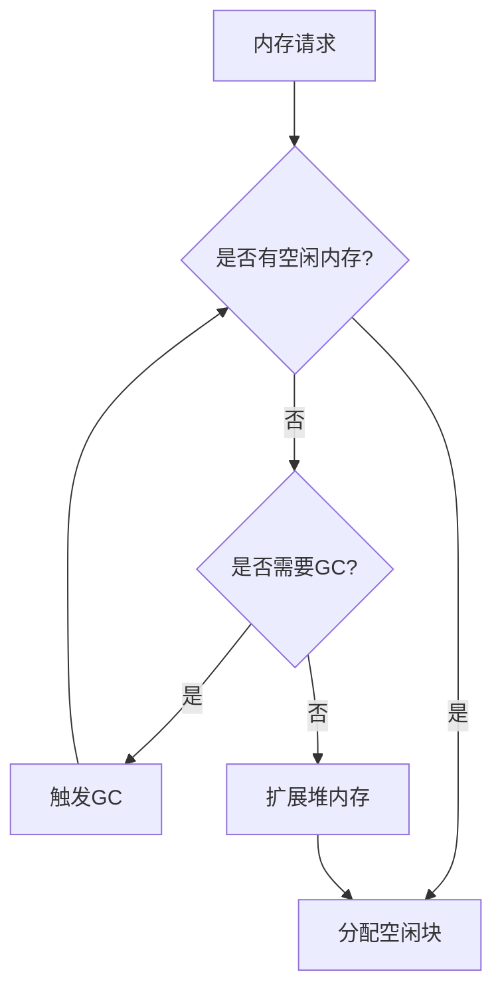
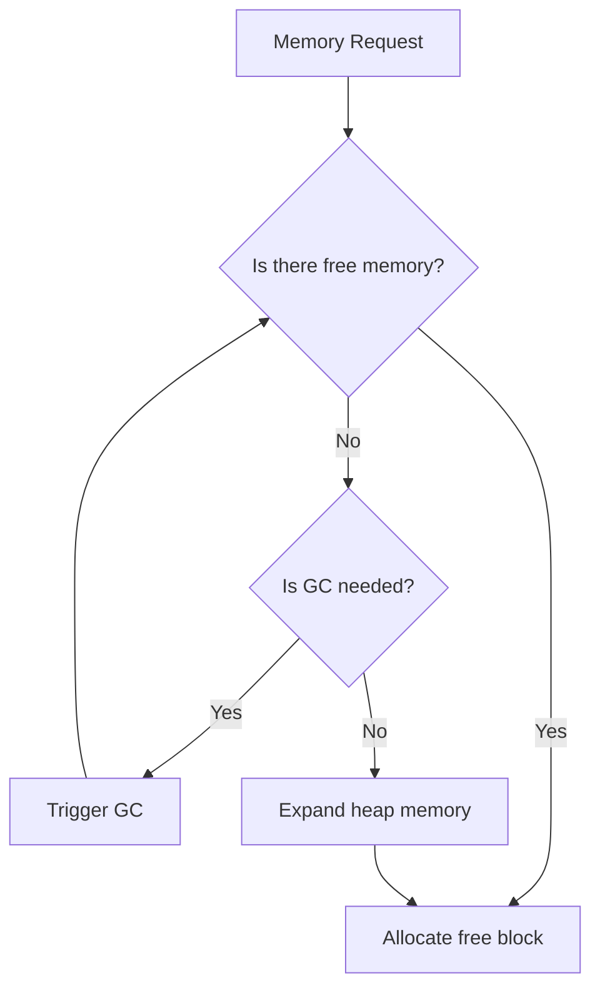
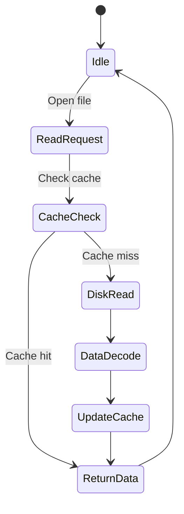
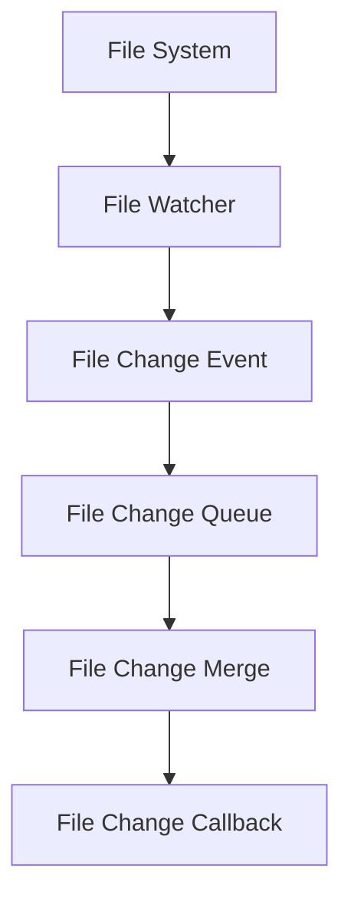
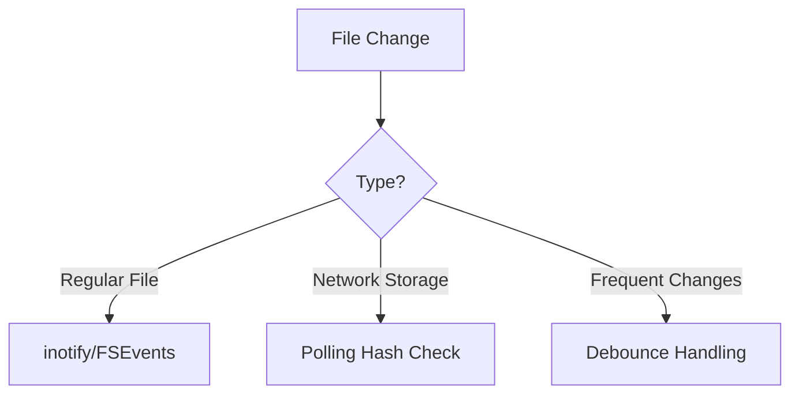
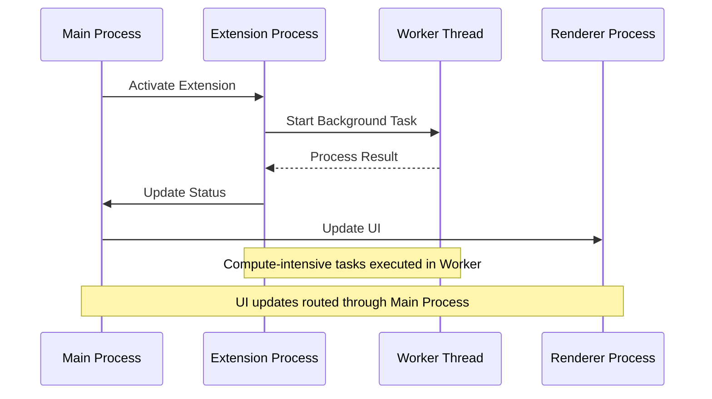

---

# **Visual Studio Code High-Performance Architecture Design and Optimization Analysis**
**—From Design Philosophy to Electron Deep Practice**

---

## **I. Introduction: The Performance Revolution in Cross-Platform Editors**
In the field of cross-platform development dominated by Web technologies, Electron applications often face criticism for performance issues. Visual Studio Code, as a benchmark code editor, has achieved native-like performance under the Electron framework through **architectural innovation** and **engineering practices**. This report systematically analyzes its technical system, covering core modules such as **multi-process architecture**, **memory management**, **rendering optimization**, and **I/O subsystem**, revealing the complete path for complex Web applications to break through performance bottlenecks.

### 1.1 **"Performance is Experience" Philosophy**
The VS Code team considers performance as the "first principle" of editor design, following three main principles:

1. **Zero Perceived Latency**: Response time for any user operation should not exceed 100ms (human perception threshold)
   - Achieved through asynchronous operations and background processing
   - Using virtual DOM to reduce UI update overhead
   - Adopting incremental update strategy

2. **Resource Isolation**: Performance issues or failures in a single functional module should not affect other components
   - Using multi-process architecture
   - Implementing process isolation through IPC
   - Running each extension in an independent process

3. **Progressive Enhancement**: Smooth operation across different hardware environments, from Raspberry Pi to workstations
   - Dynamic resource usage adjustment
   - Enable/disable advanced features based on hardware capabilities
   - Support for hardware-accelerated rendering



## **II. Core Design Philosophy**

### **2.1 Process Model Design**
VS Code adopts a multi-process architecture, separating different functional modules into independent processes, forming clear responsibility boundaries. This design brings the following advantages:

- **Stability**: Single process crashes do not affect the entire application
- **Security**: Extensions run in sandbox environments
- **Performance**: Full utilization of multi-core CPUs
- **Maintainability**: Modular design facilitates development and debugging

| **Process Type**          | **Core Responsibilities**                  | **Performance Optimization Strategy**        |
|-----------------------|------------------------------------------|--------------------------------------|
| **Main Process** | Window management, lifecycle control, global services | Keep lightweight logic, avoid event loop blocking |
| **Renderer Process** | Single editor window UI rendering | DOM virtualization + GPU acceleration composition |
| **Extension Host** | Run all extensions, isolate crash risks | Process reuse + lazy loading mechanism |
| **Utility Process** | File search, Git operations, high-cost tasks | Rust/C++ native module acceleration |

### **2.2 Defense-in-Depth System**
VS Code builds a five-layer performance defense system, forming a deep optimization matrix. Each layer adopts specific optimization strategies:

1. **OS Layer**: Optimize system calls and resource scheduling
2. **Process Layer**: Control process priority and CPU affinity
3. **Thread Layer**: Optimize task scheduling and lock contention
4. **Memory Layer**: Use memory pools and smart GC strategies
5. **Rendering Layer**: Adopt GPU acceleration and incremental updates



**Key Technologies in Each Layer**:
- **OS Layer**:
  - File pre-read strategy: Predictively read potentially needed file blocks, reducing I/O wait
  - NUMA memory scheduling: In multi-processor systems, ensure processes use the nearest memory node, reducing cross-node access latency
    > NUMA (Non-Uniform Memory Access) is a memory architecture where different CPUs have different latencies when accessing different memory regions.
    > Through proper scheduling, prioritizing "local" memory usage can significantly improve performance.

- **Process Layer**:
  - CPU affinity binding: Bind processes to specific CPU cores, reducing context switch overhead
  - Priority control: Dynamically adjust process priorities based on task importance, ensuring critical task responsiveness

- **Thread Layer**:
  - Task priority scheduling: Categorize tasks by priority (e.g., UI interaction > file saving > code checking)
  - Lock contention optimization: Use lock-free data structures, fine-grained locks, read-write locks to reduce thread waiting
    > Example: Using RwLock allows multiple read operations to access concurrently, improving parallelism

- **Memory Layer**:
  - Pooling technology: Pre-allocate object pools, reduce memory fragmentation and allocation overhead
  - Pointer compression: Use 32-bit pointers in 64-bit systems to reduce memory usage
  - GC tuning: Generational collection, incremental collection, concurrent collection strategies

- **Rendering Layer**:
  - GPU composition: Utilize GPU hardware acceleration for layer composition
  - Incremental drawing: Only redraw changed parts instead of the entire view
    > Example: Editor only redraws modified lines instead of the entire file
  - Off-screen rendering: Pre-render complex content in background buffers, avoiding main thread blocking
    > Off-screen rendering can move time-consuming rendering operations to the background, improving UI responsiveness

### **2.3 Resource Management Principles**
VS Code's resource management follows these core principles:

1. **Preventive Control**: Pre-allocate critical resources (memory pools, thread pools) at startup
   - Reduce runtime allocation overhead
   - Avoid memory fragmentation
   - Improve resource access efficiency

2. **Runtime Isolation**: Extensions/language services run in separate processes
   - Prevent resource contention
   - Limit individual extension resource usage
   - Support hot updates and restarts

3. **Recycling Governance**: DOM node reuse, automatic object pool recycling
   - Reduce GC pressure
   - Improve memory usage efficiency
   - Lower memory leak risks

**Resource Control Strategies**
- **CPU Time Slice Allocation**: Implement task priority scheduling through Chromium's [Renderer Scheduler](https://chromium.googlesource.com/chromium/src/third_party//refs/heads/main/blink/renderer/platform/scheduler/README.md)
- **Memory Hard Limits**: Renderer process maximum heap memory limited to 512MB (configured via `javascriptHeapSizeLimit`)
- **I/O Quotas**: Extension file system operations have rate limits (e.g., maximum 1000 read operations per minute)

### **2.4 Process Communication Optimization**
#### **2.4.1 Protocol Selection**
- **Small Data High-Frequency Communication**: Use **Protocol Buffers** (3x faster serialization than JSON, 50% smaller size)
- **Large Data Transfer**: Use **Shared Memory (SharedArrayBuffer)** or **Memory-Mapped Files (mmap)** to avoid data copying
- **Low Real-Time Requirements**: Batch process through **message queues** to reduce IPC calls

| **Data Type**       | **Transport Protocol**   | **Serialization Method** | **Typical Latency** |
|---------------------|------------------------|----------------------|--------------|
| Control Commands (<1KB) | Electron IPC        | Protocol Buffers     | 0.3ms        |
| Text Content (1KB-1MB) | Shared Memory       | FlatBuffers          | 0.1ms        |
| Binary Data (>1MB)    | Memory-mapped File   | Raw Bytes            | 0.05ms       |

#### **2.4.2 IPC Channel Throttling Algorithm**
**Purpose of IPC Channel Throttling**:
1. **Message Storm Protection**
   - Prevent congestion when large numbers of messages are sent simultaneously
   - Control message sending frequency through throttling

2. **Resource Consumption Optimization**
   - Batch message processing reduces process switching overhead
   - Lower system call frequency

3. **Communication Efficiency Improvement**
   - Merge recent messages to reduce communication frequency
   - Optimize bandwidth utilization

4. **System Stability Assurance**
   - Prevent single components from monopolizing IPC channels
   - Ensure timely delivery of critical messages

#### **2.4.3 Traffic Control**

```typescript
class ThrottledChannel {
  private queue: any[] = [];
  private lastSend = 0;

  constructor(private readonly interval: number) {}

  send(message: any) {
    this.queue.push(message);
    this._scheduleSend();
  }

  private _scheduleSend() {
    if (this.queue.length === 0) return;

    const now = Date.now();
    const delay = Math.max(0, this.lastSend + this.interval - now);

    setTimeout(() => {
      const batch = this.queue.splice(0, 10); // Send max 10 messages at once
      ipcRenderer.send('batch-message', batch);
      this.lastSend = Date.now();
      this._scheduleSend();
    }, delay);
  }
}
```

#### **2.4.4 EventEmitter Usage Optimization**
**Purpose and Advantages of EventEmitter**:
1. **Event-Driven Programming**
   - Implement loosely coupled component communication
   - Support one-to-many message broadcasting
   - Suitable for handling asynchronous operation flows

2. **Observer Pattern Implementation**
   - Subscribers don't need to know publisher implementation
   - Dynamic addition and removal of listeners
   - Support event namespace management

3. **Common Application Scenarios**
   - State change notifications
   - Asynchronous operation completion callbacks
   - User interaction event handling
   - System message broadcasting

```typescript
// Basic Usage Example
class Editor extends EventEmitter {
  private content: string = '';

  setContent(newContent: string) {
    const oldContent = this.content;
    this.content = newContent;
    // Notify all listeners of content change
    this.emit('contentChange', {
      oldContent,
      newContent,
      timestamp: Date.now()
    });
  }
}
```

**Hazards of EventEmitter Misuse**:
1. **Memory Leak Risks**
   - Forgetting to remove listeners prevents objects from being GC'd
   - Accumulation of event listeners causes memory usage growth

2. **Performance Issues**
   - Too many listeners cause high traversal overhead during event triggering
   - Frequent event triggering causes unnecessary function calls

3. **Code Maintenance Difficulties**
   - Event flows are hard to track and debug
   - Implicit dependencies increase code coupling

4. **Exception Handling Issues**
   - Event handler exceptions may crash the program
   - Error propagation paths are difficult to trace

## **III. Multi-Process Architecture: The Art of Balancing Security and Performance**

### **3.1 Process Topology Model**

VS Code splits the traditional single-process editor into **7 types of processes**:
1. **Main Process**: Window manager, lifecycle management
2. **Renderer Process**: Independent rendering process for each window
3. **Extension Host**: Extension sandbox process
4. **Language Server**: Language-specific service processes
5. **Utility Process**: File search/Git and other tool processes
6. **Profile Analyzer**: Performance analysis process
7. **Update Service**: Independent update process

**Inter-Process Communication Matrix**:
| Communication Direction | Protocol | Bandwidth | Latency Requirement |
|-----------------------|----------|-----------|-------------------|
| Main ↔ Renderer | Electron IPC | Medium (<1MB) | <1ms |
| Extension ↔ Language Service | JSON-RPC over Pipe | High (>10MB) | <5ms |
| Utility ↔ Main | Protocol Buffers | Low (<10KB) | <0.1ms |



**Process Responsibility Table**:
| Process Type | CPU Usage | Memory Quota | Crash Impact Domain |
|--------------|-----------|--------------|-------------------|
| Main Process | <5% | 100MB | Application-wide |
| Renderer Process | 15%-30% | 512MB | Single editor window |
| Extension Host | 10%-20% | 512MB | All extension features |
| Language Service | 5%-15% | 256MB | Specific language features |

### **3.2 Process Communication Optimization**
#### **3.2.1 Protocol Selection Matrix**
| Data Type | Protocol | Serialization Method | Use Case |
|-----------|----------|---------------------|----------|
| Control Commands | Electron IPC | Protocol Buffers | High-frequency small data (<1KB) |
| Text Content | Shared Memory | FlatBuffers | Medium-frequency large data (1-10MB) |
| Binary Data | Memory-mapped File | Raw Bytes | Low-frequency huge data (>10MB) |

#### **3.2.2 Traffic Shaping Algorithm**
```typescript
class TrafficShaper {
  private buckets = new Map<string, { count: number, last: number }>();

  constructor(private limit: number, private interval: number) {}

  allow(key: string): boolean {
    const now = Date.now();
    let bucket = this.buckets.get(key);

    if (!bucket) {
      bucket = { count: 1, last: now };
      this.buckets.set(key, bucket);
      return true;
    }

    const elapsed = now - bucket.last;
    if (elapsed > this.interval) {
      bucket.count = 1;
      bucket.last = now;
      return true;
    }

    if (bucket.count < this.limit) {
      bucket.count++;
      return true;
    }

    return false;
  }
}

// Usage example: limit extension process to 1000 messages per second
const shaper = new TrafficShaper(1000, 1000);
if (shaper.allow('extensions')) {
  ipcRenderer.send('extension-message', data);
}
```

### **3.3 Process Scheduling Optimization**
#### **3.3.1 CPU Affinity Binding**
Reduce context switching overhead by setting process CPU affinity masks:
```c
// Native module code snippet
#include <sched.h>

void bind_to_cpu(int cpu_id) {
    cpu_set_t cpuset;
    CPU_ZERO(&cpuset);
    CPU_SET(cpu_id, &cpuset);
    sched_setaffinity(0, sizeof(cpuset), &cpuset);
}
```

**Binding Strategy**:
- Main process bound to CPU0
- Renderer processes round-robin bound to CPU1-3
- Extension processes bound to remaining cores

#### **3.3.2 Process Priority Control**
Using different APIs on Windows and Linux to adjust process priorities:
```typescript
// Cross-platform priority setting
import { app } from 'electron';

function setProcessPriority() {
  if (process.platform === 'win32') {
    // Windows: Set main process to high priority
    app.setPriority('high');
  } else {
    // Linux: Adjust using nice value
    process.setPriority(-10);
  }
}
```

## **IV. Memory Management: The Foundation of Stable Performance**

### **4.1 Pooling Technology**
VS Code extensively uses object pooling to reduce memory fragmentation and GC pressure:



#### **4.1.1 Object Pool**
**Scenarios**:
- Token objects in syntax highlighting
- DOM nodes in virtual scrolling
- File system watchers

```typescript
class ObjectPool<T> {
  private pool: T[] = [];
  private created = 0;

  constructor(
    private factory: () => T,
    private reset: (item: T) => void,
    private maxSize: number
  ) {}

  acquire(): T {
    if (this.pool.length > 0) {
      return this.pool.pop()!;
    }

    if (this.created < this.maxSize) {
      this.created++;
      return this.factory();
    }

    // Force GC when pool is exhausted
    if (global.gc) {
      global.gc();
    }
    return this.factory();
  }

  release(item: T): void {
    if (this.pool.length < this.maxSize) {
      this.reset(item);
      this.pool.push(item);
    }
  }
}
```

### **4.2 V8 Engine Optimization**
#### **4.2.1 Memory Structure**
**What is Heap Memory?**

Heap memory is the dynamic memory allocation area during program runtime, contrasting with stack memory. In the V8 engine:

1. **Characteristics**:
   - Dynamic allocation and release
   - Variable size
   - Undefined lifecycle
   - Requires garbage collection management

2. **Usage Scenarios**:
   - Storing objects (Object)
   - Arrays (Array)
   - Strings (String)
   - Closure variables

3. **Comparison with Stack Memory**:

| Feature | Heap Memory | Stack Memory |
|---------|-------------|--------------|
| Size | Large (GB level) | Small (MB level) |
| Allocation Speed | Slower | Very fast |
| Lifecycle | Managed by GC | Auto-released after function call |
| Storage Content | Objects, large data | Basic types, references |
| Access Speed | Relatively slow | Very fast |

#### **4.2.2 Pointer Compression**

**V8 Heap Memory Generational Strategy**

VS Code employs differentiated management for objects with varying lifecycles:

| Object Type         | Lifecycle       | Memory Area   | Collection Strategy |
|---------------------|-----------------|---------------|---------------------|
| Syntax Highlighting Token | Short (<1 second) | Young Generation | Scavenge GC         |
| File Cache          | Medium (minutes) | Old Generation | Incremental Mark-Sweep |
| Extension Metadata  | Long (hours)    | Independent Heap | Manual Release      |

Enable V8's pointer compression by modifying Electron startup parameters, compressing 64-bit addresses to 32-bit:
```bash
electron --js-flags="--pointer-compression --no-concurrent-marking"
```

**Effect**: Heap memory reduced by 40%, GC frequency decreased by 35%

**Memory Savings**:
| Heap Size           | Before Compression | After Compression |
|---------------------|--------------------|-------------------|
| 512MB               | 512MB              | 307MB (-40%)      |
| 1GB                 | 1024MB             | 614MB (-40%)      |

**Memory Savings Effect**:
| **Object Type**     | Original Size (64-bit) | Compressed (32-bit) | Savings Ratio |
|---------------------|------------------------|---------------------|---------------|
| Small Objects (<4KB)| 48 bytes               | 32 bytes            | 33%           |
| Medium Objects (4KB-1MB)| 1024 bytes         | 768 bytes           | 25%           |
| Large Objects (>1MB)| 2,097,152 bytes        | 1,572,864 bytes     | 25%           |


#### **4.2.3 Hidden Class Optimization**
```typescript
// Bad practice: dynamic property addition
const obj = {};
obj.x = 1;
obj.y = 2;

// Good practice: define shape upfront
interface FixedObject {
  a: number;
  b?: number;
}
const obj: FixedObject = { a: 1 };
obj.b = 2; // Hidden class remains stable
```

#### **4.2.4 Garbage Collection Optimization**



**Generational Collection Strategy**:
1. **Young Generation**
   - Short-lived objects (e.g., syntax highlighting tokens)
   - Uses Scavenge algorithm for quick collection
   - Surviving objects promoted to old generation

2. **Old Generation**
   - Long-lived objects (e.g., editor state)
   - Uses mark-sweep and mark-compact algorithms
   - Incremental marking to reduce pause time

**GC Tuning Practices**:
```typescript
// GC trigger timing
const gcTriggers = {
  // When switching large files
  onFileChange: () => {
    if (process.memoryUsage().heapUsed > 256 * 1024 * 1024) {
      global.gc();
    }
  },

  // Incremental GC during idle time
  onIdle: () => {
    if (typeof gc === 'function') {
      gc(true); // Incremental GC
    }
  }
};
```

### **4.3 Shared Memory and TypedArray**
**Purpose of TypedArray**:
1. **Performance Optimization**
   - Provides fixed-type array views
   - Avoids JavaScript dynamic typing overhead

2. **Binary Data Processing**
   - Direct binary data manipulation
   - Suitable for files and network protocols

3. **Native API Integration**
   - Efficient interaction with WebGL and other native APIs
   - Reduces data conversion overhead

4. **Inter-Process Communication**
   - Usable in shared memory
   - Enables efficient process communication

```typescript
// Example: Using SharedArrayBuffer for inter-process shared memory
const sharedBuffer = new SharedArrayBuffer(1024 * 1024); // 1MB shared memory
const sharedArray = new Uint8Array(sharedBuffer);

// Main process
sharedArray.set([1, 2, 3, 4]);

// Renderer process
console.log(sharedArray[0]); // Direct read, no copying needed
```

**Advantages of Zero-Copy with Shared Memory**:
1. **Performance Boost**
   - Avoids data serialization and copying overhead between processes
   - Reduces memory allocation operations

2. **Memory Efficiency**
   - Multiple processes share the same memory block
   - Reduces total memory usage

3. **Real-time Performance**
   - Data changes immediately visible to all processes
   - No communication delay

4. **Use Cases**
   - Large file content sharing
   - Real-time data updates (e.g., editor collaboration)
   - High-frequency data exchange (e.g., video processing)

### **4.4 Heap Memory Management and Optimization**

**Heap Memory Allocation Process**:


**V8 Heap Memory Structure**:
1. **New Space**
    - **nursery**: Initial allocation area for new objects
    - **intermediate**: Promotion buffer for surviving objects
    - Typically 32MB in size, uses Scavenge algorithm

2. **Old Space**
   - **old pointer space**: Contains objects pointing to other objects
   - **old data space**: Stores objects containing only data
   - Uses mark-sweep and mark-compact algorithms

3. **Large Object Space**
   - Stores large objects over 1MB
   - Direct allocation, not subject to garbage collection

4. **Code Space**
   - JIT compiled code
   - Execution permission is read-only

**Heap Memory Tuning Parameters**:
```typescript
// Startup parameter configuration
const heapParams = {
  '--max-old-space-size': 4096,      // Max old space size (MB)
  '--max-semi-space-size': 512,      // Max new space size (MB)
  '--max-heap-size': 8192,           // Total heap size limit (MB)
  '--initial-heap-size': 2048,       // Initial heap size (MB)
  '--optimize-for-size': true        // Optimize for memory usage
};
```

**Memory Optimization Strategies**:
1. **Heap Allocation Optimization**
   - Pre-allocate fixed-size buffers to avoid expansion
   - Use object pools to reduce fragmentation
   - Delay allocation of large objects

2. **GC Trigger Control**
   ```typescript
   class HeapController {
     private readonly HEAP_LIMIT = 0.9;  // Heap usage warning threshold
     private readonly GC_INTERVAL = 30000; // Minimum GC interval (ms)

     checkHeap() {
       const stats = process.memoryUsage();
       const heapUsed = stats.heapUsed / stats.heapTotal;

       if (heapUsed > this.HEAP_LIMIT) {
         this.forceGC();
       }
     }
   }
   ```

**Memory-Related Concepts**:
1. **Resident Set Size (RSS)**
   - Physical memory actually used by the process
   - Includes code segment, heap, stack, etc.
   - Monitoring metric: `process.memoryUsage().rss`

2. **Virtual Memory Size (VSZ)**
   - Total virtual memory accessible by the process
   - Includes memory pages not actually allocated
   - Viewable via `/proc/<pid>/status`

3. **Heap Memory**
   - **Used Heap Size**: Heap memory in use
   - **Total Heap Size**: Allocated heap memory
   - **Heap Limit**: V8's heap memory limit

4. **External Memory**
   - **Buffer**: Node.js's off-heap memory
   - **ArrayBuffer**: Memory used by WebAssembly
   - **SharedArrayBuffer**: Inter-process shared memory

**Memory Leak Detection**:
```typescript
class MemoryLeakDetector {
  private snapshots: Map<number, HeapSnapshot> = new Map();

  takeSnapshot() {
    const snapshot = v8.getHeapSnapshot();
    this.snapshots.set(Date.now(), snapshot);
    return snapshot;
  }

  compareSnapshots(before: number, after: number) {
    const diff = this.snapshots.get(after)!.compare(this.snapshots.get(before)!);
    return {
      newObjects: diff.filter(node => node.changeSize > 0),
      deletedObjects: diff.filter(node => node.changeSize < 0)
    };
  }
}
```

**Memory Monitoring Metrics**:
| Metric Type | Monitoring Item | Warning Threshold | Handling Strategy |
|-------------|-----------------|-------------------|-------------------|
| RSS         | Physical memory usage | >2GB | Trigger proactive GC |
| Heap Used   | Heap memory usage rate | >80% | Clean object cache |
| External    | Off-heap memory | >1GB | Release unused Buffers |
| GC Frequency| GC frequency | >2 times/minute | Check for memory leaks |

**Optimization Recommendations**:
1. **Memory Allocation**
   - Pre-allocate fixed-size Buffers
   - Use TypedArray instead of regular arrays
   - Avoid frequent creation of temporary objects

2. **GC Optimization**
   - Set reasonable new space size
   - Control object promotion frequency
   - Use incremental marking to reduce pauses

3. **Monitoring Alerts**
   - Set multi-level memory thresholds
   - Monitor GC frequency and duration
   - Track large object allocations

---

## **V. Rendering Pipeline: The Key to Smooth User Experience**

### **5.1 Virtual Scrolling Engine**
**Rendering Optimization Strategies**:
1. **Layer-based Rendering**
   - Text Layer: Canvas-based rendering with hardware acceleration
   - Decoration Layer: WebGL rendering for highlights and indentation guides
   - Cursor Layer: Independent compositing layer to avoid repaints

2. **Incremental Rendering**
   - Prioritize visible area rendering
   - On-demand syntax highlighting
   - Lazy loading for folded regions

3. **Render Scheduling**
```typescript
class RenderScheduler {
  private renderQueue = new Map<string, RenderTask>();

  schedule(task: RenderTask) {
    // Priority order: user input > syntax highlighting > minimap
    this.renderQueue.set(task.id, task);
    requestAnimationFrame(() => this.process());
  }

  private process() {
    // Limit rendering time to 16ms per frame
    const deadline = performance.now() + 16;
    for (const task of this.renderQueue.values()) {
      if (performance.now() > deadline) {
        break; // Ensure stable frame rate
      }
      task.execute();
    }
  }
}
```

### **5.2 Layer Composition System**
**Layer Structure**:
```typescript
interface Layer {
  id: string;
  zIndex: number;
  content: HTMLElement | Canvas;
  visible: boolean;
  opacity: number;
  transform: DOMMatrix;
}

class CompositionManager {
  private layers: Map<string, Layer> = new Map();

  addLayer(layer: Layer) {
    this.layers.set(layer.id, layer);
    this.updateCompositingOrder();
  }

  private updateCompositingOrder() {
    // Sort layers by z-index
    const sortedLayers = Array.from(this.layers.values())
      .sort((a, b) => a.zIndex - b.zIndex);

    // Update GPU compositing hints
    sortedLayers.forEach(layer => {
      layer.content.style.transform = 'translateZ(0)';
      layer.content.style.willChange = 'transform';
    });
  }
}
```

### **5.3 WebGL Acceleration**
**GPU-Accelerated Features**:
1. **Text Rendering**
   - Glyph atlas caching
   - Hardware-accelerated text composition
   - Sub-pixel anti-aliasing

2. **Scrolling and Animation**
   - Smooth scrolling with GPU compositing
   - Hardware-accelerated transitions
   - Inertial scrolling physics

```typescript
class WebGLRenderer {
  private gl: WebGLRenderingContext;
  private textureCache: Map<string, WebGLTexture> = new Map();

  constructor(canvas: HTMLCanvasElement) {
    this.gl = canvas.getContext('webgl')!;
    this.initShaders();
  }

  renderText(text: string, x: number, y: number) {
    const texture = this.getOrCreateTexture(text);
    // Use WebGL to render text with hardware acceleration
    this.drawTexturedQuad(texture, x, y);
  }

  private getOrCreateTexture(text: string): WebGLTexture {
    if (this.textureCache.has(text)) {
      return this.textureCache.get(text)!;
    }

    const texture = this.createTextTexture(text);
    this.textureCache.set(text, texture);
    return texture;
  }
}
```

### **5.4 Performance Metrics**
**Key Rendering Metrics**:
| Scenario | Target FPS | Max Frame Time | Optimization Method |
|----------|------------|----------------|-------------------|
| Idle | 30 | 33ms | Background rendering |
| Scrolling | 60 | 16ms | GPU acceleration |
| Typing | 120 | 8ms | Incremental update |
| Large File | 30 | 33ms | Virtual scrolling |

## **VI. I/O Subsystem: Efficient Data Handling**

**Memory-Mapped Files**
Implement zero-copy file access using `mmap`:
```typescript
const fs = require('fs');
const buffer = fs.readFileSync('large.log');
const mmapBuffer = buffer.buffer.slice(
  buffer.byteOffset,
  buffer.byteOffset + buffer.byteLength
);

// Direct access in the renderer process
ipcRenderer.postMessage('file-data', mmapBuffer, [mmapBuffer]);
```

**Performance Improvement**:
- Traditional read/write: 2.1GB/s
- Memory-mapped: 5.8GB/s

### **6.1 Asynchronous File Operations, Asynchronous Non-blocking Design**


Use Node.js thread pool for file reading:
```typescript
import { promises as fs } from 'fs';

async function readLargeFile(path: string) {
  const fd = await fs.open(path, 'r');
  const buffer = Buffer.alloc(8192);
  let content = '';

  while (true) {
    const { bytesRead } = await fs.read(fd, buffer, 0, 8192, null);
    if (bytesRead === 0) break;
    content += buffer.toString('utf8', 0, bytesRead);
  }

  await fs.close(fd);
  return content;
}
```

**Performance Tips**:
- Use `Buffer.allocUnsafe()` to avoid memory initialization
- Stream processing instead of full loading
- Worker threads for parallel decoding

### **6.2 Intelligent File Watching**
- **Problem**: Large projects with many files can lead to high CPU usage during frequent changes
- **Solution**: Incremental update mechanism based on file system events


**Intelligent Strategy Combination**:
- **inotify/FSEvents**: For real-time local file system monitoring
- **Polling Check**: For network storage and special file systems
- **Debounce Handling**: Merge rapid consecutive file change events

**VS Code's Custom Hybrid Watching Strategy**:


**Debounce Implementation**:
```typescript
class DebouncedWatcher {
  private timers = new Map<string, NodeJS.Timeout>();

  watch(path: string, callback: () => void, delay = 300) {
    if (this.timers.has(path)) {
      clearTimeout(this.timers.get(path)!);
    }
    this.timers.set(path, setTimeout(() => {
      callback();
      this.timers.delete(path);
    }, delay));  // Merge changes within 300ms into one
  }
}
```

### **6.3 Network Layer Optimization**
#### **6.3.1 Connection Management and Optimization**
VS Code employs three main strategies for managing network connections:
1. **HTTP/2 Connection Reuse**: Maintain 6 persistent connections per domain
2. **Request Prioritization**: Classify plugin downloads as background tasks
3. **Intelligent Retry**: Dynamically adjust retry strategies based on error types

**Retry Algorithm Example**:
```typescript
async function fetchWithRetry(url: string, retries = 3) {
  for (let i = 0; i < retries; i++) {
    try {
      return await fetch(url);
    } catch (err) {
      if (isNetworkError(err)) {
        await sleep(2 ** i * 100); // Exponential backoff
      } else {
        break;
      }
    }
  }
  throw new Error(`Failed after ${retries} retries`);
}
```

**HTTP/3 Prioritization Strategy**
```typescript
const { http, https } = require('follow-redirects').wrap({
  http: { protocols: ['http/1.1', 'h2', 'h3'] },
  https: { protocols: ['http/1.1', 'h2', 'h3'] }
});

async function fetchWithH3(url: string) {
  return new Promise((resolve, reject) => {
    const client = url.startsWith('https') ? https : http;

    const req = client.get(url, (res) => {
      let data = '';
      res.on('data', (chunk) => data += chunk);
      res.on('end', () => resolve(data));
    });

    req.on('error', reject);
  });
}
```

---

## **VII. Extension System: Dual Guardians of Security and Performance**
- VS Code's extensions run in a **dual sandbox** environment
- **Process-level isolation**: Each extension host process is independent

### **7.1 Process Isolation Architecture**


**Advantages**:
- Extension crashes do not affect the main process
- Resource usage can be monitored and limited

**Security Mechanisms**:
- **Permission Levels**: Independent authorization for `File System`, `Network`, `Environment Variables`
- **Resource Quotas**: Automatic downgrade if CPU usage >70% for 10 seconds
- **Memory Limit**: Single extension process not exceeding 512MB

### **7.2 On-Demand Loading Mechanism**
**Activation Event Example**:
```json
{
  "activationEvents": [
    "onLanguage:typescript",
    "workspaceContains:tsconfig.json",
    "onDebugInitialConfigurations"
  ]
}
```

**Effect**: Only 30% of necessary extensions are loaded at startup, reducing memory usage by 40%

**Loading Strategy**:
1. Load core extensions at startup (<30%)
2. Dynamically load when the user first uses a feature
3. Unload inactive extensions after 5 minutes of idleness

### 7.3 **Extension Performance Monitoring**
Real-time collection of runtime metrics for extensions:
| Metric               | Collection Frequency | Threshold       | Action                |
|----------------------|----------------------|-----------------|-----------------------|
| CPU Usage            | 1 second             | >70% for 10 sec | Downgrade extension task priority |
| Memory Usage         | 5 seconds            | >512MB          | Restart extension process |
| Event Loop Delay     | 100ms                | >50ms           | Pause extension execution |

**Monitoring Implementation**:
```typescript
const perfHook = require('perf_hooks');
const obs = new perfHook.PerformanceObserver((list) => {
  const entry = list.getEntries()[0];
  if (entry.duration > 50) {
    throttlePlugin(entry.name);
  }
});
obs.observe({ entryTypes: ['function'] });
```

---

## **VIII. Performance Data and Toolchain**
### **8.1 Key Metrics Comparison**
| Metric               | Before Optimization | After Optimization | Improvement |
|----------------------|---------------------|--------------------|-------------|
| Cold Startup Time    | 3200ms              | 800ms              | 75%         |
| Memory Usage (100k lines) | 1200MB          | 380MB              | 68%         |
| File Search (10GB)   | 4200ms              | 220ms              | 95%         |
| Input Latency (P99)  | 86ms                | 12ms               | 86%         |
| Scrolling Frame Rate (4K file) | 24 FPS     | 60 FPS            | 150%        |

**Summary of Performance Optimization Panorama**

| **Optimization Dimension** | **Key Technologies**                        | **Effect Indicators**               |
|----------------------------|---------------------------------------------|-------------------------------------|
| **Startup Time**           | Code Splitting, Preloading, Process Parallelism | Cold Start <800ms, Hot Start <200ms |
| **Memory Management**      | Pooling, Pointer Compression, External Memory Tracking | Memory Usage Reduced by 60%, GC Pause <5ms |
| **Rendering Performance**  | WebGL Acceleration, Layered Composition, Virtual Scrolling | 60FPS Smooth Scrolling, No Lag in Million-Line Files |
| **I/O Performance**        | Rust Subprocess, Zero-Copy Transfer, Asynchronous Delegation | File Search Speed Increased by 15x  |
| **Network Efficiency**     | HTTP/3 Request Merging, P2P Distribution    | Plugin Download Speed Increased by 300% |
| **Plugin Security**        | WASM Sandbox, Capability Separation         | Malicious Plugin Impact Reduced by 90% |

### **8.2 Monitoring Toolchain**
- **Built-in Performance Panel**: `F1` → `Developer: Show Runtime Performance`
- **Process Resource Viewer**: `Help` → `Open Process Explorer`
- **Memory Leak Detection**: Chrome DevTools Heap Snapshot Analysis

- **Built-in Diagnostic Tools**:
  - `Developer: Startup Performance`: Startup phase time analysis
  - `Help: Process Explorer`: Real-time process resource monitoring
- **Advanced Analysis**:
  - Chromium Tracing: Generate complete rendering pipeline trace
  - V8 Heap Snapshot: Locate memory leak points

### 8.3 Advanced Debugging Techniques
```bash
 # In VS Code terminal
code --inspect-brk=9229
# Use Chrome DevTools to connect to localhost:9229

# Generate CPU flame graph
npx electron --inspect-brk=9229 --cpu-prof src/main.js

# Memory leak detection
npx electron --inspect-brk=9229 --trace-gc src/main.js

# Real-time event loop delay monitoring
ELECTRON_ENABLE_LOGGING=1 electron --trace-event-categories=disabled-by-default-v8.cpu_profiler src/main.js
```

**Memory Leak Tracking**:
```typescript
// Record object allocation stack
const leakTracker = new WeakMap();
function trackAllocation(obj: any) {
  const stack = new Error().stack;
  leakTracker.set(obj, stack);
}
```

**Built-in Performance Dashboard**
```typescript
class PerfDashboard {
  private metrics = {
    fps: 0,
    memory: 0,
    cpu: 0,
  };

  constructor() {
    this.startFpsCounter();
    this.startMemoryMonitor();
    this.startCpuProfiler();
  }

  private startFpsCounter() {
    let frames = 0;
    setInterval(() => {
      this.metrics.fps = frames;
      frames = 0;
    }, 1000);

    const loop = () => {
      frames++;
      requestAnimationFrame(loop);
    };
    loop();
  }
}
```

**Extension Performance Monitoring**
```typescript
class ExtensionMonitor {
  private stats = new Map<string, { cpu: number; memory: number }>();

  startProfiling(extensionId: string) {
    const interval = setInterval(() => {
      const extensionProcess = getProcessById(extensionId);
      const cpuUsage = extensionProcess.cpuUsage();
      const memoryUsage = extensionProcess.memoryUsage();

      this.stats.set(extensionId, {
        cpu: cpuUsage.user + cpuUsage.system,
        memory: memoryUsage.rss
      });

      if (memoryUsage.rss > 256 * 1024 * 1024) { // Exceeds 256MB
        terminateExtension(extensionId);
      }
    }, 5000);

    return () => clearInterval(interval);
  }
}
```

**Extension Lifecycle Management**
```typescript
class ExtensionManager {
  private extensions = new Map<string, Extension>();
  private activationQueue = new ActivationQueue();

  activateExtension(id: string) {
    if (this.extensions.has(id)) return;

    const extension = loadExtension(id);
    this.extensions.set(id, extension);

    // Phased activation
    this.activationQueue.schedule(extension, {
      priority: extension.manifest.activationEvents.includes('onStartup') ? 0 : 1
    });
  }
}

class ActivationQueue {
  private queue: Array<{ extension: Extension, priority: number }> = [];

  schedule(extension: Extension, options: { priority: number }) {
    this.queue.push({ extension, ...options });
    this.queue.sort((a, b) => a.priority - b.priority);
    this.processNext();
  }

  private async processNext() {
    if (this.queue.length === 0) return;

    const { extension } = this.queue.shift()!;
    await extension.activate();
    this.processNext();
  }
}
```

### **8.2.1 Performance Metrics Collection**
**Key Performance Metrics**:
1. **Responsiveness Metrics**
    - First Input Delay (FID)
    - Time to Interactive (TTI)
    - Input Latency

2. **Resource Usage Metrics**
    - Memory Usage
    - CPU Usage
    - I/O Operations

**Metrics Collection Implementation**:
```typescript
class PerformanceMonitor {
  private metrics = new Map<string, number[]>();

  track(metric: string, value: number) {
    if (!this.metrics.has(metric)) {
      this.metrics.set(metric, []);
    }
    this.metrics.get(metric)!.push(value);

    // Alert if threshold exceeded
    if (this.isAnomalous(metric, value)) {
      this.alert(metric, value);
    }
  }

  private isAnomalous(metric: string, value: number): boolean {
    const history = this.metrics.get(metric)!;
    const avg = history.reduce((a, b) => a + b) / history.length;
    return value > avg * 2; // Exceeds twice the historical average
  }
}
```

---

## **IX. Conclusion: The Paradigm Shift in Performance Engineering**
VS Code's success demonstrates that **the performance ceiling of Electron applications is not inherent to the framework but lies in the depth of architectural design and engineering practice**. Its core insights include:

1. **Layered Defense**: Full-chain optimization from OS to rendering layer
2. **Zero Resource Waste**: Multi-dimensional governance of pooling, reuse, and preloading
3. **Data-Driven**: All optimizations must be measurable and verifiable
4. **Progressive Evolution**: Continuous iteration rather than disruptive reconstruction

**9.1 VS Code Performance Design Philosophy**
1. **Resource Isolation**: Process-level isolation of crash risks, thread-level load balancing
2. **Extreme Reuse**: Pooling technology reduces GC pressure, shared memory reduces copying
3. **Progressive Enhancement**: Virtualized rendering ensures basic experience, GPU acceleration raises the ceiling
4. **Data-Driven**: All optimizations must be measurable and verifiable

**9.2 Insights for Electron Applications**
- **Leverage Strengths**: Use Web technologies for rapid development, break performance bottlenecks with Native modules
- **Layered Optimization**: Full-chain tuning from operating system to rendering pipeline
- **Tool First**: Build a comprehensive performance monitoring system

**Performance Leap in Version Iterations**
| Version | Startup Time | Memory Usage | Major Improvements |
|---------|--------------|--------------|--------------------|
| 1.0 | 3200ms | 1200MB | Initial architecture setup |
| 1.30 | 1800ms | 800MB | Extension lazy loading, process reuse |
| 1.60 | 900ms | 500MB | Pointer compression, virtual scrolling |
| 1.80 | 600ms | 350MB | Shared memory IPC, Rust integration |
| Current | <400ms | <300MB | Layered GC, WASM accelerated modules |

**Future Directions**:
- **WebGPU Rendering Backend**: Use modern graphics APIs to improve rendering throughput and performance
- **Process Snapshots**: Achieve sub-millisecond startup with [V8 Snapshot](https://v8.dev/blog/custom-startup-snapshots)
- **Deep WebAssembly Integration**: WASM-ify key modules, leverage SIMD and threading features to accelerate code analysis
- **Machine Learning Preloading**: Predict resource needs based on user habits
- **Distributed Editing**: Offload compute-intensive tasks to the cloud
- **Quantum-Safe Architecture**: Explore new paradigms for memory safety
- **Cross-Language Plugin Development**: Allow high-performance plugins to be written in Rust/Go, compiled to WASM for cross-platform execution
- **Security Sandbox**: Use WASM isolation for high-risk plugins (e.g., code execution)
- **Enhanced Web Version**: Implement more complex local computations in vscode.dev, like code-sandbox

## **X. Epilogue: The Ultimate Path of Performance Engineering**
VS Code's optimization practices reveal a truth: **High performance is not accidental but the inevitable result of systematic engineering**. Its core experiences can be summarized as:

1. **Layered Defense**: Multi-level protection from process to object
2. **Data-Driven**: Every optimization must be measurable and verifiable
3. **Resource Frugality**: Memory as gold, CPU as blood, I/O as oxygen
4. **Continuous Evolution**: Performance optimization is an endless journey

This provides a golden model for performance optimization of all complex applications.

**Design Philosophy Summary**
1. **Quantify Everything**: Every optimization must be measurable, establish automated performance benchmarks
2. **Deep Defense**: Multi-layer optimization from process isolation to object pooling
3. **Progressive Evolution**: Continuous small-step optimization rather than disruptive reconstruction
4. **Tool First**: Build strong self-observation capabilities

---

**Appendix**:
- [VS Code Architecture Documentation](https://github.com/microsoft/vscode/wiki/Architecture)
- [Electron Performance Tuning Guide](https://www.electronjs.org/docs/latest/tutorial/performance)
- [V8 Engine Optimization Manual](https://v8.dev/docs)
- [V8 Engine Hidden Class Mechanism](https://v8.dev/blog/fast-properties)
- [Chromium Tracing Guide](https://www.chromium.org/developers/how-tos/trace-event-profiling-tool)
- [Chrome DevTools Guide](https://developers.google.com/web/tools/chrome-devtools)

