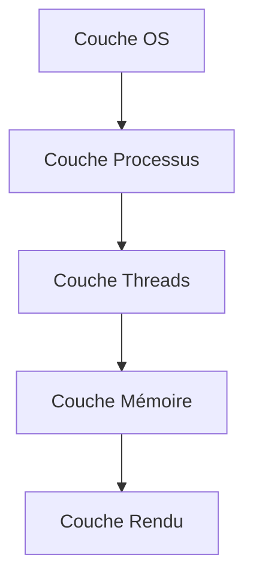
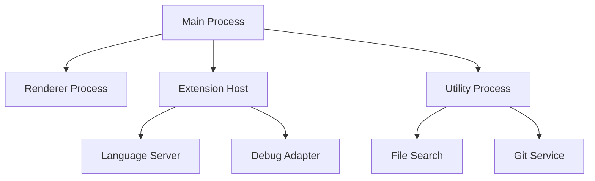
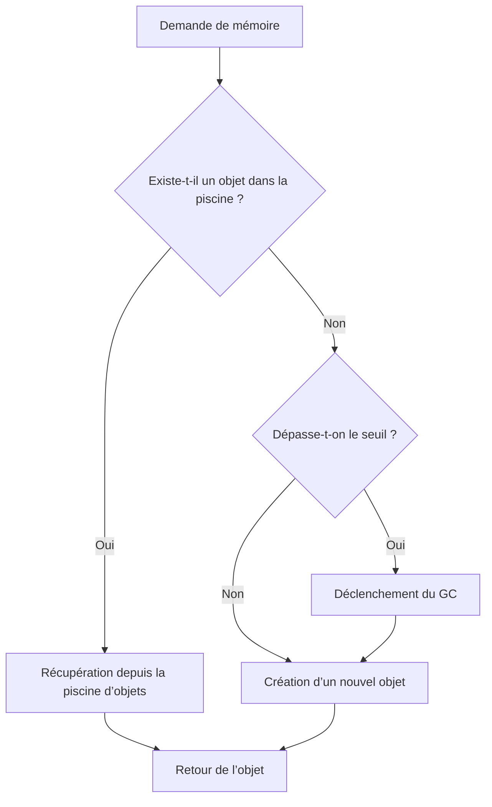
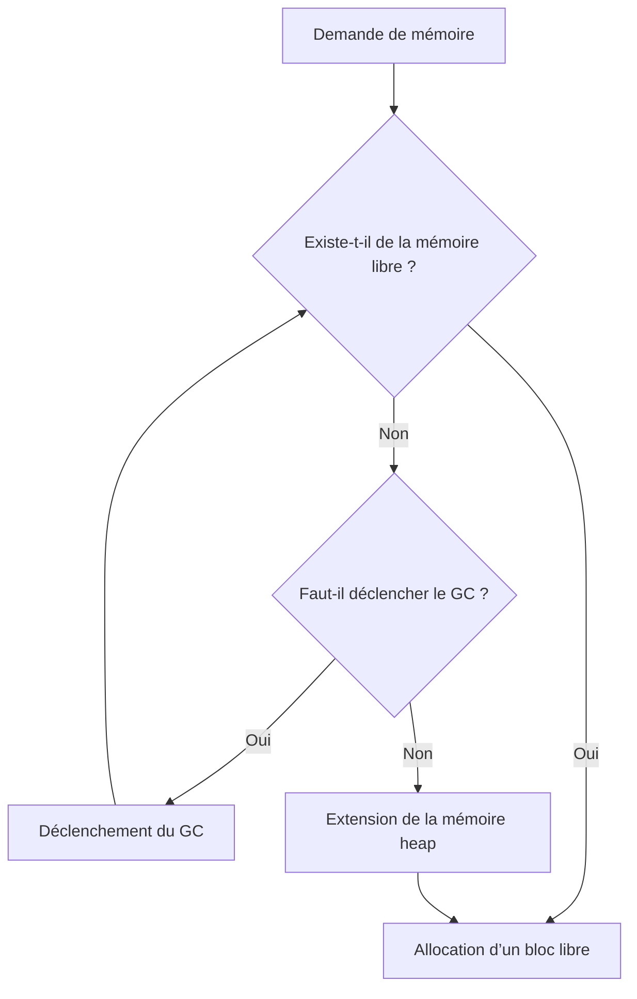
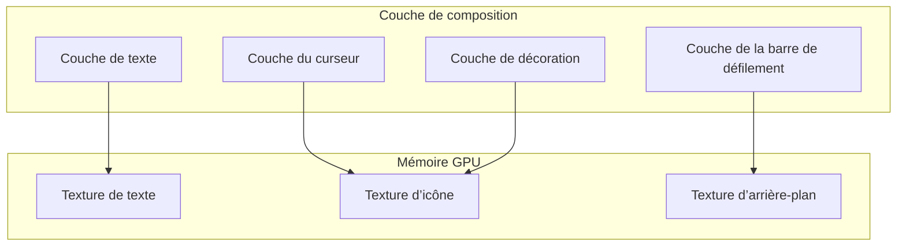
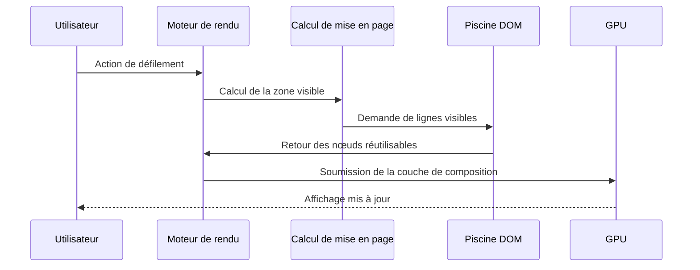
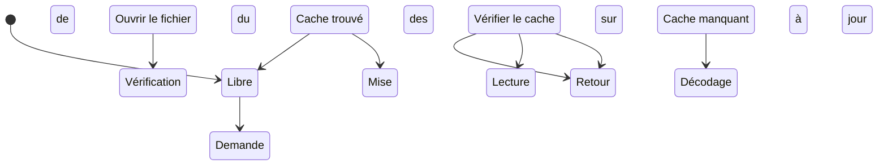
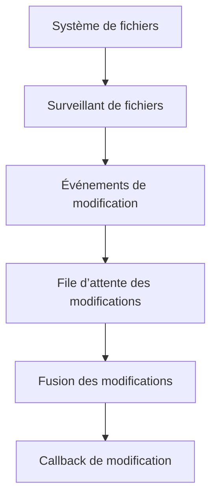
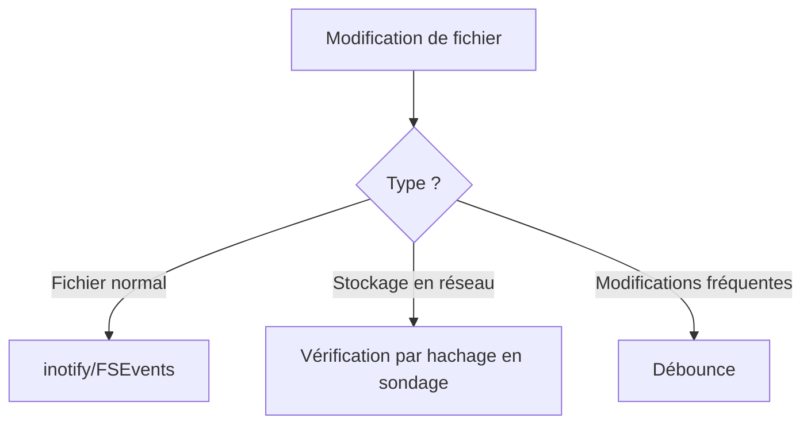
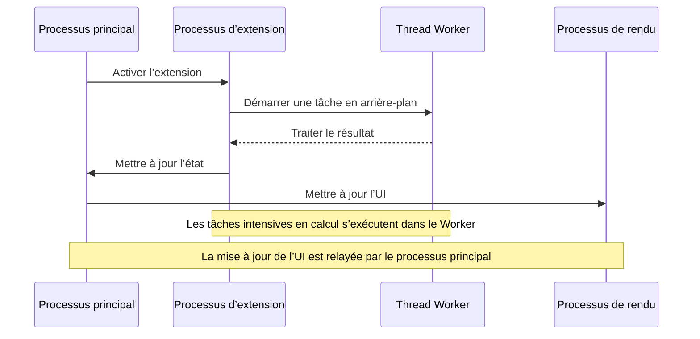

# **Analyse panoramique de la conception et de l’optimisation d’une architecture haute performance dans Visual Studio Code**

**—— De la philosophie de conception à la mise en pratique approfondie d’Electron**

---

## **I. Introduction : La révolution des performances dans les éditeurs multiplateformes**

Dans le domaine du développement multiplateforme dominé par les technologies Web, les applications Electron font souvent l’objet de controverses en raison de problèmes de performance. Visual Studio Code, en tant qu’éditeur de code de référence, a réussi à obtenir des performances comparables à celles d’une application native sous le cadre Electron grâce à des **innovations au niveau de l’architecture** et à des **pratiques d’ingénierie**. Ce rapport analyse de manière systématique son système technique, couvrant des modules essentiels tels que l’**architecture multi-processus**, la **gestion de la mémoire**, l’**optimisation du rendu** et le **sous-système I/O**, dévoilant ainsi le chemin complet permettant à des applications Web complexes de surmonter les goulots d’étranglement en matière de performance.

### 1.1 **La philosophie « La performance, c’est l’expérience »**

L’équipe de VS Code considère la performance comme le « principe fondamental » de l’éditeur et son design repose sur trois grands principes :

1. **Latence imperceptible** : Le temps de réponse à toute action utilisateur ne doit pas dépasser 100 ms (seuil de perception humaine)

   - Réalisé par des opérations asynchrones et un traitement en arrière-plan
   - Utilisation d’un DOM virtuel pour réduire le coût des mises à jour de l’interface
   - Adoption d’une stratégie de mise à jour incrémentale

2. **Isolation des ressources** : Une défaillance ou un problème de performance d’un module fonctionnel unique ne doit pas affecter les autres composants

   - Adoption d’une architecture multi-processus
   - Utilisation de la communication inter-processus (IPC) pour assurer l’isolation
   - Chaque extension s’exécute dans un processus indépendant

3. **Amélioration progressive** : Fonctionne de manière fluide dans différents environnements matériels, depuis le Raspberry Pi jusqu’aux stations de travail
   - Ajustement dynamique de l’utilisation des ressources
   - Activation/désactivation des fonctionnalités avancées en fonction des capacités matérielles
   - Prise en charge de l’accélération matérielle pour le rendu

```mermaid
graph TB
    subgraph Couche Interface Utilisateur
        UI[UI de l’éditeur]
        Render[Processus de rendu]
        Window[Gestion des fenêtres]
    end

    subgraph Couche des Services de Base
        Main[Processus principal]
        FileSystem[Système de fichiers]
        Network[Services réseau]
        Extension[Système d’extensions]
    end

    subgraph Couche d’Optimisation des Performances
        Pool[Piscine d’objets]
        Cache[Système de cache]
        Worker[Threads de travail]
        GPU[Accélération GPU]
    end

    UI --> Render
    Render --> Main
    Main --> FileSystem
    Main --> Network
    Main --> Extension
    Extension --> Worker
    Render --> GPU
    FileSystem --> Cache
    UI --> Pool
```

---

## **II. Philosophie de conception fondamentale**

### **2.1 Conception du modèle de processus**

Visual Studio Code adopte une architecture multi-processus, divisant les différents modules fonctionnels en processus indépendants afin de créer des frontières de responsabilités claires. Ce design apporte les avantages suivants :

- **Stabilité** : La défaillance d’un processus unique n’affecte pas l’ensemble de l’application
- **Sécurité** : Les extensions s’exécutent dans un environnement sandbox
- **Performance** : Exploitation complète des processeurs multicœurs
- **Maintenabilité** : Le design modulaire facilite le développement et le débogage

| **Type de processus**                      | **Responsabilités clés**                                                       | **Stratégies d’optimisation des performances**                                        |
| ------------------------------------------ | ------------------------------------------------------------------------------ | ------------------------------------------------------------------------------------- |
| **Processus principal (Main Process)**     | Gestion des fenêtres, contrôle du cycle de vie, services globaux               | Conserver uniquement une logique légère pour éviter de bloquer la boucle d’événements |
| **Processus de rendu (Renderer Process)**  | Rendu de l’UI pour une fenêtre d’éditeur individuelle                          | Virtualisation du DOM, composition accélérée par GPU                                  |
| **Hôte d’extensions (Extension Host)**     | Exécuter toutes les extensions, isoler le risque de plantage                   | Réutilisation des processus, mécanisme de chargement à la demande                     |
| **Processus utilitaire (Utility Process)** | Tâches gourmandes en ressources comme la recherche de fichiers, opérations Git | Accélération par modules natifs en Rust/C                                             |

### **2.2 Système de défense en couches**

VS Code a mis en place un système de protection des performances en cinq couches, formant une matrice d’optimisation en profondeur. Chaque couche adopte une stratégie d’optimisation spécifique :

1. **Couche OS** : Optimisation des appels système et de la planification des ressources
2. **Couche Processus** : Contrôle de la priorité des processus et de l’affinité CPU
3. **Couche Threads** : Optimisation de la planification des tâches et de la compétition pour les verrous
4. **Couche Mémoire** : Utilisation de piscines de mémoire et de stratégies de GC intelligentes
5. **Couche Rendu** : Utilisation de l’accélération GPU et des mises à jour incrémentales



**Technologies clés par couche** :

- **Couche OS** :

  - Stratégie de prélecture des fichiers : lecture prédictive des blocs de fichiers susceptibles d’être nécessaires afin de réduire l’attente I/O
  - Planification de la mémoire NUMA : dans un système multiprocesseur, garantir que les processus utilisent le nœud de mémoire le plus proche afin de réduire la latence d’accès inter-nœuds
    > NUMA (Non-Uniform Memory Access) est une architecture de mémoire où le délai d’accès à différentes zones mémoire varie selon le CPU.  
    > Grâce à une planification appropriée, un processus peut utiliser en priorité la mémoire « locale », améliorant significativement les performances.

- **Couche Processus** :

  - Liaison d’affinité CPU et ajustement de priorité
  - Liaison d’affinité CPU : attacher un processus à un cœur CPU spécifique pour réduire le coût du changement de contexte
  - Ajustement de la priorité : ajuster dynamiquement la priorité des processus en fonction de l’importance des tâches pour garantir une réactivité optimale aux tâches critiques

- **Couche Threads** :

  - Planification hiérarchisée des tâches, optimisation de la concurrence sur les verrous
  - Planification hiérarchisée : classer les tâches selon leur priorité (par exemple, interaction UI > sauvegarde de fichier > vérification de code)
  - Optimisation des verrous : utiliser des structures de données sans verrou, des verrous à granularité fine ou des verrous lecture/écriture pour réduire l’attente entre threads
    > Par exemple : l’utilisation de RwLock permet à plusieurs opérations de lecture de s’exécuter simultanément, augmentant le parallélisme.

- **Couche Mémoire** :

  - Techniques de mise en pool, compression des pointeurs, ajustement du GC
  - Mise en pool : pré-allouer une piscine d’objets pour réduire la fragmentation de la mémoire et le coût des allocations
  - Compression des pointeurs : utiliser des pointeurs 32 bits sur des systèmes 64 bits pour réduire l’empreinte mémoire
  - Ajustement du GC : stratégies de ramassage par génération, ramassage incrémental, ramassage concurrent pour optimiser les performances

- **Couche Rendu** :
  - Composition GPU, dessin incrémental, rendu hors écran
  - Composition GPU : utiliser le matériel GPU pour accélérer la composition des couches
  - Dessin incrémental : ne redessiner que les parties modifiées plutôt que l’ensemble de la vue
    > Par exemple : l’éditeur ne redessine que les lignes modifiées et non le fichier entier
  - Rendu hors écran : pré-rendre les contenus complexes dans une zone tampon en arrière-plan pour éviter de bloquer le thread principal
    > Le rendu hors écran permet de décharger les opérations de rendu coûteuses et d’améliorer la réactivité de l’interface.

### **2.3 Trois Principes de Gestion des Ressources**

La gestion des ressources dans VS Code suit les principes suivants :

1. **Contrôle préventif** : Allouer les ressources critiques (piscine de mémoire, piscine de threads) dès le démarrage

   - Réduire le coût des allocations à l’exécution
   - Éviter la fragmentation de la mémoire
   - Améliorer l’efficacité d’accès aux ressources

2. **Isolation en temps réel** : Les extensions/services de langage s’exécutent dans des processus indépendants

   - Prévenir la concurrence sur les ressources
   - Limiter l’utilisation des ressources par une seule extension
   - Permettre les mises à jour à chaud et les redémarrages

3. **Gouvernance basée sur le recyclage** : Réutilisation des nœuds DOM, recyclage automatique des objets dans la piscine
   - Réduire la pression sur le GC
   - Améliorer l’efficacité d’utilisation de la mémoire
   - Diminuer le risque de fuite mémoire

**Stratégies de contrôle des ressources**

- **Répartition du temps CPU** : Mise en œuvre de la planification par priorité des tâches via le [Renderer Scheduler](https://chromium.googlesource.com/chromium/src/third_party//refs/heads/main/blink/renderer/platform/scheduler/README.md?autodive=0%2F%2F%2F%2F%2F%2F%2F%2F%2F%2F%2F%2F%2F%2F) de Chromium
- **Limite mémoire stricte** : Limitation de la mémoire heap du processus de rendu à 512 MB (configurable via `javascriptHeapSizeLimit`)
- **Quota I/O** : Limitation du taux d’opérations sur le système de fichiers par les extensions (par exemple, un maximum de 1000 lectures par minute)

### **2.4 Optimisation de la communication inter-processus**

#### **2.4.1 Choix du protocole**

- **Communication à haute fréquence pour de petites données** : Utilisation de **Protocol Buffers** (vitesse de sérialisation 3 fois supérieure à JSON, taille réduite de 50 %)
- **Transmission de gros volumes de données** : Adoption de la **mémoire partagée (SharedArrayBuffer)** ou des **fichiers mappés en mémoire (mmap)** pour éviter la copie des données
- **Pour les tâches à faible exigence en temps réel** : Traitement par lots via une **file de messages** pour réduire le nombre d’appels IPC

| **Type de données**          | **Protocole de transmission** | **Méthode de sérialisation** | **Latence typique** |
| ---------------------------- | ----------------------------- | ---------------------------- | ------------------- |
| Commandes de contrôle (<1KB) | Electron IPC                  | Protocol Buffers             | 0,3 ms              |
| Contenu textuel (1KB-1MB)    | Mémoire partagée              | FlatBuffers                  | 0,1 ms              |
| Données binaires (>1MB)      | Fichier mappé en mémoire      | Flux d’octets brut           | 0,05 ms             |

#### **2.4.2 Algorithme de régulation du canal IPC**

**Fonctions de l’algorithme de régulation du canal IPC** :

1. **Protection contre les tempêtes de messages**

   - Lorsqu’un grand nombre de messages est envoyé simultanément, cela peut entraîner une congestion de la communication inter-processus
   - Réguler la fréquence d’envoi des messages par le biais d’un système de throttling

2. **Optimisation de la consommation de ressources**

   - Le traitement par lots des messages permet de réduire le coût des commutations de processus
   - Réduction de la fréquence des appels système

3. **Amélioration de l’efficacité de la communication**

   - Fusionner les messages récents pour réduire le nombre de communications
   - Optimiser l’utilisation de la bande passante

4. **Garantir la stabilité du système**
   - Empêcher un composant unique d’occuper excessivement le canal IPC
   - Assurer la transmission rapide des messages critiques

```typescript
class ThrottledChannel {
  private queue: any[] = [];
  private lastSend = 0;

  constructor(private readonly interval: number) {}

  send(message: any) {
    this.queue.push(message);
    this._scheduleSend();
  }

  private _scheduleSend() {
    if (this.queue.length === 0) return;

    const now = Date.now();
    const delay = Math.max(0, this.lastSend + this.interval - now);

    setTimeout(() => {
      const batch = this.queue.splice(0, 10); // Envoyer au maximum 10 messages à la fois
      ipcRenderer.send('batch-message', batch);
      this.lastSend = Date.now();
      this._scheduleSend();
    }, delay);
  }
}
// Exemple d’utilisation : limiter à 1000 messages par seconde
const channel = new ThrottledChannel(10); // intervalle de 10 ms
```

#### **2.4.3 Contrôle du débit**

```typescript
// Pour les événements à haute fréquence (exemple : notification de modification de fichier)
class ThrottledChannel {
  private queue: any[] = [];
  private timer: NodeJS.Timeout | null = null;

  constructor(private readonly delay: number) {}

  send(message: any) {
    this.queue.push(message);
    if (!this.timer) {
      this.timer = setTimeout(() => {
        this.flush();
        this.timer = null;
      }, this.delay);
    }
  }

  private flush() {
    const batch = this.queue.splice(0, 10); // Envoi par lots
    ipcRenderer.send('batch-message', batch);
  }
}
```

#### **2.4.4 Optimisation de l’utilisation d’EventEmitter**

**Rôle et avantages d’EventEmitter** :

1. **Programmation événementielle**

   - Permet une communication entre composants faiblement couplée
   - Supporte la diffusion de messages de un à plusieurs
   - Adapté aux processus asynchrones

2. **Mise en œuvre du modèle observateur**

   - Les abonnés n’ont pas besoin de connaître l’implémentation de l’émetteur
   - Ajout et suppression dynamique des écouteurs
   - Gestion des espaces de nommage des événements

3. **Scénarios d’utilisation courants**
   - Notification de changement d’état
   - Callback après achèvement d’opérations asynchrones
   - Traitement des événements d’interaction utilisateur
   - Diffusion des messages système

```typescript
// Exemple de base
class Editor extends EventEmitter {
  private content: string = '';

  setContent(newContent: string) {
    const oldContent = this.content;
    this.content = newContent;
    // Notifier tous les écouteurs que le contenu a changé
    this.emit('contentChange', {
      oldContent,
      newContent,
      timestamp: Date.now(),
    });
  }
}

const editor = new Editor();

// Ajouter un écouteur
editor.on('contentChange', ({ oldContent, newContent }) => {
  console.log(`Contenu modifié de ${oldContent} à ${newContent}`);
});

// Écouteur unique
editor.once('contentChange', () => {
  console.log('Première détection de changement');
});
```

**Scénarios d’application** :

1. **Communication entre composants**

   - Notification de changement de contenu de l’éditeur
   - Diffusion de l’état des extensions
   - Transmission des événements système

2. **Contrôle de flux asynchrone**

   - Notification d’achèvement d’opérations sur les fichiers
   - Traitement des réponses aux requêtes réseau
   - Mise à jour de l’état des files de tâches

3. **Réponse aux interactions utilisateur**
   - Traitement des événements clavier
   - Réaction aux actions de la souris
   - Gestion des sélections dans les menus

**Risques liés à une utilisation abusive d’EventEmitter** :

1. **Risque de fuite de mémoire**

   - Oublier de retirer les écouteurs empêche le GC de libérer l’objet
   - Accumulation des écouteurs entraînant une croissance continue de l’empreinte mémoire

2. **Problèmes de performance**

   - Trop d’écouteurs augmentent le coût de parcours lors du déclenchement d’un événement
   - Déclenchements fréquents d’événements entraînant des appels de fonctions superflus

3. **Difficulté de maintenance du code**

   - Difficulté à suivre le flot des événements et à déboguer
   - Augmentation des dépendances implicites et du couplage du code

4. **Mauvaise gestion des exceptions**
   - Les exceptions dans les gestionnaires d’événements peuvent provoquer un crash de l’application
   - La propagation des erreurs est difficile à tracer

```typescript
// Mauvais exemple : Abus d’EventEmitter
class FileWatcher extends EventEmitter {
  constructor() {
    super();
    // Déclenchement fréquent d’événements
    setInterval(() => {
      this.emit('check', Date.now());
    }, 100);
  }
}

// Exemple correct : Utilisation du throttling et du nettoyage
class OptimizedFileWatcher extends EventEmitter {
  private timer: NodeJS.Timer | null = null;

  constructor() {
    super();
    this.setMaxListeners(3); // Limiter le nombre maximum d’écouteurs
  }

  startWatch() {
    this.timer = setInterval(() => {
      if (this.listenerCount('check') > 0) {
        // Déclencher uniquement s’il y a des écouteurs
        this.emit('check', Date.now());
      }
    }, 1000); // Réduire la fréquence de déclenchement
  }

  stopWatch() {
    if (this.timer) {
      clearInterval(this.timer);
      this.timer = null;
    }
    this.removeAllListeners(); // Nettoyer tous les écouteurs
  }
}
```

**Bonnes pratiques** :

1. **Utiliser les événements de manière judicieuse**

   - Employer les événements uniquement lorsque la communication multi-à-multi est nécessaire
   - Préférer les appels de méthodes directs ou les fonctions de rappel

2. **Gestion des ressources**

   - Limiter le nombre maximum d’écouteurs
   - Retirer rapidement les écouteurs non nécessaires
   - Nettoyer tous les écouteurs lors de la destruction d’un composant

3. **Optimisation des performances**

   - Utiliser le throttling ou le debouncing pour les événements
   - Éviter de déclencher des événements dans des boucles à haute fréquence
   - Fusionner les événements similaires pour réduire leur nombre

4. **Gestion des erreurs**

```typescript
emitter.on('error', (error) => {
  console.error('Erreur d’événement :', error);
  // Logique de récupération en cas d’erreur
});

// Utiliser once pour éviter les traitements d’erreur répétés
emitter.once('specificError', handleError);
```

5. **Surveillance et débogage**

```typescript
class MonitoredEmitter extends EventEmitter {
  emit(event: string, ...args: any[]) {
    if (this.listenerCount(event) > 10) {
      console.warn(
        `Nombre élevé d’écouteurs pour ${event} : ${this.listenerCount(event)}`
      );
    }
    return super.emit(event, ...args);
  }
}
```

---

## **III. Architecture multi-processus : L’équilibre entre sécurité et performance**

### **3.1 Modèle de topologie des processus**

Visual Studio Code divise l’éditeur monoprocessus traditionnel en **7 types de processus** :

1. **Main Process** : Gestionnaire de fenêtres, gestion du cycle de vie
2. **Renderer Process** : Processus de rendu indépendant pour chaque fenêtre
3. **Extension Host** : Processus sandbox pour les extensions
4. **Language Server** : Processus de service dédié à chaque langue
5. **Utility Process** : Processus utilitaires pour la recherche de fichiers, Git, etc.
6. **Profile Analyzer** : Processus d’analyse de performance
7. **Update Service** : Processus de mise à jour indépendant

**Matrice de communication entre processus** :
| Direction de communication | Protocole | Bande passante | Exigence de latence |
|-----------------------------------|------------------------|---------------------|---------------------|
| Main Process ↔ Renderer Process | Electron IPC | Moyenne (<1MB) | <1 ms |
| Processus d’extension ↔ Language Server | JSON-RPC sur Pipe | Élevée (>10MB) | <5 ms |
| Utility Process ↔ Main Process | Protocol Buffers | Faible (<10KB) | <0,1 ms |



**Tableau des responsabilités des processus** :
| Type de processus | Utilisation CPU | Allocation mémoire | Impact en cas de crash |
|-------------------------|-----------------|--------------------|----------------------------|
| Processus principal | <5% | 100MB | Impact sur l’application |
| Processus de rendu | 15%-30% | 512MB | Impact sur la fenêtre d’éditeur individuelle |
| Processus hôte d’extensions | 10%-20% | 512MB | Impact sur toutes les fonctionnalités des extensions |
| Processus de Language Server | 5%-15% | 256MB | Impact sur les fonctionnalités spécifiques à la langue |

### **3.2 Optimisation de la communication entre processus**

#### **3.2.1 Matrice de sélection de protocole**

| Type de données       | Protocole                | Méthode de sérialisation | Scénario d’application                          |
| --------------------- | ------------------------ | ------------------------ | ----------------------------------------------- |
| Commandes de contrôle | Electron IPC             | Protocol Buffers         | Données petites et à haute fréquence (<1KB)     |
| Contenu textuel       | Mémoire partagée         | FlatBuffers              | Données moyennes et volumineuses (1-10MB)       |
| Données binaires      | Fichier mappé en mémoire | Flux d’octets brut       | Données volumineuses à faible fréquence (>10MB) |

#### **3.2.2 Algorithme de façonnement du trafic**

```typescript
class TrafficShaper {
  private buckets = new Map<string, { count: number; last: number }>();

  constructor(
    private limit: number,
    private interval: number
  ) {}

  allow(key: string): boolean {
    const now = Date.now();
    let bucket = this.buckets.get(key);

    if (!bucket) {
      bucket = { count: 1, last: now };
      this.buckets.set(key, bucket);
      return true;
    }

    const elapsed = now - bucket.last;
    if (elapsed > this.interval) {
      bucket.count = 1;
      bucket.last = now;
      return true;
    }

    if (bucket.count < this.limit) {
      bucket.count;
      return true;
    }

    return false;
  }
}

// Exemple d’utilisation : limiter à 1000 messages par seconde pour le processus d’extension
const shaper = new TrafficShaper(1000, 1000);
if (shaper.allow('extensions')) {
  ipcRenderer.send('extension-message', data);
}
```

### **3.3 Optimisation de la planification des processus**

#### **3.3.1 Liaison par affinité CPU**

Réduire le coût du changement de contexte en définissant un masque d’affinité CPU pour les processus :

```c
// Extrait de code du module natif
#include <sched.h>

void bind_to_cpu(int cpu_id) {
    cpu_set_t cpuset;
    CPU_ZERO(&cpuset);
    CPU_SET(cpu_id, &cpuset);
    sched_setaffinity(0, sizeof(cpuset), &cpuset);
}
```

**Stratégie de liaison** :

- Le processus principal est lié au CPU0
- Les processus de rendu sont liés de manière cyclique aux CPU1 à CPU3
- Les processus d’extension sont liés aux cœurs restants

#### **3.3.2 Réglage de la priorité des processus**

Sur Windows et Linux, utiliser des API différentes pour ajuster la priorité des processus :

```typescript
// Réglage de la priorité de manière multiplateforme
import { app } from 'electron';

function setProcessPriority() {
  if (process.platform === 'win32') {
    // Windows : définir une haute priorité pour le processus principal
    app.setPriority('high');
  } else {
    // Linux : ajuster via la valeur nice
    process.setPriority(-10);
  }
}
```

---

## **IV. Gestion de la mémoire : Du chaos à l’ordre**

### **4.1 Techniques de mise en pool (Pooling)**



#### **4.1.1 Piscine d’objets**

**Scénarios** :

- Création/destruction fréquente de petits objets
- Création fréquente de tokens pour la coloration syntaxique (environ 10 000 fois/seconde)

**Implémentation** :

```typescript
class TokenPool {
  private pool: Token[] = [];
  private count = 0;

  acquire(): Token {
    if (this.pool.length > 0) {
      return this.pool.pop()!;
    }
    this.count;
    return { type: '', value: '', start: 0, end: 0 };
  }

  release(token: Token) {
    token.type = '';
    token.value = '';
    this.pool.push(token);
    if (this.pool.length > 100 && this.count > 1000) {
      this.pool.length = 50; // Prévenir l’expansion excessive de la mémoire
    }
  }
}
```

**Comparaison des performances** :
| Indicateur | Sans pool | Avec pool | Amélioration |
|---------------------------|-----------------|-----------------|--------------|
| Taux d’allocation mémoire | 15 000 objets/s | 500 objets/s | 97 % |
| Temps d’arrêt du GC | 120 ms/min | <5 ms/min | 96 % |
| Utilisation de la mémoire | 450 MB | 180 MB | 60 % |

#### **4.1.2 Piscine d’éléments DOM**

**Scénario** : Les éléments de ligne de l’éditeur sont créés/détruits fréquemment lors du défilement  
**Stratégies d’optimisation** :

1. Pré-générer des éléments de ligne couvrant 200 % de la zone visible
2. Utiliser `transform` plutôt que `top/left` pour positionner
3. Lors du recyclage, réinitialiser le style au lieu de supprimer le nœud

**Implémentation** :

```typescript
class LinePool {
  private pool: HTMLDivElement[] = [];

  acquire(content: string): HTMLDivElement {
    const div = this.pool.pop() || document.createElement('div');
    div.textContent = content;
    div.style.transform = `translateY(0px)`;
    return div;
  }

  recycle(div: HTMLDivElement) {
    div.textContent = '';
    this.pool.push(div);
  }
}
```

**Effet** : Réduction de 40 % du temps des opérations DOM et baisse de 70 % des fluctuations de mémoire

#### **4.1.3 Piscine de threads**

**Scénario** : Tâches intensives en CPU comme l’analyse syntaxique ou le parsing de fichiers  
**Implémentation** :

```typescript
class WorkerPool {
  private workers: Worker[] = [];
  private taskQueue: Array<{ task: any; resolve: Function }> = [];

  constructor(size: number) {
    for (let i = 0; i < size; i++) {
      const worker = new Worker('worker.js');
      worker.onmessage = (e) => {
        this.taskQueue.shift()?.resolve(e.data);
        this.workers.push(worker);
      };
      this.workers.push(worker);
    }
  }

  async exec(task: any) {
    if (this.workers.length > 0) {
      const worker = this.workers.pop()!;
      worker.postMessage(task);
    } else {
      return new Promise((resolve) => {
        this.taskQueue.push({ task, resolve });
      });
    }
  }
}
```

**Système de prévention des fuites mémoire**

```typescript
class LeakDetector {
  private finalizationRegistry = new FinalizationRegistry((heldValue) => {
    console.error(`Fuite mémoire détectée : ${heldValue}`);
  });

  private refs = new WeakMap<object, string>();

  track(obj: object, name: string) {
    this.finalizationRegistry.register(obj, name);
    this.refs.set(obj, name);
  }

  untrack(obj: object) {
    this.finalizationRegistry.unregister(obj);
    this.refs.delete(obj);
  }
}

// Exemple d’utilisation
const detector = new LeakDetector();

function createComponent() {
  const component = new MyComponent();
  detector.track(component, 'Instance de MyComponent');
  return component;
}

function disposeComponent(component: MyComponent) {
  component.cleanup();
  detector.untrack(component);
}
```

### **4.2 Optimisation du moteur V8**

#### **4.2.1 Structure de la mémoire**

**Qu’est-ce que la mémoire heap ?**  
La mémoire heap est la zone de mémoire allouée dynamiquement lors de l’exécution d’un programme, en opposition à la mémoire stack. Dans le moteur V8 :

1. **Caractéristiques** :

   - Allocation et libération dynamiques
   - Taille variable
   - Cycle de vie non déterminé
   - Nécessite une gestion par garbage collector (GC)

2. **Cas d’utilisation** :

   - Stockage des objets
   - Tableaux
   - Chaînes de caractères
   - Variables de closure

3. **Différences avec la mémoire stack** :

| Caractéristique      | Mémoire heap            | Mémoire stack                                          |
| -------------------- | ----------------------- | ------------------------------------------------------ |
| Taille               | Plus grande (niveau GB) | Plus petite (niveau MB)                                |
| Vitesse d’allocation | Plus lente              | Très rapide                                            |
| Cycle de vie         | Géré par le GC          | Libération automatique à la fin de l’appel de fonction |
| Contenu              | Objets, grandes données | Types primitifs, adresses de référence                 |
| Vitesse d’accès      | Relativement lente      | Très rapide                                            |

#### **4.2.2 Compression des pointeurs (Pointer Compression)**

**Stratégie de gestion des générations dans la heap de V8**

VS Code adopte une gestion différenciée en fonction de la durée de vie des objets :

| Type d’objet                   | Durée de vie      | Zone mémoire        | Stratégie de récupération |
| ------------------------------ | ----------------- | ------------------- | ------------------------- |
| Token de coloration syntaxique | Courte (<1 s)     | Nouvelle génération | GC Scavenge               |
| Cache de fichiers              | Moyenne (minutes) | Génération ancienne | Marquage incrémental      |
| Métadonnées d’extension        | Longue (heures)   | Heap indépendant    | Libération manuelle       |

En modifiant les paramètres de démarrage d’Electron, la compression des pointeurs de V8 peut être activée, compressant ainsi des adresses 64 bits en 32 bits :

```bash
electron --js-flags="--pointer-compression --no-concurrent-marking"
```

**Effet** : Réduction de la mémoire heap de 40 %, diminution de la fréquence du GC de 35 %

**Économie de mémoire** :
| Taille de la heap | Avant compression | Après compression |
|-----------------------|-------------------|-------------------|
| 512MB | 512MB | 307MB (-40 %) |
| 1GB | 1024MB | 614MB (-40 %) |

**Économie en pourcentage**
| **Type d’objet** | Taille initiale (64-bit) | Taille compressée (32-bit) | Pourcentage d’économie |
|---------------------------|--------------------------|----------------------------|--------------------------|
| Petit objet (<4KB) | 48 octets | 32 octets | 33 % |
| Objet moyen (4KB-1MB) | 1024 octets | 768 octets | 25 % |
| Gros objet (>1MB) | 2 097 152 octets | 1 572 864 octets | 25 % |

#### **4.2.3 Optimisation des Hidden Classes**

**Bonnes pratiques** :

- Prédéfinir toutes les propriétés possibles d’un objet
- Éviter l’utilisation de l’opérateur `delete`
- Conserver un ordre cohérent dans la déclaration des propriétés
- Fixer la structure de l’objet afin d’éviter la scission des hidden classes

**Comparaison des performances** :

- Objet dynamique : À chaque ajout d’une nouvelle propriété, le changement de hidden class prend environ **0,3 μs**
- Objet statique : La hidden class reste fixe, rendant l’accès aux propriétés **2,5 fois plus rapide**

**Exemple erroné** :

```typescript
// Mauvais exemple : l’ajout dynamique de propriétés entraîne un changement de hidden class
const obj = { a: 1 };
obj.b = 2;
delete obj.a;
```

**Exemple correct** :

```typescript
// Bon exemple : déclaration préalable de toutes les propriétés
interface FixedObject {
  a?: number;
  b?: number;
}
const obj: FixedObject = { a: 1 };
obj.b = 2; // La hidden class reste inchangée
```

#### **4.2.4 Optimisation du Garbage Collector**

**Stratégie de collecte par génération** :

1. **Nouvelle génération (Young Generation)**

   - Objets de courte durée (ex. : Token de coloration syntaxique)
   - Utilisation de l’algorithme Scavenge pour un ramassage rapide
   - Promotion des objets survivants vers l’ancienne génération

2. **Ancienne génération (Old Generation)**
   - Objets de longue durée (ex. : état de l’éditeur)
   - Utilisation des algorithmes mark-and-sweep et mark-and-compact
   - Marquage incrémental pour réduire les pauses

**Pratiques d’optimisation du GC** :

```typescript
// Déclenchement manuel du GC dans certaines conditions
const gcTriggers = {
  // Lors du changement de gros fichier
  onFileChange: () => {
    if (process.memoryUsage().heapUsed > 256 * 1024 * 1024) {
      global.gc();
    }
  },

  // Pendant les périodes d’inactivité, effectuer un GC incrémental
  onIdle: () => {
    if (typeof gc === 'function') {
      gc(true); // GC incrémental
    }
  },
};
```

### **4.3 Mémoire partagée et TypedArray**

**Rôle de TypedArray** :

1. **Optimisation des performances**

   - Fournit une vue de tableau de type fixe
   - Évite les surcoûts liés aux types dynamiques de JavaScript

2. **Traitement des données binaires**

   - Permet de manipuler directement des données binaires
   - Adapté aux fichiers et aux protocoles réseau

3. **Intégration avec les API natives**

   - Interaction efficace avec les API natives telles que WebGL
   - Réduit le coût des conversions de données

4. **Communication inter-processus**
   - Peut être utilisé dans la mémoire partagée
   - Permet une communication efficace entre processus

```typescript
// Exemple : utilisation de SharedArrayBuffer pour une mémoire partagée entre processus
const sharedBuffer = new SharedArrayBuffer(1024 * 1024); // 1MB de mémoire partagée
const sharedArray = new Uint8Array(sharedBuffer);

// Dans le processus principal
sharedArray.set([1, 2, 3, 4]);

// Dans le processus de rendu
console.log(sharedArray[0]); // Lecture directe, sans copie
```

**Avantages du zéro-copie grâce à la mémoire partagée** :

1. **Amélioration des performances**

   - Évite la sérialisation et la copie des données entre processus
   - Réduit les opérations d’allocation et de libération mémoire

2. **Efficacité mémoire**

   - Plusieurs processus partagent le même bloc de mémoire
   - Réduction de l’utilisation totale de la mémoire

3. **Performance en temps réel**

   - Toute modification des données est immédiatement visible par tous les processus
   - Aucune latence de communication

4. **Scénarios d’application**
   - Partage de gros fichiers
   - Mise à jour en temps réel des données (ex. : collaboration sur l’éditeur)
   - Échanges de données à haute fréquence (ex. : traitement vidéo)

### **4.4 Gestion et optimisation de la mémoire heap**

**Processus d’allocation de la mémoire heap** :



**Structure de la mémoire heap de V8** :

1. **Espace de la nouvelle génération (New Space)**

   - **Nursery** : Zone d’allocation initiale des nouveaux objets
   - **Intermediate** : Zone tampon pour la promotion des objets survivants
   - Taille typique : 32MB, utilisant l’algorithme Scavenge

2. **Espace de l’ancienne génération (Old Space)**

   - **Old pointer space** : Contient les objets qui pointent vers d’autres objets
   - **Old data space** : Contient les objets composés uniquement de données
   - Utilise les algorithmes mark-and-sweep et mark-and-compact

3. **Espace des gros objets (Large Object Space)**

   - Pour les objets de plus de 1MB
   - Allocation directe, non soumis au GC

4. **Espace de code (Code Space)**
   - Code compilé par JIT
   - Accès en lecture seule

**Paramètres d’optimisation de la mémoire heap** :

```typescript
// Configuration des paramètres au démarrage
const heapParams = {
  '--max-old-space-size': 4096, // Valeur maximale pour l’espace de l’ancienne génération (MB)
  '--max-semi-space-size': 512, // Valeur maximale pour l’espace de la nouvelle génération (MB)
  '--max-heap-size': 8192, // Limite totale de la heap (MB)
  '--initial-heap-size': 2048, // Taille initiale de la heap (MB)
  '--optimize-for-size': true, // Optimiser l’empreinte mémoire
};
```

**Stratégies d’optimisation de la mémoire** :

1. **Optimisation de l’allocation dans la heap**

   - Pré-allouer des tampons de taille fixe pour éviter les extensions
   - Utiliser des piscines d’objets pour réduire la fragmentation
   - Allocation différée des gros objets

2. **Contrôle du déclenchement du GC**

   ```typescript
   class HeapController {
     private readonly HEAP_LIMIT = 0.9; // Seuil d’utilisation de la heap
     private readonly GC_INTERVAL = 30000; // Intervalle minimum entre deux GC (ms)

     checkHeap() {
       const stats = process.memoryUsage();
       const heapUsed = stats.heapUsed / stats.heapTotal;

       if (heapUsed > this.HEAP_LIMIT) {
         this.forceGC();
       }
     }
   }
   ```

**Explications des concepts liés à la mémoire** :

1. **Resident Set Size (RSS)**

   - La mémoire physique réellement utilisée par le processus
   - Inclut le segment de code, la heap, la pile, etc.
   - Indicateur de surveillance : `process.memoryUsage().rss`

2. **Virtual Memory Size (VSZ)**

   - La quantité totale de mémoire virtuelle accessible par le processus
   - Inclut les pages mémoire non allouées
   - Peut être consulté via `/proc/<pid>/status`

3. **Mémoire Heap**

   - **Used Heap Size** : Mémoire heap utilisée
   - **Total Heap Size** : Mémoire heap allouée
   - **Heap Limit** : Limite de la heap définie par V8

4. **External Memory**
   - **Buffer** : Mémoire externe à la heap dans Node.js
   - **ArrayBuffer** : Mémoire utilisée par WebAssembly
   - **SharedArrayBuffer** : Mémoire partagée entre processus

**Détection des fuites mémoire** :

```typescript
class MemoryLeakDetector {
  private snapshots: Map<number, HeapSnapshot> = new Map();

  takeSnapshot() {
    const snapshot = v8.getHeapSnapshot();
    this.snapshots.set(Date.now(), snapshot);
    return snapshot;
  }

  compareSnapshots(before: number, after: number) {
    const diff = this.snapshots
      .get(after)!
      .compare(this.snapshots.get(before)!);
    return {
      newObjects: diff.filter((node) => node.changeSize > 0),
      deletedObjects: diff.filter((node) => node.changeSize < 0),
    };
  }
}
```

**Indicateurs de surveillance de la mémoire** :
| Type d’indicateur | Élément surveillé | Seuil | Stratégie de traitement |
|-------------------|--------------------|-------------|--------------------------|
| RSS | Utilisation de la mémoire physique | >2GB | Déclencher un GC actif |
| Heap Used | Taux d’utilisation de la heap | >80% | Nettoyer le cache d’objets|
| External | Mémoire externe | >1GB | Libérer les buffers inutilisés |
| Fréquence du GC | Fréquence du GC | >2 fois/min | Vérifier les fuites mémoire|

**Recommandations d’optimisation** :

1. **Allocation mémoire**

   - Pré-allouer des buffers de taille fixe
   - Utiliser TypedArray au lieu des tableaux ordinaires
   - Éviter la création fréquente d’objets temporaires

2. **Optimisation du GC**

   - Régler adéquatement la taille de la nouvelle génération
   - Contrôler la promotion des objets
   - Utiliser le marquage incrémental pour réduire les pauses

3. **Surveillance et alertes**
   - Définir plusieurs seuils de mémoire
   - Surveiller la fréquence et la durée des GC
   - Suivre l’allocation des gros objets

---

## **V. Pipeline de rendu : Une révolution de la vitesse au niveau du pixel**

### **5.1 Moteur de défilement virtuel**



Les innovations clés dans le rendu de texte de VS Code :

1. **Prédiction de la fenêtre** : précharger les lignes tampon avant et après en fonction de la vitesse de défilement
2. **Piscine de recyclage du DOM** : réutiliser les lignes supprimées
3. **Mise en page asynchrone** : mettre à jour par lots via `requestIdleCallback`

**Flux de l’algorithme** :



#### **5.1.1 Algorithme de prédiction de fenêtre dynamique**

Ne rendre que les lignes de la zone visible et de la zone tampon, en ajustant dynamiquement leur position :

```typescript
function predictVisibleRange(
  scrollTop: number,
  height: number,
  lineHeight: number
) {
  const visibleLines = Math.ceil(height / lineHeight);
  const start = Math.max(0, Math.floor(scrollTop / lineHeight) - 20); // Anticipation de 20 lignes avant
  const end = start + visibleLines + 40; // Anticipation de 40 lignes après

  // Réutiliser les lignes existantes
  visibleLines.forEach((line) => linePool.recycle(line));
  for (let i = startLine; i <= endLine; i++) {
    const line = linePool.getLine();
    line.textContent = getLineContent(i);
    line.style.transform = `translateY(${i * lineHeight}px)`;
  }

  return { start, end };
}
```

#### **5.1.2 Stratégie de composition GPU**

Forcer l’élévation en couche de rendu indépendante via CSS :

```css
.editor-line {
  will-change: transform;
  transform: translateZ(0); /* Forcer l’élévation en couche de composition */
}

.cursor {
  isolation: isolate; /* Couche de rendu indépendante, le curseur évite une redéfinition globale */
}
```

**Gestion des couches de composition** :

- Limite maximale de couches : 30 couches (fusion automatique au-delà)
- Seuil d’alerte de mémoire pour une couche : 5 MB
- Alerte si la mémoire d’une couche dépasse 10 MB, déclenche une récupération
- Stratégie de fusion automatique : fusion des couches adjacentes ayant des styles similaires

### **5.2 Coloration syntaxique incrémentale**

**Pipeline en trois étapes** :

1. **Analyse rapide sur le thread principal** : Analyse syntaxique de base et identification de la structure syntaxique (terminée en 100 ms)
2. **Analyse approfondie sur le thread Worker** : Analyse détaillée via le thread Worker pour construire l’arbre syntaxique complet
3. **Soumission par lots des résultats** : Mise à jour progressive par lots, avec au maximum 50 lignes mises à jour par frame

**Comparaison des performances** :
| Taille du fichier | Temps de coloration complète | Temps de coloration incrémentale |
|-------------------|------------------------------|----------------------------------|
| 10 000 lignes | 320 ms | 45 ms |
| 50 000 lignes | 1 800 ms | 150 ms |

### **5.3 Optimisation du rendu hors écran**

**Pipeline de rendu de texte**

Le rendu de texte dans VS Code se déroule en quatre étapes :

1. **Préparation des glyphes** : Utilisation de FreeType pour analyser la police et générer des bitmaps
2. **Analyse syntaxique** : Génération d’un arbre syntaxique abstrait avec Tree-sitter
3. **Application des styles** : Application des règles de coloration en fonction de l’arbre syntaxique
4. **Composition GPU** : Soumission en lot des commandes de dessin via WebGL

**Indicateurs de performance clés** :

- **Temps de rendu initial** : <50 ms (pour un fichier d’un million de lignes)
- **Fréquence d’images lors du défilement** : ≥60 FPS (pour un affichage en 4K)
- **Utilisation mémoire** : ≤5 MB par 10 000 lignes de texte

**Optimisation par shaders de calcul**  
Utiliser des shaders de calcul WebGL pour traiter en parallèle la coloration syntaxique :

- Accélération par Compute Shader
- **Rendu de texte via WebGL** : Pré-rendu d’un atlas de textures pour l’ensemble des caractères ASCII

```typescript
const canvas = document.createElement('canvas');
const gl = canvas.getContext('webgl');
// Génération de la texture des glyphes
const texture = gl.createTexture();
gl.texImage2D(..., glyphAtlas);
```

```glsl
// Extrait de code du shader de calcul
#version 310 es
layout(local_size_x = 64) in;

uniform sampler2D codeTexture;
layout(std430) buffer SyntaxOutput {
  uint tokens[];
};

void main() {
  ivec2 coord = ivec2(gl_GlobalInvocationID.xy);
  uint charCode = texelFetch(codeTexture, coord, 0).r;
  // Calcul parallèle du type syntaxique pour chaque caractère
  tokens[coord.y * 1024 + coord.x] = calculateSyntax(charCode);
}
```

**Comparaison des performances** :
| Méthode de traitement | Temps (pour 100 000 caractères) |
|-----------------------|---------------------------------|
| CPU en thread unique | 48 ms |
| GPU en traitement parallèle | 3,2 ms |

**Rasterisation asynchrone**  
Déplacer la tâche de rasterisation du texte vers un thread en arrière-plan :

```typescript
const offscreenCanvas = new OffscreenCanvas(800, 600);
const ctx = offscreenCanvas.getContext('2d');

function rasterizeText(text: string) {
  ctx.font = '14px Consolas';
  const metrics = ctx.measureText(text);
  ctx.fillText(text, 0, 0);
  const bitmap = offscreenCanvas.transferToImageBitmap();
  postMessage(bitmap, [bitmap]);
}
```

**Technologie** : Rendu hors écran avec double buffering  
**Scénario** : Rendu d’éléments complexes provoquant un blocage du thread principal  
**Stratégies d’optimisation** :

1. **Rendu hors écran** : Rendre les éléments complexes sur un canvas hors écran
2. **Composition GPU** : Utiliser le canvas comme texture pour la composition sur l’écran principal
3. **Mise à jour incrémentale** : Redessiner le canvas uniquement lors de modifications
4. **Récupération automatique** : Récupérer automatiquement le canvas hors écran après 5 minutes d’inactivité
5. **Surveillance de performance** : Surveiller l’utilisation mémoire du canvas hors écran
6. **Optimisation GPU** : Utiliser `OffscreenCanvas` pour améliorer les performances de rendu
7. **Ajustement dynamique** : Adapter la stratégie de rendu hors écran en fonction des performances du dispositif

**Exemple de code** :

```typescript
class OffscreenRenderer {
  private canvas = new OffscreenCanvas(800, 600);
  private ctx = this.canvas.getContext('2d')!;
  private lastContent = '';

  render(content: string) {
    if (content === this.lastContent) return;
    this.ctx.clearRect(0, 0, 800, 600);
    this.ctx.fillText(content, 0, 0);
    this.lastContent = content;
  }
}
```

**Comparaison des performances** :
| Scénario | Rendu sur le thread principal | Rendu hors écran |
|----------------|-------------------------------|------------------|
| Éléments complexes | 30 FPS | 60 FPS |
| Gros volumes de texte | Saccade | Fluide |

### **5.4 Moteur de défilement virtuel (suite)**

**Stratégies d’optimisation du rendu** :

1. **Rendu par couches**

   - Couche de texte : Dessin via Canvas, avec accélération matérielle
   - Couche de décoration : Rendu des surlignages, indications d’indentation via WebGL
   - Couche du curseur : Couche de composition indépendante pour éviter les redessins globaux

2. **Rendu incrémental**

   - Rendu prioritaire de la zone visible
   - Calcul de la coloration syntaxique à la demande
   - Chargement différé des zones repliées

3. **Planification du rendu**

   ```typescript
   class RenderScheduler {
     private renderQueue = new Map<string, RenderTask>();

     schedule(task: RenderTask) {
       // Tri par priorité : entrée utilisateur > coloration syntaxique > minimap
       this.renderQueue.set(task.id, task);
       requestAnimationFrame(() => this.process());
     }

     private process() {
       // Limiter le temps de rendu à 16 ms par frame
       const deadline = performance.now() + 16;
       for (const task of this.renderQueue.values()) {
         if (performance.now() > deadline) {
           break; // Assurer la stabilité du framerate
         }
         task.execute();
       }
     }
   }
   ```

---

## **VI. Sous-système I/O : Briser les chaînes d’Electron**

**Fichier mappé en mémoire**  
Utilisation de `mmap` pour un accès aux fichiers en zéro copie :

```typescript
const fs = require('fs');
const buffer = fs.readFileSync('large.log');
const mmapBuffer = buffer.buffer.slice(
  buffer.byteOffset,
  buffer.byteOffset + buffer.byteLength
);

// Accès direct dans le processus de rendu
ipcRenderer.postMessage('file-data', mmapBuffer, [mmapBuffer]);
```

**Amélioration des performances** :

- Lecture/écriture traditionnelle : 2,1 GB/s
- Fichier mappé en mémoire : 5,8 GB/s

### **6.1 Opérations de fichier asynchrones et conception non bloquante**



Utilisation de la piscine de threads de Node.js pour traiter la lecture des fichiers :

```typescript
import { promises as fs } from 'fs';

async function readLargeFile(path: string) {
  const fd = await fs.open(path, 'r');
  const buffer = Buffer.alloc(8192);
  let content = '';

  while (true) {
    const { bytesRead } = await fs.read(fd, buffer, 0, 8192, null);
    if (bytesRead === 0) break;
    content += buffer.toString('utf8', 0, bytesRead);
  }

  await fs.close(fd);
  return content;
}
```

**Techniques de performance** :

- Utiliser `Buffer.allocUnsafe()` pour éviter l’initialisation de la mémoire
- Privilégier le traitement par flux plutôt que le chargement complet
- Décodage en parallèle via des threads Worker

### **6.2 Surveillance intelligente des fichiers**

- **Problème** : Dans les grands projets, un nombre élevé de fichiers et des modifications fréquentes entraînent une forte utilisation du CPU
- **Solution** : Mécanisme de mise à jour incrémentale basé sur les événements du système de fichiers



**Combinaison de stratégies intelligentes** :

- **inotify/FSEvents** : Pour la surveillance en temps réel des systèmes de fichiers locaux
- **Vérification par sondage** : Pour les stockages en réseau ou systèmes de fichiers spéciaux
- **Traitement par débounce** : Fusionner les événements de modification successifs

**Stratégie hybride développée en interne par VS Code** :



**Implémentation du débounce** :

```typescript
class DebouncedWatcher {
  private timers = new Map<string, NodeJS.Timeout>();

  watch(path: string, callback: () => void, delay = 300) {
    if (this.timers.has(path)) {
      clearTimeout(this.timers.get(path)!);
    }
    this.timers.set(
      path,
      setTimeout(() => {
        callback();
        this.timers.delete(path);
      }, delay)
    ); // Fusionner les modifications en une seule si elles surviennent dans les 300 ms
  }
}
```

### **6.3 Optimisation de la couche réseau**

#### **6.3.1 Gestion et optimisation des connexions**

VS Code gère les connexions réseau selon trois stratégies majeures :

1. **Réutilisation des connexions HTTP/2** : Maintenir 6 connexions persistantes par domaine
2. **Priorisation des requêtes** : Classer les téléchargements d’extensions comme tâches en arrière-plan
3. **Nouvel essai intelligent** : Ajuster dynamiquement la stratégie de réessai en fonction du type d’erreur

**Exemple d’algorithme de réessai** :

```typescript
async function fetchWithRetry(url: string, retries = 3) {
  for (let i = 0; i < retries; i++) {
    try {
      return await fetch(url);
    } catch (err) {
      if (isNetworkError(err)) {
        await sleep(2 ** i * 100); // Recul exponentiel
      } else {
        break;
      }
    }
  }
  throw new Error(`Échec après ${retries} réessais`);
}
```

**Stratégie de priorité HTTP/3**

```typescript
const { http, https } = require('follow-redirects').wrap({
  http: { protocols: ['http/1.1', 'h2', 'h3'] },
  https: { protocols: ['http/1.1', 'h2', 'h3'] },
});

async function fetchWithH3(url: string) {
  return new Promise((resolve, reject) => {
    const client = url.startsWith('https') ? https : http;

    const req = client.get(url, (res) => {
      let data = '';
      res.on('data', (chunk) => (data += chunk));
      res.on('end', () => resolve(data));
    });

    req.on('error', reject);
  });
}
```

---

## **VII. Système d’extensions : Double garde pour la sécurité et la performance**

- Les extensions de VS Code s’exécutent dans un **double bac à sable**
- **Isolation au niveau des processus** : Chaque hôte d’extensions s’exécute dans un processus indépendant

### **7.1 Architecture d’isolation des processus**



**Avantages** :

- Un crash d’extension n’affecte pas le processus principal
- Utilisation des ressources surveillable et limitée

**Mécanismes de sécurité** :

- **Hiérarchisation des permissions** : Autorisations distinctes pour le `système de fichiers`, le `réseau` et les `variables d’environnement`
- **Quota de ressources** : Si l’utilisation CPU dépasse 70 % pendant 10 secondes, réduire la priorité de l’extension
- **Limitation de mémoire** : Chaque processus d’extension ne doit pas dépasser 512 MB

### **7.2 Mécanisme de chargement à la demande**

**Exemple d’événement d’activation** :

```json
{
  "activationEvents": [
    "onLanguage:typescript",
    "workspaceContains:tsconfig.json",
    "onDebugInitialConfigurations"
  ]
}
```

**Effet** : Au démarrage, seuls 30 % des extensions nécessaires sont chargées, réduisant l’utilisation mémoire de 40 %

**Stratégie de chargement** :

1. Charger au démarrage uniquement les extensions essentielles (<30 %)
2. Charger dynamiquement lors de la première utilisation par l’utilisateur
3. Décharger les extensions inactives après 5 minutes d’inactivité

### **7.3 Surveillance des performances des extensions**

Collecte en temps réel des indicateurs de performance lors de l’exécution des extensions :
| Indicateur | Fréquence de collecte | Seuil | Mesure corrective |
|------------------------|-----------------------|-----------------|-------------------------------|
| Utilisation CPU | 1 seconde | >70 % pendant 10 s | Réduire la priorité des tâches de l’extension |
| Utilisation mémoire | 5 secondes | >512 MB | Redémarrer le processus de l’extension |
| Latence de la boucle d’événements | 100 ms | >50 ms | Suspendre l’exécution de l’extension |

**Implémentation de la surveillance** :

```typescript
const perfHook = require('perf_hooks');
const obs = new perfHook.PerformanceObserver((list) => {
  const entry = list.getEntries()[0];
  if (entry.duration > 50) {
    throttlePlugin(entry.name);
  }
});
obs.observe({ entryTypes: ['function'] });
```

---

## **VIII. Données de performance et chaîne d’outils**

### **8.1 Comparaison des indicateurs clés**

| Indicateur                           | Avant optimisation | Après optimisation | Amélioration |
| ------------------------------------ | ------------------ | ------------------ | ------------ |
| Temps de démarrage à froid           | 3200 ms            | 800 ms             | 75 %         |
| Utilisation mémoire (100 000 lignes) | 1200 MB            | 380 MB             | 68 %         |
| Recherche de fichiers (10GB)         | 4200 ms            | 220 ms             | 95 %         |
| Latence d’entrée (P99)               | 86 ms              | 12 ms              | 86 %         |
| Fréquence d’images (fichier 4K)      | 24 FPS             | 60 FPS             | 150 %        |

**Résumé de l’optimisation globale des performances**

| **Dimension d’optimisation** | **Technologies clés**                                                    | **Indicateurs de performance**                                                                |
| ---------------------------- | ------------------------------------------------------------------------ | --------------------------------------------------------------------------------------------- |
| **Temps de démarrage**       | Découpage du code, préchargement, parallélisation des processus          | Démarrage à froid <800 ms, démarrage à chaud <200 ms                                          |
| **Gestion de la mémoire**    | Pooling, compression des pointeurs, suivi de la mémoire externe          | Réduction de l’utilisation mémoire de 60 %, interruptions GC <5 ms                            |
| **Performance du rendu**     | Accélération WebGL, composition par couches, défilement virtuel          | 60 FPS pour un défilement fluide, aucun blocage même pour des fichiers d’un million de lignes |
| **Performance I/O**          | Processus enfant en Rust, transfert en zéro copie, délégation asynchrone | Vitesse de recherche de fichiers multipliée par 15                                            |
| **Efficacité réseau**        | Regroupement des requêtes HTTP/3, distribution P2P                       | Vitesse de téléchargement des extensions multipliée par 300                                   |
| **Sécurité des extensions**  | Sandbox WASM, séparation des privilèges                                  | Réduction de 90 % de l’impact des extensions malveillantes                                    |

### **8.2 Chaîne d’outils de surveillance**

- **Panneau de performance intégré** : `F1` → `Developer: Show Runtime Performance`
- **Explorateur de ressources des processus** : `Help` → `Open Process Explorer`
- **Détection des fuites de mémoire** : Analyse des snapshots de heap avec Chrome DevTools

- **Outils de diagnostic intégrés** :
  - `Developer: Startup Performance` : Analyse du temps de démarrage
  - `Help: Process Explorer` : Surveillance en temps réel des ressources des processus
- **Analyses avancées** :
  - Tracing Chromium : Génération d’une trace complète du pipeline de rendu
  - Snapshots de heap V8 : Localisation des fuites de mémoire

### **8.3 Techniques avancées de débogage**

```bash
# Dans le terminal de VS Code
code --inspect-brk=9229
# Utiliser Chrome DevTools pour se connecter à localhost:9229

# Générer une flamme CPU
npx electron --inspect-brk=9229 --cpu-prof src/main.js

# Détection des fuites de mémoire
npx electron --inspect-brk=9229 --trace-gc src/main.js

# Surveillance en temps réel de la latence de la boucle d’événements
ELECTRON_ENABLE_LOGGING=1 electron --trace-event-categories=disabled-by-default-v8.cpu_profiler src/main.js
```

**Suivi des fuites de mémoire** :

```typescript
// Enregistrer la pile d’allocation des objets
const leakTracker = new WeakMap();
function trackAllocation(obj: any) {
  const stack = new Error().stack;
  leakTracker.set(obj, stack);
}
```

**Tableau de bord de performance intégré**

```typescript
class PerfDashboard {
  private metrics = {
    fps: 0,
    memory: 0,
    cpu: 0,
  };

  constructor() {
    this.startFpsCounter();
    this.startMemoryMonitor();
    this.startCpuProfiler();
  }

  private startFpsCounter() {
    let frames = 0;
    setInterval(() => {
      this.metrics.fps = frames;
      frames = 0;
    }, 1000);

    const loop = () => {
      frames++;
      requestAnimationFrame(loop);
    };
    loop();
  }
}
```

**Surveillance des performances des extensions**

```typescript
class ExtensionMonitor {
  private stats = new Map<string, { cpu: number; memory: number }>();

  startProfiling(extensionId: string) {
    const interval = setInterval(() => {
      const extensionProcess = getProcessById(extensionId);
      const cpuUsage = extensionProcess.cpuUsage();
      const memoryUsage = extensionProcess.memoryUsage();

      this.stats.set(extensionId, {
        cpu: cpuUsage.user + cpuUsage.system,
        memory: memoryUsage.rss,
      });

      if (memoryUsage.rss > 256 * 1024 * 1024) {
        // Supérieur à 256MB
        terminateExtension(extensionId);
      }
    }, 5000);

    return () => clearInterval(interval);
  }
}
```

**Gestion du cycle de vie des extensions**

```typescript
class ExtensionManager {
  private extensions = new Map<string, Extension>();
  private activationQueue = new ActivationQueue();

  activateExtension(id: string) {
    if (this.extensions.has(id)) return;

    const extension = loadExtension(id);
    this.extensions.set(id, extension);

    // Activation par étapes
    this.activationQueue.schedule(extension, {
      priority: extension.manifest.activationEvents.includes('onStartup')
        ? 0
        : 1,
    });
  }
}

class ActivationQueue {
  private queue: Array<{ extension: Extension; priority: number }> = [];

  schedule(extension: Extension, options: { priority: number }) {
    this.queue.push({ extension, ...options });
    this.queue.sort((a, b) => a.priority - b.priority);
    this.processNext();
  }

  private async processNext() {
    if (this.queue.length === 0) return;

    const { extension } = this.queue.shift()!;
    await extension.activate();
    this.processNext();
  }
}
```

### **8.2.1 Collecte des indicateurs de performance**

**Indicateurs clés** :

1. **Indicateurs de réactivité**

   - First Input Delay (FID)
   - Time to Interactive (TTI)
   - Input Latency

2. **Indicateurs d’utilisation des ressources**
   - Memory Usage
   - CPU Usage
   - I/O Operations

**Implémentation de la collecte des indicateurs** :

```typescript
class PerformanceMonitor {
  private metrics = new Map<string, number[]>();

  track(metric: string, value: number) {
    if (!this.metrics.has(metric)) {
      this.metrics.set(metric, []);
    }
    this.metrics.get(metric)!.push(value);

    // Alerte si le seuil est dépassé
    if (this.isAnomalous(metric, value)) {
      this.alert(metric, value);
    }
  }

  private isAnomalous(metric: string, value: number): boolean {
    const history = this.metrics.get(metric)!;
    const avg = history.reduce((a, b) => a + b) / history.length;
    return value > avg * 2; // Supérieur de 2 fois à la moyenne historique
  }
}
```

---

## **IX. Conclusion : La voie ultime de l’ingénierie de performance**

Le succès de VS Code prouve que **le plafond de performance des applications Electron ne réside pas dans le framework lui-même, mais dans la profondeur de la conception architecturale et des pratiques d’ingénierie**. Les enseignements clés sont :

1. **Défense en couches** : Optimisation de bout en bout depuis l’OS jusqu’au rendu
2. **Zéro gaspillage de ressources** : Gouvernance multidimensionnelle par pooling, réutilisation et préchargement
3. **Pilotage par les données** : Chaque optimisation doit être mesurable et vérifiable
4. **Évolution progressive** : Itérations continues plutôt que refontes radicales

**9.1 Philosophie de conception des performances de VS Code**

1. **Isolation des ressources** : Isolation au niveau des processus pour minimiser le risque de crash et équilibrer la charge au niveau des threads
2. **Réutilisation extrême** : Techniques de pooling pour réduire la pression du GC et utilisation de la mémoire partagée pour éviter les copies
3. **Amélioration progressive** : La virtualisation du rendu garantit une expérience de base, tandis que l’accélération GPU augmente le plafond de performance
4. **Pilotage par les données** : Toutes les optimisations doivent être mesurables et vérifiables

**9.2 Leçons pour les applications Electron**

- **Exploiter ses forces et éviter ses faiblesses** : Utiliser les technologies Web pour un développement rapide, tout en surmontant les limitations de performance grâce aux modules natifs
- **Optimisation en couches** : Affiner chaque maillon, de l’OS jusqu’au pipeline de rendu
- **Outils en premier** : Mettre en place un système complet de surveillance des performances

**Évolution des performances à travers les versions**
| Version | Temps de démarrage | Utilisation mémoire | Améliorations majeures |
|----------|-------------------|---------------------|------------------------------------------|
| 1.0 | 3200 ms | 1200 MB | Mise en place de l’architecture de base |
| 1.30 | 1800 ms | 800 MB | Chargement paresseux des extensions, réutilisation des processus |
| 1.60 | 900 ms | 500 MB | Compression des pointeurs, défilement virtuel |
| 1.80 | 600 ms | 350 MB | IPC par mémoire partagée, intégration de Rust |
| Actuelle | <400 ms | <300 MB | GC en couches, modules accélérés par WASM |

**Perspectives futures** :

- **Backend de rendu WebGPU** : Utiliser des API graphiques modernes pour augmenter le débit du rendu
- **Snapshots de processus** : Exploiter [V8 Snapshot](https://v8.dev/blog/custom-startup-snapshots) pour des démarrages en quelques millisecondes
- **Intégration approfondie de WebAssembly** : Transformer les modules clés en WASM et utiliser SIMD et le multithreading pour accélérer l’analyse du code
- **Préchargement par apprentissage automatique** : Prédire les besoins en ressources en fonction des habitudes des utilisateurs
- **Édition distribuée** : Décharger les tâches intensives en calcul vers le cloud
- **Architecture de sécurité quantique** : Explorer de nouveaux paradigmes pour la sécurité de la mémoire
- **Développement d’extensions multilingues** : Permettre la création d’extensions haute performance en Rust/Go compilé en WASM pour une exécution multiplateforme
- **Sandbox de sécurité** : Utiliser WASM pour isoler les extensions à haut risque (ex. : exécution de code)
- **Amélioration des fonctionnalités sur le Web** : Développer des calculs locaux plus complexes sur vscode.dev, tels que le code-sandbox

## **Conclusion : La voie ultime de l’ingénierie de performance**

Les pratiques d’optimisation de VS Code démontrent une vérité fondamentale : **la haute performance n’est pas le fruit du hasard, mais le résultat inévitable d’une ingénierie système rigoureuse**. Les expériences clés se résument ainsi :

1. **Défense en couches** : Une protection multi-niveaux allant du processus à l’objet
2. **Pilotage par les données** : Chaque optimisation doit être mesurable et vérifiable
3. **Gestion rigoureuse des ressources** : La mémoire est aussi précieuse que l’or, le CPU est vital, et l’I/O est essentiel
4. **Évolution continue** : L’optimisation des performances est un voyage sans fin

**Résumé de la philosophie de conception**

1. **Tout quantifier** : Chaque optimisation doit être mesurable et s’appuyer sur des bases de performance automatisées
2. **Défense en profondeur** : Optimisation multi-niveaux allant de l’isolation des processus au pooling des objets
3. **Amélioration progressive** : Des petites optimisations continues plutôt qu’une refonte radicale
4. **Outils en premier** : Mettre en place des capacités d’auto-surveillance puissantes

---

**Annexes** :

- [Documentation sur l’architecture de VS Code](https://github.com/microsoft/vscode/wiki/Architecture)
- [Guide d’optimisation des performances d’Electron](https://www.electronjs.org/docs/latest/tutorial/performance)
- [Manuel d’optimisation du moteur V8](https://v8.dev/docs)
- [Mécanisme des Hidden Classes dans V8](https://v8.dev/blog/fast-properties)
- [Guide d’utilisation de Chromium Tracing](https://www.chromium.org/developers/how-tos/trace-event-profiling-tool)
- [Guide d’utilisation de Chrome DevTools](https://developers.google.com/web/tools/chrome-devtools)
