# **Visual Studio Code 高性能アーキテクチャ設計と最適化の全景解析**

**――設計哲学から Electron の深堀実践まで**

---

## **一、はじめに：クロスプラットフォームエディタのパフォーマンス革命**

Web 技術が主導するクロスプラットフォーム開発領域では、Electron アプリケーションは性能問題によりしばしば議論の的となってきました。Visual Studio Code は、業界のベンチマークとなるコードエディタとして、**アーキテクチャレベルの革新** と **エンジニアリング実践** を通して、Electron フレームワーク上であってもネイティブアプリケーションに匹敵する性能を実現しています。本レポートでは、その技術体系を体系的に解析し、**マルチプロセスアーキテクチャ**、**メモリ管理**、**レンダリング最適化**、**I/O サブシステム** などのコアモジュールを網羅し、複雑な Web アプリケーションが性能のボトルネックを打破するための完全なパスを明らかにします。

### 1.1 **「パフォーマンスは体験である」という理念**

VS Code チームはパフォーマンスをエディタの「第一原理」と見なし、その設計は次の三大原則に従っています：

1. **ゼロ感知の遅延**：ユーザー操作に対する応答時間は 100ms を超えない（人間の知覚閾値）

   - 非同期処理とバックグラウンド処理により実現
   - 仮想 DOM を使用して UI 更新のオーバーヘッドを削減
   - インクリメンタルアップデート戦略を採用

2. **リソースの分離**：単一の機能モジュールの障害や性能問題が他のコンポーネントに波及しない

   - マルチプロセスアーキテクチャを採用
   - プロセス間通信 (IPC) により分離
   - 各プラグインは独立したプロセスで実行

3. **漸進的強化**：ハードウェア環境の違いにかかわらず、ラズベリーパイからワークステーションまでスムーズに動作
   - リソース使用量を動的に調整
   - ハードウェア能力に基づき高度な機能の有効化/無効化を行う
   - ハードウェアアクセラレーションによるレンダリングをサポート

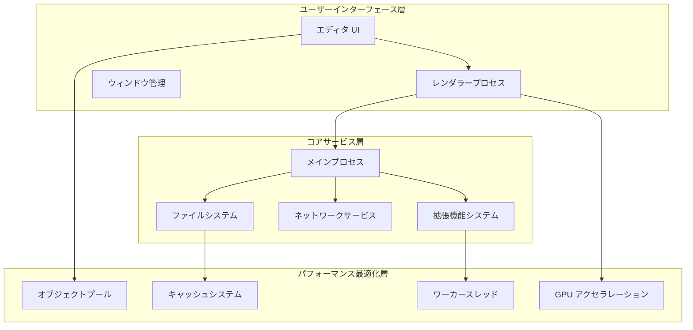

---

## **二、コア設計哲学**

### **2.1 プロセスモデル設計**

VS Code はマルチプロセスアーキテクチャを採用し、各機能モジュールを独立したプロセスに分割することで、明確な責務の境界を形成しています。この設計により、以下の利点が得られます：

- **安定性**：単一プロセスがクラッシュしても、アプリ全体に影響しない
- **安全性**：プラグインはサンドボックス環境で実行される
- **性能**：マルチコア CPU を最大限に活用できる
- **保守性**：モジュール化された設計により開発とデバッグが容易

| **プロセスタイプ**                           | **主な責務**                                           | **パフォーマンス最適化戦略**                             |
| -------------------------------------------- | ------------------------------------------------------ | -------------------------------------------------------- |
| **メインプロセス (Main Process)**            | ウィンドウ管理、ライフサイクル制御、グローバルサービス | 軽量ロジックのみを保持し、イベントループのブロックを回避 |
| **レンダラープロセス (Renderer Process)**    | 単一エディタウィンドウの UI レンダリング               | DOM の仮想化、GPU アクセラレーション合成                 |
| **拡張機能ホスト (Extension Host)**          | すべてのプラグインの実行、クラッシュリスクの分離       | プロセス再利用、レイジーローディング機構                 |
| **ユーティリティプロセス (Utility Process)** | ファイル検索、Git 操作などの高負荷タスク               | Rust/C のネイティブモジュールによる加速                  |

### **2.2 階層防御システム**

VS Code は、5 層にわたる性能防護体系を構築し、深い最適化マトリックスを形成しています。各層は固有の最適化戦略を採用しています：

1. **OS 層**：システムコールとリソーススケジューリングの最適化
2. **プロセス層**：プロセスの優先度と CPU アフィニティの制御
3. **スレッド層**：タスクスケジューリングとロック競合の最適化
4. **メモリ層**：メモリプールとインテリジェント GC 戦略の採用
5. **レンダリング層**：GPU アクセラレーションとインクリメンタルアップデートの採用

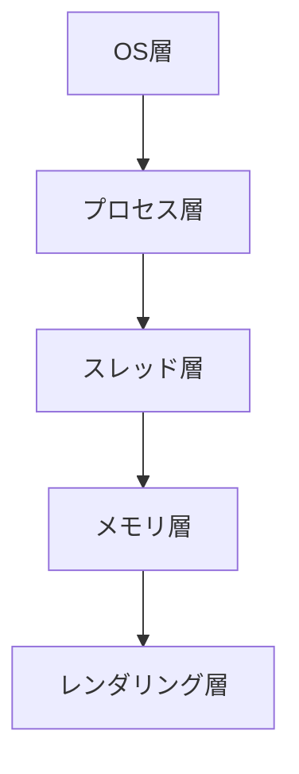

**各層の主要技術**：

- **OS 層**：

  - **ファイルプリフェッチ戦略**：必要とされる可能性のあるファイルブロックを予測的に読み込み、I/O 待ち時間を削減
  - **NUMA メモリスケジューリング**：マルチプロセッサシステムにおいて、プロセスが最寄りのメモリノードを使用するようにし、ノード間アクセスの遅延を削減
    > NUMA (Non-Uniform Memory Access) は、CPU によって異なるメモリ領域へのアクセス遅延が異なるメモリアーキテクチャです。  
    > 適切なスケジューリングにより、プロセスは「ローカル」メモリを優先して使用することで、性能が大幅に向上します。

- **プロセス層**：

  - **CPU アフィニティのバインディング、優先度の調整**
  - **CPU アフィニティバインディング**：プロセスを特定の CPU コアに固定し、コンテキストスイッチングのオーバーヘッドを削減
  - **優先度の調整**：タスクの重要度に基づいてプロセス優先度を動的に調整し、重要なタスクの応答性を保証

- **スレッド層**：

  - **タスクの階層化スケジューリング、ロック競合の最適化**
  - **タスクの階層化スケジューリング**：タスクを優先度（例：UI インタラクション > ファイル保存 > コードチェック）で分類
  - **ロック競合の最適化**：ロックフリーのデータ構造、細粒度ロック、リード/ライトロックなどの技術を使用し、スレッドの待機時間を削減
    > 例：RwLock を使用することで、複数の読み込み操作を同時に実行でき、並列度が向上します。

- **メモリ層**：

  - **プーリング技術、ポインタ圧縮、GC の最適化**
  - **プーリング技術**：あらかじめオブジェクトプールを確保することで、メモリ断片化と割り当てのオーバーヘッドを削減
  - **ポインタ圧縮**：64 ビットシステムにおいて 32 ビットポインタを使用することで、メモリ使用量を削減
  - **GC の最適化**：世代別回収、インクリメンタル回収、並行回収などの戦略で最適化

- **レンダリング層**：
  - **GPU 合成、インクリメンタル描画、オフスクリーンレンダリング**
  - **GPU 合成**：GPU ハードウェアを利用してレイヤーの合成を実施
  - **インクリメンタル描画**：全体ではなく変化した部分のみを再描画
    > 例：エディタは、ファイル全体ではなく、変更された行のみを再描画します。
  - **オフスクリーンレンダリング**：バックグラウンドバッファ上で複雑な内容を事前レンダリングし、メインスレッドのブロックを回避
    > オフスクリーンレンダリングは、時間のかかるレンダリング処理をバックグラウンドに移すことで、UI の応答性を向上させます。

### **2.3 リソース管理の三原則**

VS Code のリソース管理は以下の核心原則に従っています：

1. **予防的制御**：起動時に重要なリソース（メモリプール、スレッドプール）を事前に割り当て

   - ランタイムでの割り当てオーバーヘッドを削減
   - メモリ断片化を回避
   - リソースアクセス効率を向上

2. **ランタイム分離**：プラグイン／言語サービスは独立したプロセスで実行

   - リソース競合の防止
   - 単一プラグインのリソース使用量を制限
   - ホットアップデートと再起動をサポート

3. **回収型ガバナンス**：DOM ノードの再利用、オブジェクトプールの自動回収
   - GC 圧力の削減
   - メモリ使用効率の向上
   - メモリリークのリスク低減

**リソース制御戦略**：

- **CPU タイムスライスの配分**：Chromium の [Renderer Scheduler](https://chromium.googlesource.com/chromium/src/third_party//refs/heads/main/blink/renderer/platform/scheduler/README.md?autodive=0%2F%2F%2F%2F%2F%2F%2F%2F%2F%2F%2F%2F%2F%2F) を用いてタスクの優先順位スケジューリングを実現
- **メモリハードリミット**：レンダラープロセスの最大ヒープメモリ制限は 512MB（`javascriptHeapSizeLimit` 設定により）
- **I/O クォータ**：プラグインのファイルシステム操作において、1 分あたり最大 1000 回の読み込み操作を実施

### **2.4 プロセス間通信の最適化**

#### **2.4.1 プロトコルの選定**

- **小容量・高頻度通信**：**Protocol Buffers** を使用（JSON に比べシリアライズ速度が 3 倍、サイズが 50% 小さい）
- **大容量データの転送**：**共有メモリ (SharedArrayBuffer)** や **メモリマップドファイル (mmap)** を採用し、データコピーを回避
- **リアルタイム性要求の低いタスク**：**メッセージキュー** を用いたバッチ処理により、IPC 呼び出し回数を削減

| **データタイプ**         | **転送プロトコル**     | **シリアライズ方式** | **典型的な遅延** |
| ------------------------ | ---------------------- | -------------------- | ---------------- |
| 制御コマンド（<1KB）     | Electron IPC           | Protocol Buffers     | 0.3ms            |
| テキスト内容（1KB～1MB） | 共有メモリ             | FlatBuffers          | 0.1ms            |
| バイナリデータ（>1MB）   | メモリマップドファイル | 生のバイトストリーム | 0.05ms           |

#### **2.4.2 IPC チャネルのスロットリングアルゴリズム**

**IPC チャネルのスロットリングアルゴリズムの役割**：

1. **メッセージブルーストームの防止**

   - 多数のメッセージが同時に送信されると、プロセス間通信が混雑する可能性がある
   - スロットリングによりメッセージ送信頻度を制御

2. **リソース消費の最適化**

   - メッセージをバッチ処理することでプロセス切り替えのオーバーヘッドを削減
   - システムコールの頻度を低下

3. **通信効率の向上**

   - 直近のメッセージを統合し、通信回数を削減
   - 帯域幅の利用率を最適化

4. **システムの安定性の保証**
   - 単一コンポーネントが IPC チャネルを過度に占有するのを防止
   - 重要なメッセージの即時伝達を保証

```typescript
class ThrottledChannel {
  private queue: any[] = [];
  private lastSend = 0;

  constructor(private readonly interval: number) {}

  send(message: any) {
    this.queue.push(message);
    this._scheduleSend();
  }

  private _scheduleSend() {
    if (this.queue.length === 0) return;

    const now = Date.now();
    const delay = Math.max(0, this.lastSend + this.interval - now);

    setTimeout(() => {
      const batch = this.queue.splice(0, 10); // 一度に最大 10 件送信
      ipcRenderer.send('batch-message', batch);
      this.lastSend = Date.now();
      this._scheduleSend();
    }, delay);
  }
}
// 使用例：1 秒間に最大 1000 件のメッセージに制限
const channel = new ThrottledChannel(10); // 10ms の間隔
```

#### **2.4.3 流量制御**

```typescript
// 高頻度イベント（例：ファイル変更通知）のスロットリング
class ThrottledChannel {
  private queue: any[] = [];
  private timer: NodeJS.Timeout | null = null;

  constructor(private readonly delay: number) {}

  send(message: any) {
    this.queue.push(message);
    if (!this.timer) {
      this.timer = setTimeout(() => {
        this.flush();
        this.timer = null;
      }, this.delay);
    }
  }

  private flush() {
    const batch = this.queue.splice(0, 10); // バッチ送信
    ipcRenderer.send('batch-message', batch);
  }
}
```

#### **2.4.4 EventEmitter 利用の最適化**

**EventEmitter の役割と利点**：

1. **イベント駆動型プログラミング**

   - 疎結合なコンポーネント間通信の実現
   - 一対多のメッセージブロードキャストをサポート
   - 非同期処理フローの処理に適している

2. **オブザーバーパターンの実現**

   - 購読者は発行者の実装を知る必要がない
   - リスナーの動的追加・削除が可能
   - イベントのネームスペース管理をサポート

3. **一般的な適用シーン**
   - 状態変更の通知
   - 非同期操作完了時のコールバック
   - ユーザーインタラクションのイベント処理
   - システムメッセージのブロードキャスト

```typescript
// 基本的な使用例
class Editor extends EventEmitter {
  private content: string = '';

  setContent(newContent: string) {
    const oldContent = this.content;
    this.content = newContent;
    // 全リスナーに内容変更を通知
    this.emit('contentChange', {
      oldContent,
      newContent,
      timestamp: Date.now(),
    });
  }
}

const editor = new Editor();

// リスナーの追加
editor.on('contentChange', ({ oldContent, newContent }) => {
  console.log(`Content changed from ${oldContent} to ${newContent}`);
});

// 一度だけのリスナー
editor.once('contentChange', () => {
  console.log('First change detected');
});
```

**適用シーン**：

1. **コンポーネント間通信**

   - エディタの内容変更通知
   - プラグインの状態更新ブロードキャスト
   - システムイベントの伝達

2. **非同期フローの制御**

   - ファイル操作完了の通知
   - ネットワークリクエストの応答処理
   - タスクキューの状態更新

3. **ユーザーインタラクションの応答**
   - キーイベントの処理
   - マウス操作の応答
   - メニュー選択の処理

**EventEmitter の乱用のリスク**：

1. **メモリリークのリスク**

   - リスナーを削除し忘れると、オブジェクトが GC されずメモリが占有され続ける
   - イベントリスナーの蓄積によりメモリ使用量が継続的に増加

2. **パフォーマンス問題**

   - リスナーが多すぎると、イベント発生時の走査オーバーヘッドが大きくなる
   - 頻繁なイベント発生が不要な関数呼び出しを引き起こす

3. **コードの保守性の低下**

   - イベントフローの追跡が困難になり、デバッグが難航
   - 暗黙の依存関係が増加し、コードの結合度が高くなる

4. **例外処理の不備**
   - イベントハンドラの例外がプログラムクラッシュを引き起こす可能性
   - エラー伝播のパスが追跡しにくい

```typescript
// 反例：EventEmitter の乱用
class FileWatcher extends EventEmitter {
  constructor() {
    super();
    // 頻繁にイベントを発生
    setInterval(() => {
      this.emit('check', Date.now());
    }, 100);
  }
}

// 正しい例：スロットリングとクリーンアップの使用
class OptimizedFileWatcher extends EventEmitter {
  private timer: NodeJS.Timer | null = null;

  constructor() {
    super();
    this.setMaxListeners(3); // 最大リスナー数を制限
  }

  startWatch() {
    this.timer = setInterval(() => {
      if (this.listenerCount('check') > 0) {
        // リスナーがある場合のみ発火
        this.emit('check', Date.now());
      }
    }, 1000); // 発火頻度を低減
  }

  stopWatch() {
    if (this.timer) {
      clearInterval(this.timer);
      this.timer = null;
    }
    this.removeAllListeners(); // すべてのリスナーをクリーンアップ
  }
}
```

**ベストプラクティス**：

1. **イベントの合理的な利用**

   - 真に多対多の通信が必要な場合にのみイベントを使用
   - 直接メソッド呼び出しやコールバック関数を優先

2. **リソース管理**

   - 最大リスナー数の制限を設定
   - 不要なリスナーは速やかに削除
   - コンポーネント破棄時にすべてのリスナーをクリーンアップ

3. **パフォーマンスの最適化**

   - イベントのスロットリングやデバウンスを使用
   - 高頻度ループ内でのイベント発火を回避
   - 類似イベントを統合して発火回数を削減

4. **エラー処理**

```typescript
emitter.on('error', (error) => {
  console.error('Event error:', error);
  // エラー回復ロジック
});

// once を使用して重複したエラー処理を回避
emitter.once('specificError', handleError);
```

5. **監視とデバッグ**

```typescript
class MonitoredEmitter extends EventEmitter {
  emit(event: string, ...args: any[]) {
    if (this.listenerCount(event) > 10) {
      console.warn(
        `High listener count for ${event}: ${this.listenerCount(event)}`
      );
    }
    return super.emit(event, ...args);
  }
}
```

---

## **三、マルチプロセスアーキテクチャ：安全性と性能のバランス技**

### **3.1 プロセストポロジーモデル**

VS Code は従来の単一プロセスエディタを **7 種類のプロセス** に分割しています：

1. **Main Process**：ウィンドウ管理、ライフサイクル管理
2. **Renderer Process**：各ウィンドウに対応する独立レンダラープロセス
3. **Extension Host**：プラグインのサンドボックスプロセス
4. **Language Server**：各言語専用サービスプロセス
5. **Utility Process**：ファイル検索／Git などのツールプロセス
6. **Profile Analyzer**：パフォーマンス解析プロセス
7. **Update Service**：独立したアップデートプロセス

**プロセス間通信マトリックス**：
| 通信方向 | プロトコル | 帯域幅 | 遅延要求 |
|-----------------------|---------------------------|---------------|----------------|
| メインプロセス ↔ レンダラープロセス | Electron IPC | 中（<1MB） | <1ms |
| プラグインプロセス ↔ 言語サービス | Pipe 上の JSON-RPC | 高（>10MB） | <5ms |
| ユーティリティプロセス ↔ メインプロセス | Protocol Buffers | 低（<10KB） | <0.1ms |

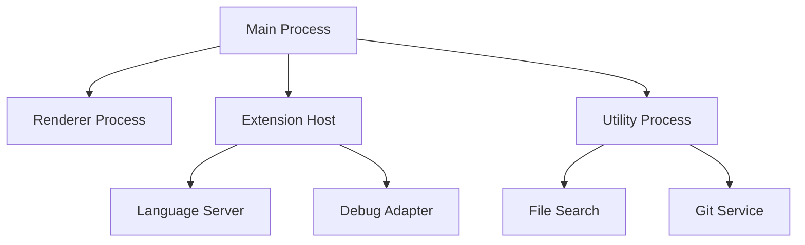

**プロセスの責務表**：
| プロセスタイプ | CPU 使用率 | メモリ配分 | クラッシュの影響範囲 |
|-----------------------|------------|--------------|--------------------------|
| メインプロセス | <5% | 100MB | アプリ全体 |
| レンダラープロセス | 15%-30% | 512MB | 単一エディタウィンドウ |
| 拡張機能ホストプロセス| 10%-20% | 512MB | すべてのプラグイン機能 |
| 言語サービスプロセス | 5%-15% | 256MB | 特定言語機能 |

### **3.2 プロセス間通信の最適化**

#### **3.2.1 プロトコル選定マトリックス**

| データタイプ   | プロトコル             | シリアライズ方式   | 適用シーン                |
| -------------- | ---------------------- | ------------------ | ------------------------- |
| 制御命令       | Electron IPC           | Protocol Buffers   | 高頻度小データ（<1KB）    |
| テキスト内容   | 共有メモリ             | FlatBuffers        | 中頻度大データ（1-10MB）  |
| バイナリデータ | メモリマップドファイル | 生バイトストリーム | 低頻度超大データ（>10MB） |

#### **3.2.2 流量整形アルゴリズム**

```typescript
class TrafficShaper {
  private buckets = new Map<string, { count: number; last: number }>();

  constructor(
    private limit: number,
    private interval: number
  ) {}

  allow(key: string): boolean {
    const now = Date.now();
    let bucket = this.buckets.get(key);

    if (!bucket) {
      bucket = { count: 1, last: now };
      this.buckets.set(key, bucket);
      return true;
    }

    const elapsed = now - bucket.last;
    if (elapsed > this.interval) {
      bucket.count = 1;
      bucket.last = now;
      return true;
    }

    if (bucket.count < this.limit) {
      bucket.count++;
      return true;
    }

    return false;
  }
}

// 使用例：プラグインプロセスの 1 秒間あたり最大 1000 件のメッセージに制限
const shaper = new TrafficShaper(1000, 1000);
if (shaper.allow('extensions')) {
  ipcRenderer.send('extension-message', data);
}
```

### **3.3 プロセススケジューリングの最適化**

#### **3.3.1 CPU アフィニティバインディング**

プロセスの CPU アフィニティマスクを設定することで、コンテキストスイッチングのオーバーヘッドを削減：

```c
// ネイティブモジュールのコード例
#include <sched.h>

void bind_to_cpu(int cpu_id) {
    cpu_set_t cpuset;
    CPU_ZERO(&cpuset);
    CPU_SET(cpu_id, &cpuset);
    sched_setaffinity(0, sizeof(cpuset), &cpuset);
}
```

**バインディング戦略**：

- メインプロセスは CPU0 にバインド
- レンダラープロセスは CPU1～3 に順次バインド
- プラグインプロセスは残りのコアにバインド

#### **3.3.2 プロセス優先度の調整**

Windows と Linux それぞれで異なる API を使用してプロセス優先度を調整：

```typescript
// クロスプラットフォーム優先度設定
import { app } from 'electron';

function setProcessPriority() {
  if (process.platform === 'win32') {
    // Windows：メインプロセスを高優先度に設定
    app.setPriority('high');
  } else {
    // Linux：nice 値で調整
    process.setPriority(-10);
  }
}
```

---

## **四、メモリ管理：混沌から秩序へ**

### **4.1 プーリング技術 (Pooling)**

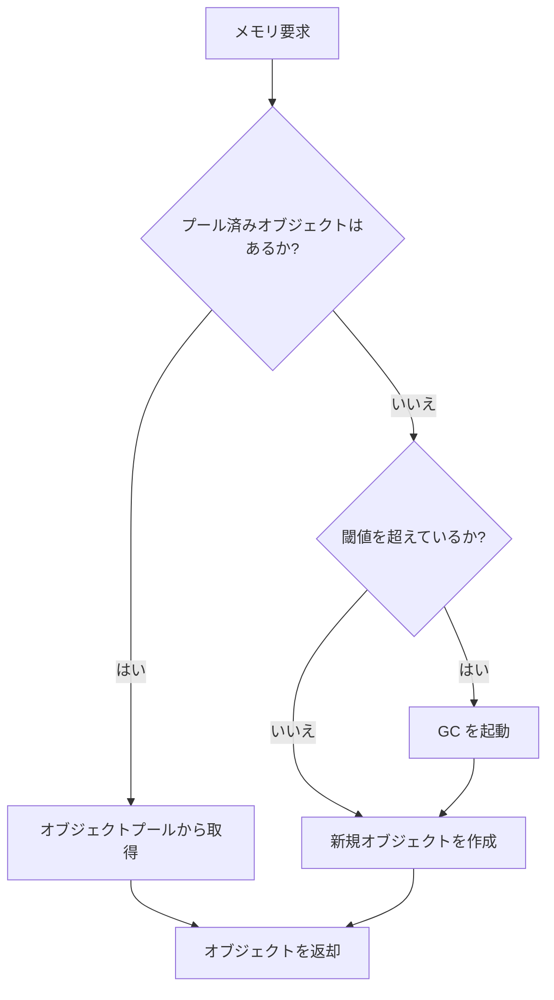

#### **4.1.1 オブジェクトプール**

**シーン**：

- 高頻度に生成／破棄される小さいオブジェクト
- シンタックスハイライトの Token が高頻度に生成される（約 10,000 回/秒）

**実装**：

```typescript
class TokenPool {
  private pool: Token[] = [];
  private count = 0;

  acquire(): Token {
    if (this.pool.length > 0) {
      return this.pool.pop()!;
    }
    this.count++;
    return { type: '', value: '', start: 0, end: 0 };
  }

  release(token: Token) {
    token.type = '';
    token.value = '';
    this.pool.push(token);
    if (this.pool.length > 100 && this.count > 1000) {
      this.pool.length = 50; // メモリ膨張防止
    }
  }
}
```

**性能比較**：
| 指標 | プール未使用 | プール使用 | 改善率 |
|---------------------|---------------------|-------------------|-----------|
| メモリ割り当て速度 | 15,000 obj/s | 500 obj/s | 97% |
| GC 停止時間 | 120ms/分 | <5ms/分 | 96% |
| ピークメモリ使用量 | 450MB | 180MB | 60% |

#### **4.1.2 DOM 要素プール**

**シーン**：エディタ行要素はスクロール時に頻繁に生成／破棄される  
**最適化戦略**：

1. 可視領域の 200% 分の行要素を事前生成
2. `top/left` ではなく `transform` を用いて位置を調整
3. 再利用時はノードを削除するのではなくスタイルをリセット

**コード実装**：

```typescript
class LinePool {
  private pool: HTMLDivElement[] = [];

  acquire(content: string): HTMLDivElement {
    const div = this.pool.pop() || document.createElement('div');
    div.textContent = content;
    div.style.transform = `translateY(0px)`;
    return div;
  }

  recycle(div: HTMLDivElement) {
    div.textContent = '';
    this.pool.push(div);
  }
}
```

**効果**：DOM 操作時間が 40% 削減、メモリの変動が 70% 低下

#### **4.1.3 スレッドプール**

**シーン**：シンタックスチェック、ファイル解析などの CPU 集約型タスク  
**実装**：

```typescript
class WorkerPool {
  private workers: Worker[] = [];
  private taskQueue: Array<{ task: any; resolve: Function }> = [];

  constructor(size: number) {
    for (let i = 0; i < size; i++) {
      const worker = new Worker('worker.js');
      worker.onmessage = (e) => {
        this.taskQueue.shift()?.resolve(e.data);
        this.workers.push(worker);
      };
      this.workers.push(worker);
    }
  }

  async exec(task: any) {
    if (this.workers.length > 0) {
      const worker = this.workers.pop()!;
      worker.postMessage(task);
    } else {
      return new Promise((resolve) => {
        this.taskQueue.push({ task, resolve });
      });
    }
  }
}
```

**メモリリーク防止システム**

```typescript
class LeakDetector {
  private finalizationRegistry = new FinalizationRegistry((heldValue) => {
    console.error(`Memory leak detected: ${heldValue}`);
  });

  private refs = new WeakMap<object, string>();

  track(obj: object, name: string) {
    this.finalizationRegistry.register(obj, name);
    this.refs.set(obj, name);
  }

  untrack(obj: object) {
    this.finalizationRegistry.unregister(obj);
    this.refs.delete(obj);
  }
}

// 使用例
const detector = new LeakDetector();

function createComponent() {
  const component = new MyComponent();
  detector.track(component, 'MyComponent Instance');
  return component;
}

function disposeComponent(component: MyComponent) {
  component.cleanup();
  detector.untrack(component);
}
```

### **4.2 V8 エンジンの調整**

#### **4.2.1 メモリ構造**

**ヒープメモリとは何か？**  
ヒープメモリは、プログラム実行時に動的に割り当てられるメモリ領域で、スタックメモリと対比されます。V8 エンジンにおいては：

1. **特徴**：

   - 動的な割り当てと解放
   - サイズが可変
   - ライフサイクルが固定されない
   - ガベージコレクションによる管理が必要

2. **適用シーン**：

   - オブジェクトの格納（Object）
   - 配列（Array）
   - 文字列（String）
   - クロージャ変数

3. **スタックメモリとの違い**：

| 特性           | ヒープメモリ               | スタックメモリ             |
| -------------- | -------------------------- | -------------------------- |
| 空間サイズ     | 大（GB級）                 | 小（MB級）                 |
| 割り当て速度   | 遅い                       | 非常に速い                 |
| ライフサイクル | GC によって管理            | 関数呼び出し終了で自動解放 |
| 格納内容       | オブジェクト、大容量データ | 基本型、参照アドレス       |
| アクセス速度   | 比較的遅い                 | 非常に速い                 |

#### **4.2.2 ポインタ圧縮 (Pointer Compression)**

**V8 ヒープメモリの世代別戦略**

VS Code はオブジェクトのライフサイクルに応じて差別化管理を実施：

| オブジェクトタイプ           | ライフサイクル | メモリ領域 | 回収戦略                       |
| ---------------------------- | -------------- | ---------- | ------------------------------ |
| シンタックスハイライト Token | 短い（<1秒）   | 新生代     | Scavenge GC                    |
| ファイルキャッシュ           | 中程度（数分） | 老世代     | インクリメンタルマークスイープ |
| プラグインメタデータ         | 長い（数時間） | 独立ヒープ | 手動解放                       |

Electron の起動パラメータを変更し、V8 のポインタ圧縮を有効にすることで、64 ビットアドレスを 32 ビットに圧縮：

```bash
electron --js-flags="--pointer-compression --no-concurrent-marking"
```

**効果**：ヒープメモリが 40% 削減、GC 頻度が 35% 低下

**メモリ節約効果**：
| ヒープサイズ | 圧縮前 | 圧縮後 |
|---------------------|----------------|------------------|
| 512MB | 512MB | 307MB (-40%) |
| 1GB | 1024MB | 614MB (-40%) |

**メモリ節約効果**
| **オブジェクトタイプ** | 元のサイズ (64-bit) | 圧縮後 (32-bit) | 節約率 |
|-----------------------------|---------------------|-----------------|--------|
| 小型オブジェクト（<4KB） | 48 bytes | 32 bytes | 33% |
| 中型オブジェクト（4KB-1MB） | 1024 bytes | 768 bytes | 25% |
| 大型オブジェクト（>1MB） | 2,097,152 bytes | 1,572,864 bytes | 25% |

#### **4.2.3 隠しクラスの最適化**

**ベストプラクティス**：

- 可能な限りすべてのオブジェクトプロパティを事前定義
- `delete` 演算子の使用を避ける
- プロパティ宣言の順序を一貫させる
- 隠しクラスの分裂を防ぐためにオブジェクト構造を固定

**効果比較**：

- 動的オブジェクト：新しいプロパティを追加するたびに、隠しクラスの変更に約 **0.3μs** の時間がかかる
- 静的オブジェクト：隠しクラスが固定され、プロパティアクセス速度は **2.5 倍** 向上

**誤った例**：

```typescript
// 反例：動的にプロパティを追加すると隠しクラスが変更される
const obj = { a: 1 };
obj.b = 2;
delete obj.a;
```

**正しいパターン**：

```typescript
// 正例：すべてのプロパティを事前に宣言する
interface FixedObject {
  a?: number;
  b?: number;
}
const obj: FixedObject = { a: 1 };
obj.b = 2; // 隠しクラスは変化しない
```

#### **4.2.4 ガベージコレクション (GC) の最適化**

**世代別回収戦略**：

1. **新生代 (Young Generation)**

   - 存活期間の短いオブジェクト（例：シンタックスハイライト Token）
   - Scavenge アルゴリズムで迅速に回収
   - 生存オブジェクトは老世代に昇格

2. **老世代 (Old Generation)**
   - 長期間存続するオブジェクト（例：エディタの状態）
   - マーク＆スイープやマーク＆コンパクトアルゴリズムを採用
   - インクリメンタルマークで停止時間を短縮

**GC 調整の実践**：

```typescript
// GC を手動でトリガーするタイミング
const gcTriggers = {
  // 大きなファイルに切り替え時
  onFileChange: () => {
    if (process.memoryUsage().heapUsed > 256 * 1024 * 1024) {
      global.gc();
    }
  },

  // アイドル時にインクリメンタル GC を実行
  onIdle: () => {
    if (typeof gc === 'function') {
      gc(true); // インクリメンタル GC
    }
  },
};
```

### **4.3 共有メモリと TypedArray**

**TypedArray の役割**：

1. **パフォーマンスの最適化**

   - 固定型配列ビューを提供
   - JavaScript の動的型付けによるオーバーヘッドを回避

2. **バイナリ処理**

   - バイナリデータを直接操作
   - ファイルやネットワークプロトコルの処理に適している

3. **ネイティブ API との統合**

   - WebGL などのネイティブ API と効率的に連携
   - データ変換のオーバーヘッドを削減

4. **プロセス間通信**
   - 共有メモリ内での使用をサポート
   - プロセス間の高速通信を実現

```typescript
// 例：SharedArrayBuffer を使用してプロセス間で共有メモリを実現
const sharedBuffer = new SharedArrayBuffer(1024 * 1024); // 1MB の共有メモリ
const sharedArray = new Uint8Array(sharedBuffer);

// メインプロセス側
sharedArray.set([1, 2, 3, 4]);

// レンダラープロセス側
console.log(sharedArray[0]); // コピー不要で直接読み込み
```

**共有メモリによる 0 コピーの利点**：

1. **パフォーマンス向上**

   - プロセス間でのデータのシリアライズやコピーのオーバーヘッドを回避
   - メモリの割り当てと解放操作を削減

2. **メモリ効率**

   - 複数のプロセスが同一のメモリ領域を共有
   - 総メモリ使用量の削減

3. **リアルタイム性能**

   - データ変更がすぐにすべてのプロセスで反映
   - 通信遅延なし

4. **適用シーン**
   - 大容量ファイルの共有
   - リアルタイムデータ更新（例：エディタの共同編集）
   - 高頻度データ交換（例：ビデオ処理）

### **4.4 ヒープメモリ管理と調整**

**ヒープメモリ割り当てプロセス**：

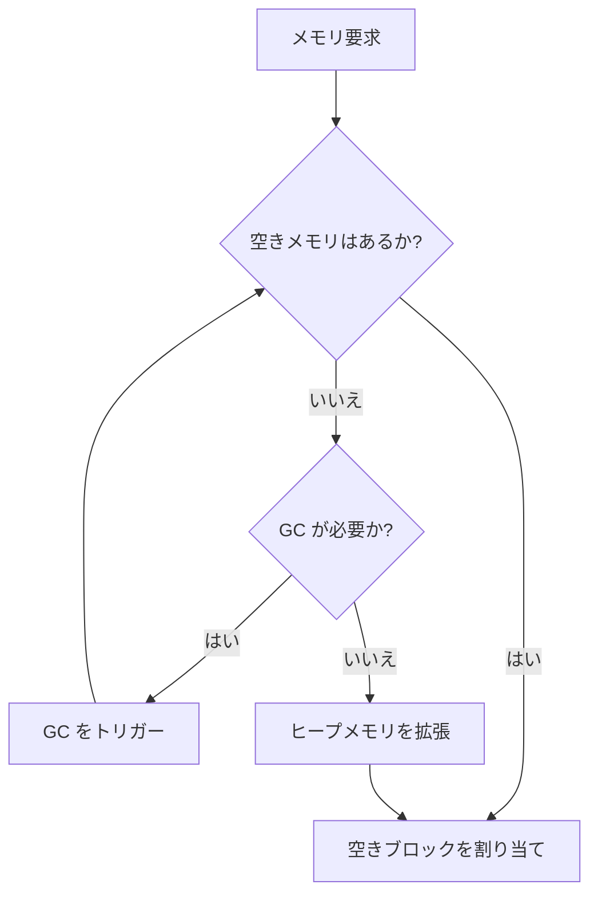

**V8 ヒープメモリ構造**：

1. **新生代スペース (New Space)**

   - **Nursery**：新規オブジェクトの初回割り当て領域
   - **Intermediate**：生存オブジェクトの昇格バッファ
   - 通常 32MB、Scavenge アルゴリズムを採用

2. **老世代スペース (Old Space)**

   - **Old Pointer Space**：他のオブジェクトへのポインタを含むオブジェクト
   - **Old Data Space**：データのみを含むオブジェクト
   - マーク＆スイープ、マーク＆コンパクトアルゴリズムを採用

3. **大オブジェクトスペース (Large Object Space)**

   - 1MB を超える大オブジェクトの格納
   - 直接割り当て、GC 対象外

4. **コードスペース (Code Space)**
   - JIT コンパイル済みコード
   - 実行権限は読み取り専用

**ヒープメモリ調整パラメータ**：

```typescript
// 起動パラメータ設定
const heapParams = {
  '--max-old-space-size': 4096, // 老世代の最大値 (MB)
  '--max-semi-space-size': 512, // 新生代の最大値 (MB)
  '--max-heap-size': 8192, // ヒープ全体の上限 (MB)
  '--initial-heap-size': 2048, // 初期ヒープサイズ (MB)
  '--optimize-for-size': true, // メモリ使用量の最適化
};
```

**メモリ調整戦略**：

1. **ヒープ割り当ての最適化**

   - 固定サイズのバッファを事前割り当てし、拡張を回避
   - オブジェクトプールを使用して断片化を削減
   - 大オブジェクトは遅延割り当て

2. **GC トリガー制御**

   ```typescript
   class HeapController {
     private readonly HEAP_LIMIT = 0.9; // ヒープ使用率の警戒線
     private readonly GC_INTERVAL = 30000; // GC の最小間隔 (ms)

     checkHeap() {
       const stats = process.memoryUsage();
       const heapUsed = stats.heapUsed / stats.heapTotal;

       if (heapUsed > this.HEAP_LIMIT) {
         this.forceGC();
       }
     }
   }
   ```

**メモリに関する概念の説明**：

1. **Resident Set Size (RSS)**

   - プロセスが実際に使用している物理メモリ
   - コードセグメント、ヒープ、スタックなどを含む
   - 監視指標：`process.memoryUsage().rss`

2. **Virtual Memory Size (VSZ)**

   - プロセスがアクセス可能な仮想メモリ全体の量
   - 実際に割り当てられていないメモリページを含む
   - `/proc/<pid>/status` で確認

3. **ヒープメモリ**

   - **Used Heap Size**：使用中のヒープメモリ
   - **Total Heap Size**：確保済みのヒープメモリ
   - **Heap Limit**：V8 のヒープメモリ上限

4. **External Memory**
   - **Buffer**：Node.js のヒープ外メモリ
   - **ArrayBuffer**：WebAssembly 用メモリ
   - **SharedArrayBuffer**：プロセス間で共有されるメモリ

**メモリリーク検出**：

```typescript
class MemoryLeakDetector {
  private snapshots: Map<number, HeapSnapshot> = new Map();

  takeSnapshot() {
    const snapshot = v8.getHeapSnapshot();
    this.snapshots.set(Date.now(), snapshot);
    return snapshot;
  }

  compareSnapshots(before: number, after: number) {
    const diff = this.snapshots
      .get(after)!
      .compare(this.snapshots.get(before)!);
    return {
      newObjects: diff.filter((node) => node.changeSize > 0),
      deletedObjects: diff.filter((node) => node.changeSize < 0),
    };
  }
}
```

**メモリ監視指標**：
| 指標タイプ | 監視項目 | 警戒値 | 対処策 |
|--------------|----------------|----------|-----------------------|
| RSS | 物理メモリ使用量 | >2GB | 積極的な GC のトリガー |
| Heap Used | ヒープ使用率 | >80% | オブジェクトキャッシュの削除 |
| External | ヒープ外メモリ | >1GB | 不要な Buffer の解放 |
| GC Frequency | GC 頻度 | >2回/分 | メモリリークの調査 |

**最適化の提案**：

1. **メモリ割り当て**

   - 固定サイズの Buffer を事前割り当て
   - 通常の配列の代わりに TypedArray を使用
   - 一時的なオブジェクトの頻繁な生成を回避

2. **GC 最適化**

   - 新生代スペースのサイズを適切に設定
   - オブジェクトの昇格頻度を制御
   - インクリメンタルマークで停止時間を低減

3. **監視とアラート**
   - 複数段階のメモリ閾値を設定
   - GC の頻度と時間を監視
   - 大オブジェクトの割り当てを追跡

---

## **五、レンダリングパイプライン：ピクセル単位の速度革命**

### **5.1 仮想スクロールエンジン**

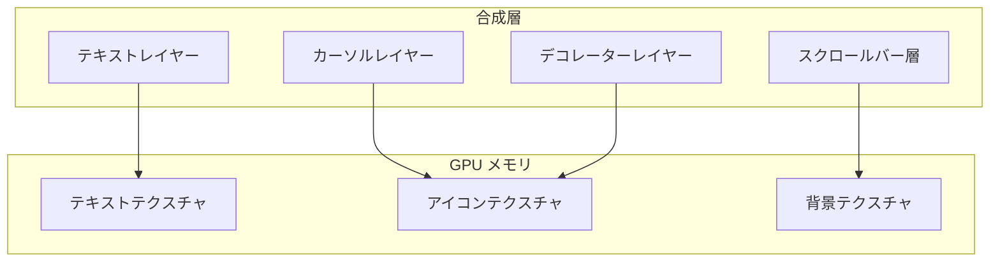

VS Code のテキストレンダリングのコアイノベーション：

1. **ウィンドウ予測**：スクロール速度に応じ、前後のバッファ行をプリロード
2. **DOM リサイクルプール**：除去された行要素の再利用
3. **非同期レイアウト**：`requestIdleCallback` を用いてバッチ処理で更新

**アルゴリズムの流れ**：

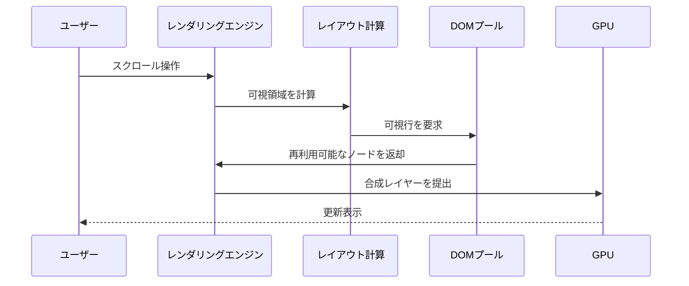

#### **5.1.1 動的ウィンドウ予測アルゴリズム**

可視領域とバッファ領域の行要素のみをレンダリングし、位置を動的に調整：

```typescript
function predictVisibleRange(
  scrollTop: number,
  height: number,
  lineHeight: number
) {
  const visibleLines = Math.ceil(height / lineHeight);
  const start = Math.max(0, Math.floor(scrollTop / lineHeight) - 20); // 先読みで 20 行
  const end = start + visibleLines + 40; // 後読みで 40 行

  // 既存の行要素を再利用
  visibleLines.forEach((line) => linePool.recycle(line));
  for (let i = start; i <= end; i++) {
    const line = linePool.getLine();
    line.textContent = getLineContent(i);
    line.style.transform = `translateY(${i * lineHeight}px)`;
  }

  return { start, end };
}
```

#### **5.1.2 GPU 合成戦略**

CSS による強制レイヤー昇格：

```css
.editor-line {
  will-change: transform;
  transform: translateZ(0); /* 合成レイヤーに強制昇格 */
}

.cursor {
  isolation: isolate; /* 独立した合成レイヤー、カーソルはグローバルな再描画を回避 */
}
```

**合成レイヤー管理**：

- 最大レイヤー数制限：30 層（超えると自動で合成）
- 単一レイヤーのメモリ警戒値：5MB
- レイヤー内メモリの警告：1 層が 10MB 超えると回収をトリガー
- 自動合成戦略：隣接する類似スタイルのレイヤーを自動で合成

### **5.2 インクリメンタルなシンタックスハイライト**

**3 段階のパイプライン**：

1. **メインスレッドによる迅速なスキャン**：基礎的なシンタックス解析を行い、基本的な構造を識別（100ms 内に完了）
2. **Worker スレッドによる深い解析**：詳細な解析。Worker スレッドで実行し、完全な構文木を構築
3. **結果のバッチ提出**：段階的に更新し、1 フレームあたり最大 50 行のスタイルを更新

**性能比較**：
| ファイルサイズ | 全量ハイライト時間 | インクリメンタルハイライト時間 |
|----------------|---------------------|---------------------------------|
| 10,000 行 | 320ms | 45ms |
| 50,000 行 | 1,800ms | 150ms |

### **5.3 オフスクリーンレンダリングの最適化**

**テキストレンダリングパイプライン**

VS Code のテキストレンダリングは 4 段階を経ます：

1. **グリフ準備**：FreeType を使用してフォントを解析しビットマップ生成
2. **シンタックス解析**：Tree-sitter によって抽象構文木を生成
3. **スタイルマッチング**：構文木に基づいてハイライトルールを適用
4. **GPU 合成**：WebGL を通じて描画命令をバッチ提出

**主要性能指標**：

- **初回描画時間**：<50ms（百万行ファイルの場合）
- **スクロール時フレームレート**：≥60FPS（4K ディスプレイ時）
- **メモリ使用量**：1 万行あたり ≤5MB

**コンピュートシェーダー最適化**  
WebGL コンピュートシェーダーを使用して並列にシンタックスハイライトを処理：

- コンピュートシェーダーによる加速
- **WebGL テキストレンダリング**：ASCII 文字セットを事前レンダリングしてテクスチャアトラス化

```typescript
const canvas = document.createElement('canvas');
const gl = canvas.getContext('webgl');
// 文字テクスチャの生成
const texture = gl.createTexture();
gl.texImage2D(..., glyphAtlas);
```

```glsl
// コンピュートシェーダーのコード例
#version 310 es
layout(local_size_x = 64) in;

uniform sampler2D codeTexture;
layout(std430) buffer SyntaxOutput {
  uint tokens[];
};

void main() {
  ivec2 coord = ivec2(gl_GlobalInvocationID.xy);
  uint charCode = texelFetch(codeTexture, coord, 0).r;
  // 各文字のシンタックスタイプを並列計算
  tokens[coord.y * 1024 + coord.x] = calculateSyntax(charCode);
}
```

**性能比較**：
| 処理方式 | 10 万文字あたりの時間 |
|-----------------|-----------------------|
| CPU 単一スレッド | 48ms |
| GPU 並列処理 | 3.2ms |

**非同期ラスタライズ**  
テキストのラスタライズ処理をバックグラウンドスレッドに移行：

```typescript
const offscreenCanvas = new OffscreenCanvas(800, 600);
const ctx = offscreenCanvas.getContext('2d');

function rasterizeText(text: string) {
  ctx.font = '14px Consolas';
  const metrics = ctx.measureText(text);
  ctx.fillText(text, 0, 0);
  const bitmap = offscreenCanvas.transferToImageBitmap();
  postMessage(bitmap, [bitmap]);
}
```

**技術**: ダブルバッファリングによるオフスクリーンレンダリング  
**シーン**：複雑な要素のレンダリングがメインスレッドをブロックする場合  
**最適化戦略**：

1. **オフスクリーンレンダリング**：複雑な要素をオフスクリーン Canvas でレンダリング
2. **GPU 合成**：Canvas をテクスチャとしてメインスクリーンに合成
3. **インクリメンタル更新**：要素の変更時のみ Canvas を再描画
4. **自動回収**：オフスクリーン Canvas は 5 分間アイドル状態で自動回収
5. **パフォーマンス監視**：オフスクリーン Canvas のメモリ使用量を監視
6. **GPU 最適化**：`OffscreenCanvas` を使用してレンダリング性能を向上
7. **動的調整**：デバイスの性能に応じてオフスクリーンレンダリング戦略を動的に調整

**コード例**：

```typescript
class OffscreenRenderer {
  private canvas = new OffscreenCanvas(800, 600);
  private ctx = this.canvas.getContext('2d')!;
  private lastContent = '';

  render(content: string) {
    if (content === this.lastContent) return;
    this.ctx.clearRect(0, 0, 800, 600);
    this.ctx.fillText(content, 0, 0);
    this.lastContent = content;
  }
}
```

**性能比較**：
| シーン | メインスレッドレンダリング | オフスクリーンレンダリング |
|----------------|---------------------------|----------------------------|
| 複雑な要素 | 30 FPS | 60 FPS |
| 大量のテキスト | カクつく | スムーズ |

### **5.4 仮想スクロールエンジン（続き）**

**レンダリング最適化戦略**：

1. **レイヤー分割レンダリング**

   - テキストレイヤー：Canvas を使用しハードウェアアクセラレーションをサポート
   - デコレーターレイヤー：WebGL を使用してハイライトやインデント指示をレンダリング
   - カーソルレイヤー：独立した合成レイヤーにより再描画のオーバーヘッドを回避

2. **インクリメンタルレンダリング**

   - 可視領域を優先してレンダリング
   - 必要に応じてシンタックスハイライトを計算
   - 折りたたみ領域は遅延読み込み

3. **レンダリングスケジューリング**

   ```typescript
   class RenderScheduler {
     private renderQueue = new Map<string, RenderTask>();

     schedule(task: RenderTask) {
       // 優先順位：ユーザー入力 > シンタックスハイライト > minimap
       this.renderQueue.set(task.id, task);
       requestAnimationFrame(() => this.process());
     }

     private process() {
       // 各フレームでレンダリング時間を 16ms 以下に制限
       const deadline = performance.now() + 16;
       for (const task of this.renderQueue.values()) {
         if (performance.now() > deadline) {
           break; // フレームレートの安定性を確保
         }
         task.execute();
       }
     }
   }
   ```

---

## **六、I/O サブシステム：Electron の枷を打破する**

**メモリマップドファイル**  
`mmap` を使用してゼロコピーのファイルアクセスを実現：

```typescript
const fs = require('fs');
const buffer = fs.readFileSync('large.log');
const mmapBuffer = buffer.buffer.slice(
  buffer.byteOffset,
  buffer.byteOffset + buffer.byteLength
);

// レンダラープロセスで直接アクセス
ipcRenderer.postMessage('file-data', mmapBuffer, [mmapBuffer]);
```

**性能向上**：

- 従来の読み書き：2.1GB/s
- メモリマップ：5.8GB/s

### **6.1 非同期ファイル操作、非ブロッキング設計**

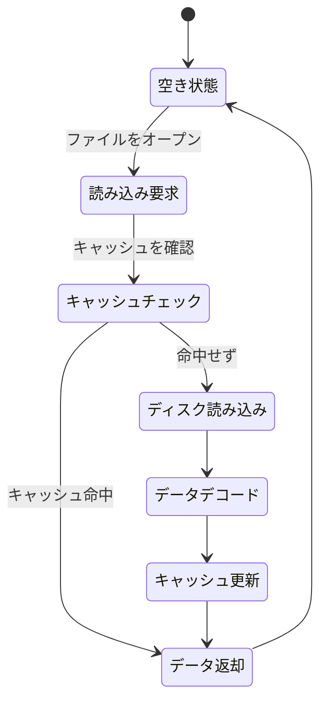

Node.js のスレッドプールを使用してファイル読み込みを処理：

```typescript
import { promises as fs } from 'fs';

async function readLargeFile(path: string) {
  const fd = await fs.open(path, 'r');
  const buffer = Buffer.alloc(8192);
  let content = '';

  while (true) {
    const { bytesRead } = await fs.read(fd, buffer, 0, 8192, null);
    if (bytesRead === 0) break;
    content += buffer.toString('utf8', 0, bytesRead);
  }

  await fs.close(fd);
  return content;
}
```

**性能テクニック**：

- `Buffer.allocUnsafe()` を使用してメモリ初期化を回避
- 全体読み込みの代わりにストリーム処理を実施
- Worker スレッドによる並行デコード

### **6.2 インテリジェントなファイル監視**

- **課題**：大規模プロジェクトではファイル数が多く、頻繁な変更時に CPU 使用率が高くなる
- **解決策**：ファイルシステムイベントに基づくインクリメンタルアップデート機構

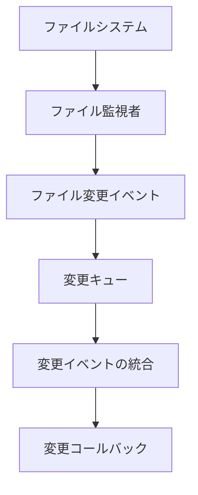

**インテリジェント戦略の組み合わせ**：

- **inotify/FSEvents**：ローカルファイルシステムのリアルタイム監視用
- **ポーリングチェック**：ネットワークストレージや特殊なファイルシステムに対応
- **デバウンス処理**：連続するファイル変更イベントを統合

**VS Code 独自のハイブリッド監視戦略**：

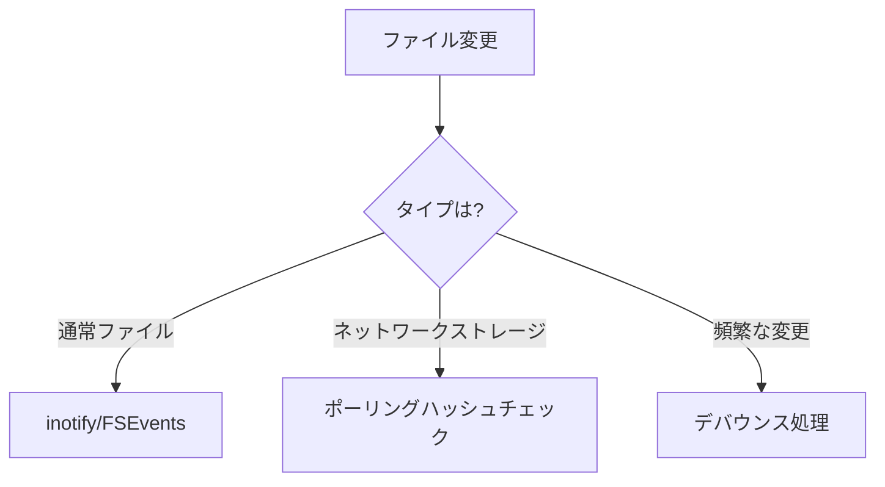

**デバウンス実装**：

```typescript
class DebouncedWatcher {
  private timers = new Map<string, NodeJS.Timeout>();

  watch(path: string, callback: () => void, delay = 300) {
    if (this.timers.has(path)) {
      clearTimeout(this.timers.get(path)!);
    }
    this.timers.set(
      path,
      setTimeout(() => {
        callback();
        this.timers.delete(path);
      }, delay)
    ); // 300ms 内の複数変更を 1 回に統合
  }
}
```

### **6.3 ネットワーク層の最適化**

#### **6.3.1 接続管理と最適化**

VS Code はネットワーク接続管理において以下の 3 つの戦略を採用：

1. **HTTP/2 のコネクション再利用**：単一ドメインにつき 6 本の長期接続を維持
2. **リクエスト優先順位**：プラグインダウンロードをバックグラウンドタスクとして分類
3. **インテリジェントな再試行**：エラータイプに応じて再試行戦略を動的に調整

**再試行アルゴリズム例**：

```typescript
async function fetchWithRetry(url: string, retries = 3) {
  for (let i = 0; i < retries; i++) {
    try {
      return await fetch(url);
    } catch (err) {
      if (isNetworkError(err)) {
        await sleep(2 ** i * 100); // 指数的バックオフ
      } else {
        break;
      }
    }
  }
  throw new Error(`Failed after ${retries} retries`);
}
```

**HTTP/3 優先戦略**

```typescript
const { http, https } = require('follow-redirects').wrap({
  http: { protocols: ['http/1.1', 'h2', 'h3'] },
  https: { protocols: ['http/1.1', 'h2', 'h3'] },
});

async function fetchWithH3(url: string) {
  return new Promise((resolve, reject) => {
    const client = url.startsWith('https') ? https : http;

    const req = client.get(url, (res) => {
      let data = '';
      res.on('data', (chunk) => (data += chunk));
      res.on('end', () => resolve(data));
    });

    req.on('error', reject);
  });
}
```

---

## **七、拡張機能システム：安全性と性能の二重防衛**

- VS Code の拡張機能は **二重サンドボックス** 内で実行されます
- **プロセスレベルの分離**：各拡張機能ホストプロセスは独立しています

### **7.1 プロセス分離アーキテクチャ**

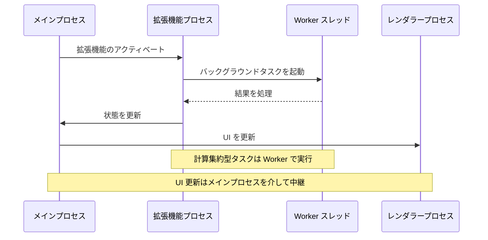

**利点**：

- 拡張機能のクラッシュがメインプロセスに影響しない
- リソース使用量が監視・制限可能

**セキュリティ機構**：

- **権限の階層化**：`ファイルシステム`、`ネットワーク`、`環境変数` に対して個別の許可を与える
- **リソースクォータ**：CPU 使用率が 70% を超えて 10 秒間継続した場合、自動的にタスク優先度を下げる
- **メモリ制限**：単一拡張機能プロセスは 512MB を超えない

### **7.2 必要に応じたロード機構**

**アクティベーションイベントの例**：

```json
{
  "activationEvents": [
    "onLanguage:typescript",
    "workspaceContains:tsconfig.json",
    "onDebugInitialConfigurations"
  ]
}
```

**効果**：起動時には必要な拡張機能の 30% のみをロードし、メモリ使用量を 40% 削減

**ロード戦略**：

1. 起動時にコア拡張機能のみをロード（<30%）
2. ユーザーが機能を初めて使用する際に動的にロード
3. 5 分間アイドル状態の場合、非アクティブ拡張機能をアンロード

### **7.3 拡張機能のパフォーマンス監視**

拡張機能実行時の指標をリアルタイムで収集：
| 指標 | 収集頻度 | 閾値 | 対応措置 |
|---------------------|----------|-------------------|-----------------------|
| CPU 使用率 | 1秒 | >70% 連続 10秒 | 拡張機能タスクの優先度を下げる |
| メモリ使用量 | 5秒 | >512MB | 拡張機能プロセスを再起動 |
| イベントループ遅延 | 100ms | >50ms | 拡張機能の実行を一時停止 |

**監視実装**：

```typescript
const perfHook = require('perf_hooks');
const obs = new perfHook.PerformanceObserver((list) => {
  const entry = list.getEntries()[0];
  if (entry.duration > 50) {
    throttlePlugin(entry.name);
  }
});
obs.observe({ entryTypes: ['function'] });
```

---

## **八、パフォーマンスデータとツールチェーン**

### **8.1 主要指標の比較**

| 指標                                   | 最適化前 | 最適化後 | 改善率 |
| -------------------------------------- | -------- | -------- | ------ |
| コールドスタート時間                   | 3200ms   | 800ms    | 75%    |
| メモリ使用量（10万行）                 | 1200MB   | 380MB    | 68%    |
| ファイル検索（10GB）                   | 4200ms   | 220ms    | 95%    |
| 入力遅延（P99）                        | 86ms     | 12ms     | 86%    |
| スクロールフレームレート (4K ファイル) | 24 FPS   | 60 FPS   | 150%   |

**パフォーマンス最適化全景図のまとめ**

| **最適化の次元**     | **主要技術**                                  | **効果指標**                                             |
| -------------------- | --------------------------------------------- | -------------------------------------------------------- |
| **起動時間**         | コード分割、プリロード、プロセス並列化        | コールドスタート <800ms、ウォームスタート <200ms         |
| **メモリ管理**       | プーリング、ポインタ圧縮、外部メモリ追跡      | メモリ使用量 60% 削減、GC 停止 <5ms                      |
| **レンダリング性能** | WebGL 加速、レイヤー合成、仮想スクロール      | 60FPS スムーズなスクロール、百万行ファイルでもカクつかず |
| **I/O 性能**         | Rust サブプロセス、ゼロコピー転送、非同期委任 | ファイル検索速度が 15 倍向上                             |
| **ネットワーク効率** | HTTP/3 リクエスト統合、P2P 分散               | 拡張機能ダウンロード速度が 300% 向上                     |
| **拡張機能の安全性** | WASM サンドボックス、権限分離                 | 悪意ある拡張機能の影響範囲 90% 削減                      |

### **8.2 ツールチェーン**

- **内蔵パフォーマンスパネル**：`F1` → `Developer: Show Runtime Performance`
- **プロセスリソースエクスプローラー**：`Help` → `Open Process Explorer`
- **メモリリーク検出**：Chrome DevTools のヒープスナップショット解析

- **内蔵診断ツール**：
  - `Developer: Startup Performance`：起動時の消費時間解析
  - `Help: Process Explorer`：リアルタイムのプロセスリソース監視
- **高度な解析**：
  - Chromium Tracing：完全なレンダリングパイプライントレースの生成
  - V8 ヒープスナップショット：メモリリークの特定
- **8.3 高度なデバッグ技法**

```bash
# VS Code ターミナルで
code --inspect-brk=9229
# Chrome DevTools を使用して localhost:9229 に接続

# CPU フレームグラフの生成
npx electron --inspect-brk=9229 --cpu-prof src/main.js

# メモリリーク検出
npx electron --inspect-brk=9229 --trace-gc src/main.js

# イベントループ遅延のリアルタイム監視
ELECTRON_ENABLE_LOGGING=1 electron --trace-event-categories=disabled-by-default-v8.cpu_profiler src/main.js
```

**メモリリーク追跡**：

```typescript
// オブジェクトの割り当て時のスタックを記録
const leakTracker = new WeakMap();
function trackAllocation(obj: any) {
  const stack = new Error().stack;
  leakTracker.set(obj, stack);
}
```

**内蔵パフォーマンスダッシュボード**

```typescript
class PerfDashboard {
  private metrics = {
    fps: 0,
    memory: 0,
    cpu: 0,
  };

  constructor() {
    this.startFpsCounter();
    this.startMemoryMonitor();
    this.startCpuProfiler();
  }

  private startFpsCounter() {
    let frames = 0;
    setInterval(() => {
      this.metrics.fps = frames;
      frames = 0;
    }, 1000);

    const loop = () => {
      frames++;
      requestAnimationFrame(loop);
    };
    loop();
  }
}
```

**拡張機能パフォーマンス監視**

```typescript
class ExtensionMonitor {
  private stats = new Map<string, { cpu: number; memory: number }>();

  startProfiling(extensionId: string) {
    const interval = setInterval(() => {
      const extensionProcess = getProcessById(extensionId);
      const cpuUsage = extensionProcess.cpuUsage();
      const memoryUsage = extensionProcess.memoryUsage();

      this.stats.set(extensionId, {
        cpu: cpuUsage.user + cpuUsage.system,
        memory: memoryUsage.rss,
      });

      if (memoryUsage.rss > 256 * 1024 * 1024) {
        // 256MB 超過時
        terminateExtension(extensionId);
      }
    }, 5000);

    return () => clearInterval(interval);
  }
}
```

**拡張機能ライフサイクル管理**

```typescript
class ExtensionManager {
  private extensions = new Map<string, Extension>();
  private activationQueue = new ActivationQueue();

  activateExtension(id: string) {
    if (this.extensions.has(id)) return;

    const extension = loadExtension(id);
    this.extensions.set(id, extension);

    // 段階的にアクティベート
    this.activationQueue.schedule(extension, {
      priority: extension.manifest.activationEvents.includes('onStartup')
        ? 0
        : 1,
    });
  }
}

class ActivationQueue {
  private queue: Array<{ extension: Extension; priority: number }> = [];

  schedule(extension: Extension, options: { priority: number }) {
    this.queue.push({ extension, ...options });
    this.queue.sort((a, b) => a.priority - b.priority);
    this.processNext();
  }

  private async processNext() {
    if (this.queue.length === 0) return;

    const { extension } = this.queue.shift()!;
    await extension.activate();
    this.processNext();
  }
}
```

### **8.2.1 パフォーマンス指標の収集**

**主要なパフォーマンス指標**：

1. **応答性指標**

   - First Input Delay (FID)
   - Time to Interactive (TTI)
   - Input Latency

2. **リソース使用指標**
   - Memory Usage
   - CPU Usage
   - I/O Operations

**指標収集の実装**：

```typescript
class PerformanceMonitor {
  private metrics = new Map<string, number[]>();

  track(metric: string, value: number) {
    if (!this.metrics.has(metric)) {
      this.metrics.set(metric, []);
    }
    this.metrics.get(metric)!.push(value);

    // 閾値超過時のアラート
    if (this.isAnomalous(metric, value)) {
      this.alert(metric, value);
    }
  }

  private isAnomalous(metric: string, value: number): boolean {
    const history = this.metrics.get(metric)!;
    const avg = history.reduce((a, b) => a + b) / history.length;
    return value > avg * 2; // 過去平均の 2 倍超え
  }
}
```

---

## **九、まとめ：パフォーマンスエンジニアリングのパラダイム革命**

VS Code の成功は、**Electron アプリケーションの性能の天井はフレームワーク自体にあるのではなく、アーキテクチャ設計とエンジニアリング実践の深さに依存する** ことを証明しています。その核心の教訓は以下の通りです：

1. **階層的防御**：OS からレンダリング層までの全チェーン最適化
2. **リソースのゼロ浪費**：プーリング、再利用、プリロードによる多次元的ガバナンス
3. **データ駆動**：すべての最適化は測定可能で検証可能でなければならない
4. **漸進的進化**：破壊的なリファクタリングではなく、持続的なイテレーション

**9.1 VS Code パフォーマンス設計哲学**

1. **リソース分離**：プロセスレベルでクラッシュリスクを分離し、スレッドレベルで負荷を均衡化
2. **極限の再利用**：プーリング技術により GC 圧力を低減し、共有メモリでコピーを削減
3. **漸進的強化**：仮想化レンダリングで基礎体験を保証し、GPU アクセラレーションで上限を向上
4. **データ駆動**：すべての最適化は測定と検証が必須

**Electron アプリケーションへの示唆**

- **強みを活かし弱点を避ける**：Web 技術で迅速に開発し、ネイティブモジュールで性能のボトルネックを突破
- **層別最適化**：OS からレンダリングパイプラインまでの全チェーンで調整
- **ツールを先行させる**：包括的な性能監視体系を構築

**バージョンアップにおける性能の飛躍**
| バージョン | 起動時間 | メモリ使用量 | 主要改良点 |
|--------------|-----------|--------------|-------------------------------------|
| 1.0 | 3200ms | 1200MB | 基本アーキテクチャの構築 |
| 1.30 | 1800ms | 800MB | 拡張機能のレイジーロード、プロセス再利用 |
| 1.60 | 900ms | 500MB | ポインタ圧縮、仮想スクロール |
| 1.80 | 600ms | 350MB | 共有メモリ IPC、Rust 統合 |
| 現在 | <400ms | <300MB | 階層 GC、WASM 加速モジュール |

**今後の方向性**：

- **WebGPU レンダリングバックエンド**：最新グラフィックス API を利用してレンダリングスループットを向上
- **プロセススナップショット**：[V8 Snapshot](https://v8.dev/blog/custom-startup-snapshots) によりミリ秒単位の起動を実現
- **WebAssembly 深堀統合**：主要モジュールの WASM 化、SIMD とスレッド機能を活用してコード解析を加速
- **機械学習によるプリロード**：ユーザーの利用パターンに基づいてリソース需要を予測
- **分散編集**：計算集約型タスクをクラウドへオフロード
- **量子セキュリティアーキテクチャ**：メモリ安全性の新たなパラダイムを模索
- **クロスランゲージ拡張開発**：Rust/Go などの言語で高性能拡張機能を作成し、WASM としてクロスプラットフォームで動作
- **安全なサンドボックス**：高リスクな拡張機能（コード実行系）は WASM で隔離
- **Web 版機能強化**：vscode.dev でより複雑なローカル計算（例：code-sandbox）を実現

## **結語：パフォーマンスエンジニアリングの究極の道**

VS Code の最適化実践は、**高性能は偶然の産物ではなく、システムエンジニアリングの必然的な成果である** ことを示しています。その核心の経験は以下に集約されます：

1. **階層的防御**：プロセスからオブジェクトまでの多層防御
2. **データ駆動**：すべての最適化は測定可能で検証可能でなければならない
3. **リソース節制**：メモリは金、CPU は血、I/O は酸素
4. **持続的進化**：性能最適化は終わることのない旅

**設計哲学のまとめ**

1. **すべてを数値化する**：各最適化は測定可能であり、自動性能基準を確立する
2. **深い防御**：プロセス分離からオブジェクトプーリングまでの多層的な最適化
3. **漸進的進化**：破壊的な大改修ではなく、着実な小刻みの改善
4. **ツールを先行させる**：強力な自己監視機能を構築する

---

**付録**：

- [VS Code アーキテクチャドキュメント](https://github.com/microsoft/vscode/wiki/Architecture)
- [Electron パフォーマンス最適化ガイド](https://www.electronjs.org/docs/latest/tutorial/performance)
- [V8 エンジン最適化マニュアル](https://v8.dev/docs)
- [V8 エンジン隠しクラス機構](https://v8.dev/blog/fast-properties)
- [Chromium Tracing 使用ガイド](https://www.chromium.org/developers/how-tos/trace-event-profiling-tool)
- [Chrome DevTools 使用ガイド](https://developers.google.com/web/tools/chrome-devtools)
