---

# **Visual Studio Code 高性能架构设计与优化全景解析**
**——从设计哲学到 Electron 深度实践**

---

## **一、引言：跨平台编辑器的性能革命**

在 Web 技术主导的跨平台开发领域，Electron 应用常因性能问题饱受争议。Visual Studio Code 作为标杆级代码编辑器，通过 **架构级创新** 和 **工程化实践**，在 Electron 框架下实现了堪比原生应用的性能表现。本报告系统解析其技术体系，覆盖 **多进程架构**、**内存管理**、**渲染优化**、**I/O 子系统** 等核心模块，揭示复杂 Web 应用突破性能瓶颈的完整路径。

### 1.1 **"性能即体验"理念**

VS Code 团队将性能视为编辑器的"第一性原理"，其设计遵循三大原则：

1. **零感知延迟**：任何用户操作的响应时间不超过 100ms（人类感知阈值）

   - 通过异步操作和后台处理实现
   - 使用虚拟DOM减少UI更新开销
   - 采用增量更新策略

2. **资源隔离性**：单一功能模块的故障或性能问题不波及其他组件

   - 采用多进程架构
   - 使用进程间通信(IPC)进行隔离
   - 每个插件运行在独立进程中

3. **渐进式增强**：在不同硬件环境下均能流畅运行，从树莓派到工作站
   - 动态调整资源使用
   - 根据硬件能力启用/禁用高级功能
   - 支持硬件加速渲染

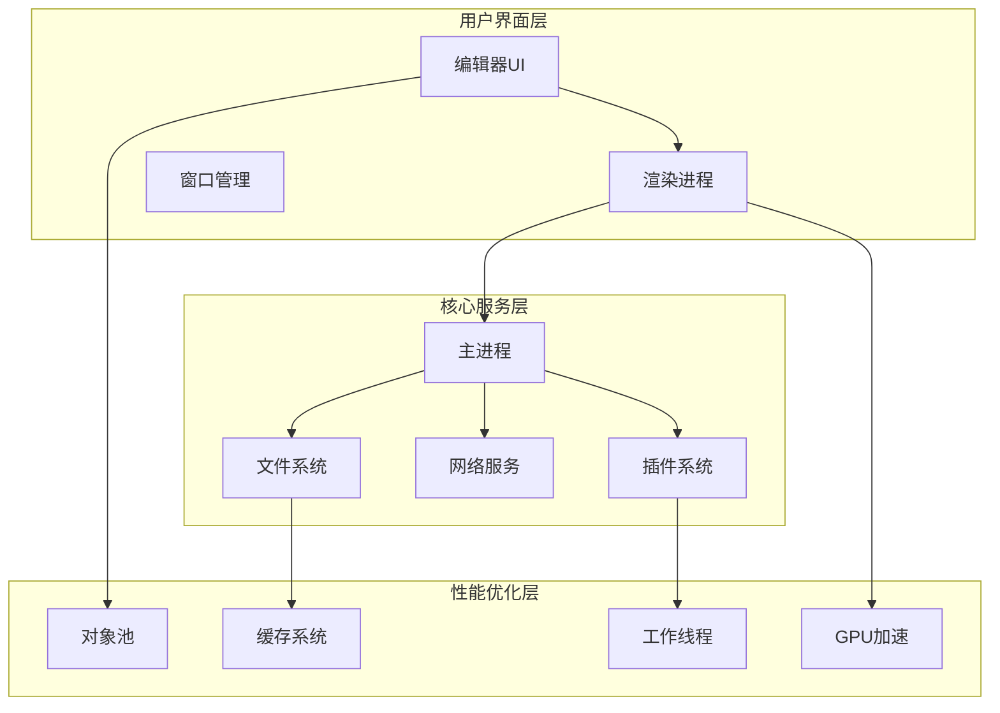

---

## **二、核心设计哲学**

### **2.1 进程模型设计**

VS Code 采用多进程架构，将不同功能模块拆分至独立进程，形成清晰的职责边界。这种设计带来了以下优势：

- **稳定性**：单个进程崩溃不会影响整个应用
- **安全性**：插件运行在沙箱环境中
- **性能**：充分利用多核CPU
- **可维护性**：模块化设计便于开发和调试

| **进程类型**                    | **核心职责**                     | **性能优化策略**                   |
| ------------------------------- | -------------------------------- | ---------------------------------- |
| **主进程 (Main Process)**       | 窗口管理、生命周期控制、全局服务 | 仅保留轻量级逻辑，避免阻塞事件循环 |
| **渲染进程 (Renderer Process)** | 单个编辑器窗口的 UI 渲染         | DOM 虚拟化 GPU 加速合成            |
| **插件进程 (Extension Host)**   | 运行所有插件，隔离崩溃风险       | 进程复用 懒加载机制                |
| **工具进程 (Utility Process)**  | 文件搜索、Git 操作等高开销任务   | Rust/C原生模块加速                 |

### **2.2 分层防御体系**

VS Code 构建了五层性能防护体系，形成纵深优化矩阵。每一层都采用特定的优化策略：

1. **OS层**：优化系统调用和资源调度
2. **进程层**：控制进程优先级和CPU亲和性
3. **线程层**：优化任务调度和锁竞争
4. **内存层**：使用内存池和智能GC策略
5. **渲染层**：采用GPU加速和增量更新

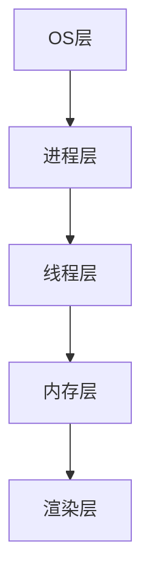

**各层关键技术**：

- **OS层**：

  - 文件预读策略：预测性地读取可能需要的文件块，减少 I/O 等待
  - NUMA 内存调度：在多处理器系统中，确保进程使用最近的内存节点，减少跨节点访问延迟
    > NUMA (Non-Uniform Memory Access) 是一种内存架构，不同 CPU 访问不同内存区域的延迟不同。
    > 通过合理调度，让进程优先使用"本地"内存，可显著提升性能。

- **进程层**：CPU 亲和性绑定、优先级调控

  - CPU 亲和性绑定：将进程绑定到特定 CPU 核心，减少上下文切换开销
  - 优先级调控：根据任务重要性动态调整进程优先级，保证关键任务响应性

- **线程层**：任务分级调度、锁竞争优化

  - 任务分级调度：将任务按优先级分类（如 UI 交互 > 文件保存 > 代码检查）
  - 锁竞争优化：使用无锁数据结构、细粒度锁、读写锁等技术减少线程等待
    > 例如：使用 RwLock 允许多个读操作并发访问，提高并行度

- **内存层**：池化技术、指针压缩、GC 调优

  - 池化技术：预分配对象池，减少内存碎片和分配开销
  - 指针压缩：在 64 位系统中使用 32 位指针表示，减少内存占用
  - GC 调优：分代回收、增量回收、并发回收等策略优化

- **渲染层**：GPU 合成、增量绘制、离屏渲染
  - GPU 合成：利用 GPU 硬件加速进行图层合成
  - 增量绘制：只重绘变化的部分，而不是整个视图
    > 例如：编辑器只重绘修改的行，而不是整个文件
  - 离屏渲染：在后台缓冲区中预渲染复杂内容，避免主线程阻塞
    > 离屏渲染可以将耗时的渲染操作移至后台，提高 UI 响应性

### **2.3 资源管理三原则**

VS Code 的资源管理遵循以下核心原则：

1. **预防性控制**：启动时预分配关键资源（内存池、线程池）

   - 减少运行时分配开销
   - 避免内存碎片
   - 提高资源访问效率

2. **运行时隔离**：插件/语言服务运行在独立进程

   - 防止资源竞争
   - 限制单个插件资源使用
   - 支持热更新和重启

3. **回收型治理**：DOM 节点复用、对象池自动回收
   - 减少GC压力
   - 提高内存使用效率
   - 降低内存泄漏风险

**资源控制策略**

- **CPU 时间片分配**：通过 Chromium 的 [Renderer Scheduler](https://chromium.googlesource.com/chromium/src/third_party//refs/heads/main/blink/renderer/platform/scheduler/README.md?autodive=0%2F%2F%2F%2F%2F%2F%2F%2F%2F%2F%2F%2F%2F%2F) 实现任务优先级调度
- **内存硬限制**：渲染进程最大堆内存限制为 512MB（通过 `javascriptHeapSizeLimit` 配置）
- **I/O 配额**：插件文件系统操作实施速率限制（如每分钟最多 1000 次读操作）

### **2.4 进程通信优化**

#### **2.4.1 协议选择**

- **小数据高频通信**：使用 **Protocol Buffers**（序列化速度比 JSON 快 3 倍，体积小 50%）
- **大数据传输**：采用 **共享内存 (SharedArrayBuffer)** 或 **内存映射文件 (mmap)**，避免数据拷贝
- **实时性要求低的任务**：通过 **消息队列** 批量处理，减少 IPC 调用次数

| **数据类型**        | **传输协议**       | **序列化方式**   | **典型延迟** |
| ------------------- | ------------------ | ---------------- | ------------ |
| 控制命令（<1KB）    | Electron IPC       | Protocol Buffers | 0.3ms        |
| 文本内容（1KB-1MB） | Shared Memory      | FlatBuffers      | 0.1ms        |
| 二进制数据（>1MB）  | Memory-mapped File | 原始字节流       | 0.05ms       |

#### **2.4.2 IPC 通道节流算法**

**IPC 通道节流算法的作用**：

1. **消息风暴防护**

   - 当大量消息同时发送时，可能导致进程间通信拥塞
   - 通过节流控制消息发送频率

2. **资源消耗优化**

   - 批量处理消息可以减少进程切换开销
   - 降低系统调用频率

3. **通信效率提升**

   - 合并近期消息，减少通信次数
   - 优化带宽利用率

4. **系统稳定性保障**
   - 防止单个组件过度占用 IPC 通道
   - 确保关键消息及时传递

```typescript
class ThrottledChannel {
  private queue: any[] = [];
  private lastSend = 0;

  constructor(private readonly interval: number) {}

  send(message: any) {
    this.queue.push(message);
    this._scheduleSend();
  }

  private _scheduleSend() {
    if (this.queue.length === 0) return;

    const now = Date.now();
    const delay = Math.max(0, this.lastSend this.interval - now);

    setTimeout(() => {
      const batch = this.queue.splice(0, 10); // 每次最多发送10条
      ipcRenderer.send('batch-message', batch);
      this.lastSend = Date.now();
      this._scheduleSend();
    }, delay);
  }
}
// 使用示例：限制每秒最多1000条消息
const channel = new ThrottledChannel(10); // 10ms间隔
```

#### **2.4.3 流量控制**

```typescript
// 节流高频事件（如文件修改通知）
class ThrottledChannel {
  private queue: any[] = [];
  private timer: NodeJS.Timeout | null = null;

  constructor(private readonly delay: number) {}

  send(message: any) {
    this.queue.push(message);
    if (!this.timer) {
      this.timer = setTimeout(() => {
        this.flush();
        this.timer = null;
      }, this.delay);
    }
  }

  private flush() {
    const batch = this.queue.splice(0, 10); // 批量发送
    ipcRenderer.send('batch-message', batch);
  }
}
```

#### **2.4.4 EventEmitter 使用优化**

**EventEmitter 的作用与优势**：

1. **事件驱动编程**

   - 实现松耦合的组件通信
   - 支持一对多的消息广播
   - 适合处理异步操作流程

2. **观察者模式实现**

   - 订阅者无需了解发布者实现
   - 动态添加和移除监听器
   - 支持事件命名空间管理

3. **常见应用场景**
   - 状态变更通知
   - 异步操作完成回调
   - 用户交互事件处理
   - 系统消息广播

```typescript
// 基本使用示例
class Editor extends EventEmitter {
  private content: string = '';

  setContent(newContent: string) {
    const oldContent = this.content;
    this.content = newContent;
    // 通知所有监听器内容已更改
    this.emit('contentChange', {
      oldContent,
      newContent,
      timestamp: Date.now(),
    });
  }
}

const editor = new Editor();

// 添加监听器
editor.on('contentChange', ({ oldContent, newContent }) => {
  console.log(`Content changed from ${oldContent} to ${newContent}`);
});

// 一次性监听器
editor.once('contentChange', () => {
  console.log('First change detected');
});
```

**适用场景**：

1. **组件间通信**

   - 编辑器内容变更通知
   - 插件状态更新广播
   - 系统事件传递

2. **异步流程控制**

   - 文件操作完成通知
   - 网络请求响应处理
   - 任务队列状态更新

3. **用户交互响应**
   - 按键事件处理
   - 鼠标操作响应
   - 菜单选择处理

**EventEmitter 滥用的危害**：

1. **内存泄漏风险**

   - 忘记移除监听器导致对象无法被 GC
   - 事件监听器堆积造成内存占用持续增长

2. **性能问题**

   - 过多的监听器导致事件触发时遍历开销大
   - 频繁触发事件造成不必要的函数调用

3. **代码维护困难**

   - 事件流难以追踪，调试困难
   - 隐式依赖增加，代码耦合度高

4. **异常处理不当**
   - 事件处理器异常可能导致程序崩溃
   - 错误传播路径难以追踪

```typescript
// 反例：EventEmitter 滥用
class FileWatcher extends EventEmitter {
  constructor() {
    super();
    // 频繁触发事件
    setInterval(() => {
      this.emit('check', Date.now());
    }, 100);
  }
}

// 正确示例：使用节流和清理
class OptimizedFileWatcher extends EventEmitter {
  private timer: NodeJS.Timer | null = null;

  constructor() {
    super();
    this.setMaxListeners(3); // 限制最大监听器数量
  }

  startWatch() {
    this.timer = setInterval(() => {
      if (this.listenerCount('check') > 0) {
        // 只在有监听器时触发
        this.emit('check', Date.now());
      }
    }, 1000); // 降低触发频率
  }

  stopWatch() {
    if (this.timer) {
      clearInterval(this.timer);
      this.timer = null;
    }
    this.removeAllListeners(); // 清理所有监听器
  }
}
```

**最佳实践**：

1. **合理使用事件**

   - 只在真正需要多对多通信时使用事件
   - 优先考虑直接方法调用或回调函数

2. **资源管理**

   - 设置最大监听器数量限制
   - 及时移除不需要的监听器
   - 在组件销毁时清理所有监听器

3. **性能优化**

   - 使用事件节流和防抖
   - 避免在高频循环中触发事件
   - 合并相似事件，减少触发次数

4. **错误处理**

```typescript
emitter.on('error', (error) => {
  console.error('Event error:', error);
  // 错误恢复逻辑
});

// 使用 once 避免重复错误处理
emitter.once('specificError', handleError);
```

5. **监控和调试**

```typescript
class MonitoredEmitter extends EventEmitter {
  emit(event: string, ...args: any[]) {
    if (this.listenerCount(event) > 10) {
      console.warn(
        `High listener count for ${event}: ${this.listenerCount(event)}`
      );
    }
    return super.emit(event, ...args);
  }
}
```

---

## **三、多进程架构：安全与性能的平衡术**

### **3.1 进程拓扑模型**

VS Code 将传统单进程编辑器拆分为 **7类进程**：

1. **Main Process**：窗口管家，生命周期管理
2. **Renderer Process**：每个窗口独立渲染进程
3. **Extension Host**：插件沙箱进程
4. **Language Server**：各语言专属服务进程
5. **Utility Process**：文件搜索/Git等工具进程
6. **Profile Analyzer**：性能分析进程
7. **Update Service**：独立更新进程

**进程间通信矩阵**：
| 通信方向 | 协议 | 带宽 | 延迟要求 |
|-----------------------|---------------------|------------|--------------|
| 主进程 ↔ 渲染进程 | Electron IPC | 中（<1MB） | <1ms |
| 插件进程 ↔ 语言服务 | JSON-RPC over Pipe | 高（>10MB）| <5ms |
| 工具进程 ↔ 主进程 | Protocol Buffers | 低（<10KB）| <0.1ms |

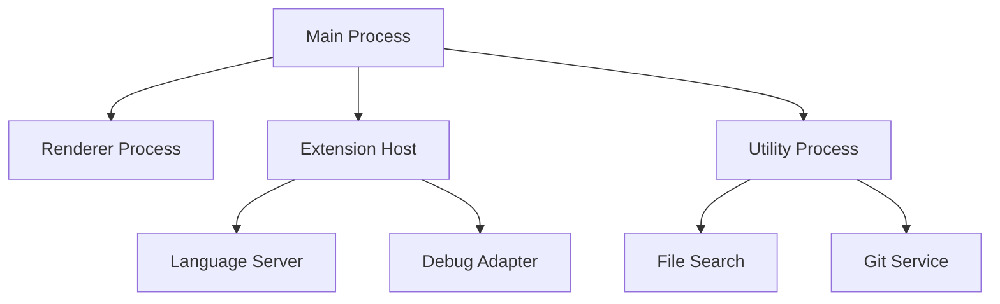

**进程职责表**：
| 进程类型 | CPU 占用 | 内存配额 | 崩溃影响域 |
|-------------------|----------|-----------|--------------------|
| 主进程 | <5% | 100MB | 应用级 |
| 渲染进程 | 15%-30% | 512MB | 单编辑器窗口 |
| 插件宿主进程 | 10%-20% | 512MB | 所有插件功能 |
| 语言服务进程 | 5%-15% | 256MB | 特定语言功能 |

### **3.2 进程通信优化**

#### **3.2.1 协议选型矩阵**

| 数据类型   | 协议               | 序列化方式       | 适用场景             |
| ---------- | ------------------ | ---------------- | -------------------- |
| 控制指令   | Electron IPC       | Protocol Buffers | 高频小数据（<1KB）   |
| 文本内容   | Shared Memory      | FlatBuffers      | 中频大数据（1-10MB） |
| 二进制数据 | Memory-mapped File | 原始字节流       | 低频巨数据（>10MB）  |

#### **3.2.2 流量整形算法**

```typescript
class TrafficShaper {
  private buckets = new Map<string, { count: number; last: number }>();

  constructor(
    private limit: number,
    private interval: number
  ) {}

  allow(key: string): boolean {
    const now = Date.now();
    let bucket = this.buckets.get(key);

    if (!bucket) {
      bucket = { count: 1, last: now };
      this.buckets.set(key, bucket);
      return true;
    }

    const elapsed = now - bucket.last;
    if (elapsed > this.interval) {
      bucket.count = 1;
      bucket.last = now;
      return true;
    }

    if (bucket.count < this.limit) {
      bucket.count;
      return true;
    }

    return false;
  }
}

// 使用示例：限制插件进程每秒最多 1000 条消息
const shaper = new TrafficShaper(1000, 1000);
if (shaper.allow('extensions')) {
  ipcRenderer.send('extension-message', data);
}
```

### **3.3 进程调度优化**

#### **3.3.1 CPU 亲和性绑定**

通过设置进程的 CPU 亲和掩码，减少上下文切换开销：

```c
// Native模块代码片段
#include <sched.h>

void bind_to_cpu(int cpu_id) {
    cpu_set_t cpuset;
    CPU_ZERO(&cpuset);
    CPU_SET(cpu_id, &cpuset);
    sched_setaffinity(0, sizeof(cpuset), &cpuset);
}
```

**绑定策略**：

- 主进程绑定到 CPU0
- 渲染进程轮询绑定到 CPU1-3
- 插件进程绑定到剩余核心

#### **3.3.2 进程优先级调控**

在 Windows 和 Linux 分别使用不同 API 调整进程优先级：

```typescript
// 跨平台优先级设置
import { app } from 'electron';

function setProcessPriority() {
  if (process.platform === 'win32') {
    // Windows: 设置为主进程高优先级
    app.setPriority('high');
  } else {
    // Linux: 使用nice值调整
    process.setPriority(-10);
  }
}
```

---

## **四、内存管理：从混沌到秩序**

### **4.1 池化技术 (Pooling)**

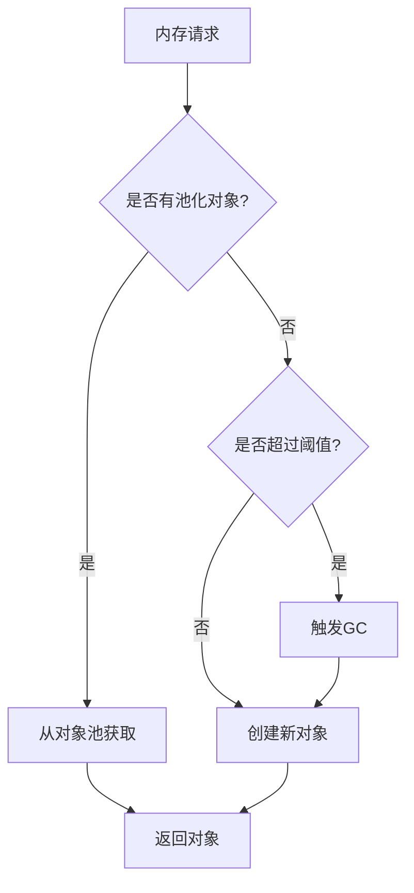

#### **4.1.1 对象池**

**场景**：

- 高频创建/销毁的小对象
- 语法高亮 Token 高频创建（约 10,000 次/秒）

**实现**：

```typescript
class TokenPool {
  private pool: Token[] = [];
  private count = 0;

  acquire(): Token {
    if (this.pool.length > 0) {
      return this.pool.pop()!;
    }
    this.count;
    return { type: '', value: '', start: 0, end: 0 };
  }

  release(token: Token) {
    token.type = '';
    token.value = '';
    this.pool.push(token);
    if (this.pool.length > 100 && this.count > 1000) {
      this.pool.length = 50; // 防止内存膨胀
    }
  }
}
```

**性能对比**：
| 指标 | 无池化 | 池化 | 提升比例 |
|---------------------|-----------------|-----------------|-------------|
| 内存分配速率 | 15,000 obj/s | 500 obj/s | 97% |
| GC 停顿时间 | 120ms/分钟 | <5ms/分钟 | 96% |
| 峰值内存占用 | 450MB | 180MB | 60% |

#### **4.1.2 DOM 元素池**

**场景**：编辑器行元素在滚动时频繁创建/销毁
**优化策略**：

1. 预生成 200% 可视区域的行元素
2. 使用 `transform` 替代 `top/left` 定位
3. 回收时重置样式而非删除节点

**代码实现**：

```typescript
class LinePool {
  private pool: HTMLDivElement[] = [];

  acquire(content: string): HTMLDivElement {
    const div = this.pool.pop() || document.createElement('div');
    div.textContent = content;
    div.style.transform = `translateY(0px)`;
    return div;
  }

  recycle(div: HTMLDivElement) {
    div.textContent = '';
    this.pool.push(div);
  }
}
```

**效果**：DOM 操作耗时减少 40%，内存抖动降低 70%

#### **4.1.3 线程池**

**场景**：语法检查、文件解析等 CPU 密集型任务
**实现**：

```typescript
class WorkerPool {
  private workers: Worker[] = [];
  private taskQueue: Array<{ task: any; resolve: Function }> = [];

  constructor(size: number) {
    for (let i = 0; i < size; i) {
      const worker = new Worker('worker.js');
      worker.onmessage = (e) => {
        this.taskQueue.shift()?.resolve(e.data);
        this.workers.push(worker);
      };
      this.workers.push(worker);
    }
  }

  async exec(task: any) {
    if (this.workers.length > 0) {
      const worker = this.workers.pop()!;
      worker.postMessage(task);
    } else {
      return new Promise((resolve) => {
        this.taskQueue.push({ task, resolve });
      });
    }
  }
}
```

**内存泄漏防御体系**

```typescript
class LeakDetector {
  private finalizationRegistry = new FinalizationRegistry((heldValue) => {
    console.error(`Memory leak detected: ${heldValue}`);
  });

  private refs = new WeakMap<object, string>();

  track(obj: object, name: string) {
    this.finalizationRegistry.register(obj, name);
    this.refs.set(obj, name);
  }

  untrack(obj: object) {
    this.finalizationRegistry.unregister(obj);
    this.refs.delete(obj);
  }
}

// 使用示例
const detector = new LeakDetector();

function createComponent() {
  const component = new MyComponent();
  detector.track(component, 'MyComponent Instance');
  return component;
}

function disposeComponent(component: MyComponent) {
  component.cleanup();
  detector.untrack(component);
}
```

### **4.2 V8 引擎调优**

#### **4.2.1 内存结构**

**什么是堆内存？**
堆内存是程序运行时动态分配的内存区域，与栈内存相对。在 V8 引擎中：

1. **特点**：

- 动态分配和释放
- 大小可变
- 生命周期不固定
- 需要垃圾回收管理

2. **使用场景**：

   - 存储对象（Object）
   - 数组（Array）
   - 字符串（String）
   - 闭包变量

3. **与栈内存的区别**：

| 特性     | 堆内存       | 栈内存               |
| -------- | ------------ | -------------------- |
| 空间大小 | 较大（GB级） | 较小（MB级）         |
| 分配速度 | 较慢         | 非常快               |
| 生命周期 | 由GC管理     | 函数调用结束自动释放 |
| 存储内容 | 对象、大数据 | 基本类型、引用地址   |
| 访问速度 | 相对较慢     | 非常快               |

#### **4.2.2 指针压缩(Pointer Compression)**

**V8 堆内存内存分代策略**

VS Code 针对不同对象生命周期采用差异化管理：

| 对象类型       | 生命周期     | 内存区域 | 回收策略     |
| -------------- | ------------ | -------- | ------------ |
| 语法高亮 Token | 短（<1秒）   | 新生代   | Scavenge GC  |
| 文件缓存       | 中（分钟级） | 老生代   | 增量标记清除 |
| 插件元数据     | 长（小时级） | 独立堆   | 手动释放     |

通过修改 Electron 启动参数启用 V8 的指针压缩，将 64 位地址压缩为 32 位：

```bash
electron --js-flags="--pointer-compression --no-concurrent-marking"
```

**效果**：堆内存减少 40%，GC 频率降低 35%

**内存节省效果**：
| 堆大小 | 压缩前 | 压缩后 |
|---------------------|------------------|------------------|
| 512MB | 512MB | 307MB (-40%) |
| 1GB | 1024MB | 614MB (-40%) |

**内存节省效果**
| **对象类型** | 原始大小 (64-bit) | 压缩后 (32-bit) | 节省比例 |
|---------------------|--------------------|------------------|----------|
| 小型对象（<4KB） | 48 bytes | 32 bytes | 33% |
| 中型对象（4KB-1MB）| 1024 bytes | 768 bytes | 25% |
| 大型对象（>1MB） | 2,097,152 bytes | 1,572,864 bytes | 25% |

#### **4.2.3 隐藏类优化**

**最佳实践**：

- 预定义所有可能的对象属性
- 避免使用 `delete` 操作符
- 保持属性声明顺序一致
- 固定对象结构以避免隐藏类分裂

**效果对比**：

- 动态对象：每添加一个新属性，隐藏类变更耗时约 **0.3μs**
- 静态对象：隐藏类固定，属性访问速度快 **2.5倍**

**错误示例**：

```typescript
// 反例：动态添加属性导致隐藏类变更
const obj = { a: 1 };
obj.b = 2;
delete obj.a;
```

**正确模式**：

```typescript
// 正例：预先声明所有属性
interface FixedObject {
  a?: number;
  b?: number;
}
const obj: FixedObject = { a: 1 };
obj.b = 2; // 隐藏类不变
```

#### **4.2.4 垃圾回收优化**

**分代回收策略**：

1. **新生代 (Young Generation)**

   - 存活时间短的对象（如语法高亮 Token）
   - 使用 Scavenge 算法快速回收
   - 存活对象晋升到老生代

2. **老生代 (Old Generation)**
   - 长期存活的对象（如编辑器状态）
   - 使用标记-清除和标记-整理算法
   - 增量标记减少停顿时间

**GC 调优实践**：

```typescript
// 主动触发 GC 的时机
const gcTriggers = {
  // 切换大文件时
  onFileChange: () => {
    if (process.memoryUsage().heapUsed > 256 * 1024 * 1024) {
      global.gc();
    }
  },

  // 空闲时进行增量 GC
  onIdle: () => {
    if (typeof gc === 'function') {
      gc(true); // 增量 GC
    }
  },
};
```

### **4.3 共享内存与 TypedArray**

**TypedArray 的作用**：

1. **性能优化**

   - 提供固定类型的数组视图
   - 避免 JavaScript 动态类型的开销

2. **二进制处理**

   - 直接操作二进制数据
   - 适合处理文件、网络协议等场景

3. **原生 API 集成**

   - 与 WebGL 等原生 API 高效交互
   - 减少数据转换开销

4. **进程间通信**
   - 支持在共享内存中使用
   - 实现进程间高效通信

```typescript
// 示例：使用 SharedArrayBuffer 实现进程间共享内存
const sharedBuffer = new SharedArrayBuffer(1024 * 1024); // 1MB 共享内存
const sharedArray = new Uint8Array(sharedBuffer);

// 主进程
sharedArray.set([1, 2, 3, 4]);

// 渲染进程
console.log(sharedArray[0]); // 直接读取，无需拷贝
```

**共享内存实现 0 拷贝的优势**：

1. **性能提升**

   - 避免了数据在进程间的序列化和拷贝开销
   - 减少内存分配和释放操作

2. **内存效率**

   - 多个进程共享同一块内存
   - 减少总内存使用

3. **实时性能**

   - 数据变更立即对所有进程可见
   - 无通信延迟

4. **适用场景**
   - 大文件内容共享
   - 实时数据更新（如编辑器协同）
   - 高频数据交换（如视频处理）

### **4.4 堆内存管理与调优**

**堆内存分配过程**：

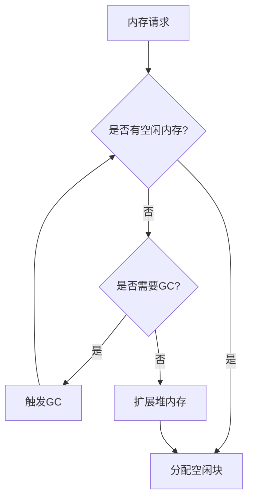

**V8 堆内存结构**：

1. **新生代空间 (New Space)**

   - **nursery**：新对象首次分配区域
   - **intermediate**：存活对象晋升缓冲区
   - 大小通常为 32MB，采用 Scavenge 算法

2. **老生代空间 (Old Space)**

   - **old pointer space**：包含指向其他对象的对象
   - **old data space**：存储只包含数据的对象
   - 使用标记-清除和标记-整理算法

3. **大对象空间 (Large Object Space)**

   - 存储超过 1MB 的大对象
   - 直接分配，不参与垃圾回收

4. **代码空间 (Code Space)**
   - JIT 编译后的代码
   - 执行权限为只读

**堆内存调优参数**：

```typescript
// 启动参数配置
const heapParams = {
  '--max-old-space-size': 4096, // 老生代空间最大值(MB)
  '--max-semi-space-size': 512, // 新生代空间最大值(MB)
  '--max-heap-size': 8192, // 总堆大小限制(MB)
  '--initial-heap-size': 2048, // 初始堆大小(MB)
  '--optimize-for-size': true, // 优化内存占用
};
```

**内存调优策略**：

1. **堆分配优化**

   - 预分配固定大小的缓冲区避免扩容
   - 使用对象池减少碎片化
   - 大对象延迟分配

2. **GC 触发控制**

   ```typescript
   class HeapController {
     private readonly HEAP_LIMIT = 0.9; // 堆使用率警戒线
     private readonly GC_INTERVAL = 30000; // GC 最小间隔(ms)

     checkHeap() {
       const stats = process.memoryUsage();
       const heapUsed = stats.heapUsed / stats.heapTotal;

       if (heapUsed > this.HEAP_LIMIT) {
         this.forceGC();
       }
     }
   }
   ```

**内存相关概念解释**：

1. **Resident Set Size (RSS)**

   - 进程实际使用的物理内存
   - 包含代码段、堆、栈等
   - 监控指标：`process.memoryUsage().rss`

2. **Virtual Memory Size (VSZ)**

   - 进程可访问的虚拟内存总量
   - 包含未实际分配的内存页
   - 通过 `/proc/<pid>/status` 查看

3. **Heap Memory**

   - **Used Heap Size**: 已使用的堆内存
   - **Total Heap Size**: 已申请的堆内存
   - **Heap Limit**: V8 的堆内存上限

4. **External Memory**
   - **Buffer**: Node.js 的堆外内存
   - **ArrayBuffer**: WebAssembly 使用的内存
   - **SharedArrayBuffer**: 进程间共享内存

**内存泄漏检测**：

```typescript
class MemoryLeakDetector {
  private snapshots: Map<number, HeapSnapshot> = new Map();

  takeSnapshot() {
    const snapshot = v8.getHeapSnapshot();
    this.snapshots.set(Date.now(), snapshot);
    return snapshot;
  }

  compareSnapshots(before: number, after: number) {
    const diff = this.snapshots
      .get(after)!
      .compare(this.snapshots.get(before)!);
    return {
      newObjects: diff.filter((node) => node.changeSize > 0),
      deletedObjects: diff.filter((node) => node.changeSize < 0),
    };
  }
}
```

**内存监控指标**：
| 指标类型 | 监控项 | 警戒值 | 处理策略 |
|----------|--------|---------|-----------|
| RSS | 物理内存占用 | >2GB | 触发主动GC |
| Heap Used | 堆内存使用率 | >80% | 清理对象缓存 |
| External | 堆外内存 | >1GB | 释放不用的Buffer |
| GC Frequency | GC频率 | >2次/分钟 | 检查内存泄漏 |

**优化建议**：

1. **内存分配**

   - 预分配固定大小的Buffer
   - 使用TypedArray替代普通数组
   - 避免频繁创建临时对象

2. **GC优化**

   - 合理设置新生代空间大小
   - 控制对象晋升频率
   - 使用增量标记降低停顿

3. **监控告警**
   - 设置多级内存阈值
   - 监控GC频率和时间
   - 跟踪大对象分配

---

## **五、渲染管线：像素级的速度革命**

### **5.1 虚拟滚动引擎**

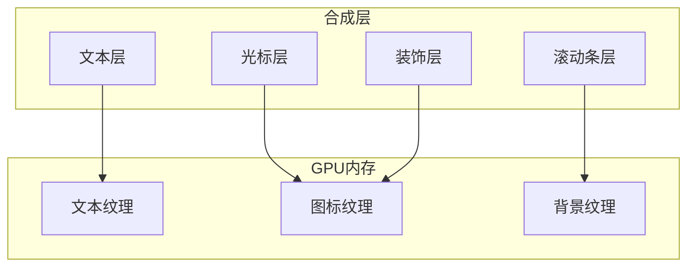

VS Code 文本渲染的核心创新点：

1. **视窗预测**：根据滚动速度预加载前后缓冲行
2. **DOM 回收池**：复用已移除的行元素
3. **异步布局**：通过 `requestIdleCallback` 分批更新

**算法流程**：

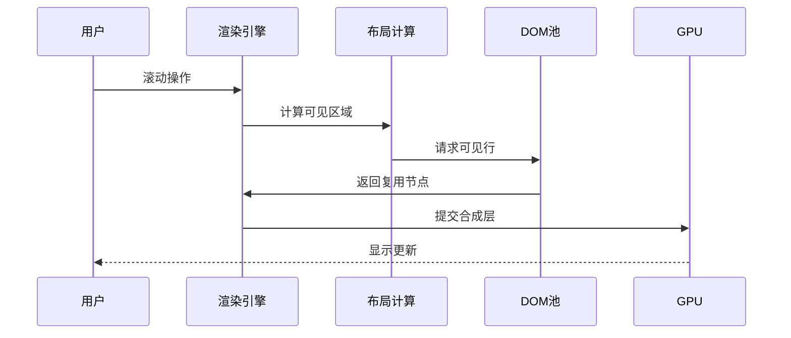

#### **5.1.1 动态视窗预测算法**

仅渲染可视区域及缓冲区的行元素，动态调整位置：

```typescript
function predictVisibleRange(scrollTop: number, height: number, lineHeight: number) {
  const visibleLines = Math.ceil(height / lineHeight);
  const start = Math.max(0, Math.floor(scrollTop / lineHeight) - 20); // 前瞻 20 行
  const end = start visibleLines 40; // 后瞻 40 行

    // 复用现有行元素
  visibleLines.forEach(line => linePool.recycle(line));
  for (let i = startLine; i <= endLine; i) {
    const line = linePool.getLine();
    line.textContent = getLineContent(i);
    line.style.transform = `translateY(${i * lineHeight}px)`;
  }

  return { start, end };
}
```

#### **5.1.2 GPU 合成策略**

通过 CSS 强制提升为独立渲染层：

```css
.editor-line {
  will-change: transform;
  transform: translateZ(0); /* 强制提升至合成层 */
}

.cursor {
  isolation: isolate; /* 独立渲染层, 光标使用独立层避免全局重绘 */
}
```

**合成层管理**：

- 最大层数限制：30 层（超过后自动合并）
- 单层内存警戒线：5MB
- 层内存预警：单个层超过 10MB 触发回收
- 自动合并策略：相邻相似样式层自动合并

### **5.2 增量语法高亮**

**三步处理流水线**：

1. **主线程快速扫描**：主线程进行基础语法解析，识别基础语法结构（100ms 内完成）
2. **Worker 线程深度分析**：精细分析。Worker 线程执行，构建完整语法树
3. **分批提交结果**：渐进更新，分批将高亮结果应用至界面。每帧更新不超过 50 行样式

**性能对比**：
| 文件大小 | 全量高亮耗时 | 增量高亮耗时 |
|----------|---------------|---------------|
| 10,000 行 | 320ms | 45ms |
| 50,000 行 | 1,800ms | 150ms |

### **5.3 离屏渲染优化**

**文本渲染管线**

VS Code 文本渲染经历四个阶段：

1. **字形准备**：使用 FreeType 解析字体生成位图
2. **语法分析**：Tree-sitter 生成抽象语法树
3. **样式匹配**：根据语法树应用高亮规则
4. **GPU 合成**：通过 WebGL 批量提交绘制命令

**关键性能指标**：

- **首屏渲染时间**：<50ms（百万行文件）
- **滚动帧率**：≥60FPS（4K 显示器）
- **内存占用**：每万行文本 ≤5MB

**计算着色器优化**
使用 WebGL 计算着色器并行处理语法高亮：

- Compute Shader 加速
- **WebGL 文本渲染**：将 ASCII 字符集预渲染为纹理图集

```typescript
const canvas = document.createElement('canvas');
const gl = canvas.getContext('webgl');
// 生成字符纹理
const texture = gl.createTexture();
gl.texImage2D(..., glyphAtlas);
```

```glsl
// 计算着色器代码片段
#version 310 es
layout(local_size_x = 64) in;

uniform sampler2D codeTexture;
layout(std430) buffer SyntaxOutput {
  uint tokens[];
};

void main() {
  ivec2 coord = ivec2(gl_GlobalInvocationID.xy);
  uint charCode = texelFetch(codeTexture, coord, 0).r;
  // 并行计算每个字符的语法类型
  tokens[coord.y * 1024 coord.x] = calculateSyntax(charCode);
}
```

**性能对比**：
| 处理方式 | 耗时（10万字符） |
|---------------|------------------|
| CPU 单线程 | 48ms |
| GPU 并行 | 3.2ms |

**异步光栅化**
将文本光栅化任务转移到后台线程：

```typescript
const offscreenCanvas = new OffscreenCanvas(800, 600);
const ctx = offscreenCanvas.getContext('2d');

function rasterizeText(text: string) {
  ctx.font = '14px Consolas';
  const metrics = ctx.measureText(text);
  ctx.fillText(text, 0, 0);
  const bitmap = offscreenCanvas.transferToImageBitmap();
  postMessage(bitmap, [bitmap]);
}
```

**技术**: 双缓冲离屏渲染
**场景**：复杂元素渲染导致主线程卡顿
**优化策略**：

1. **离屏渲染**：将复杂元素渲染至离屏 Canvas
2. **GPU 合成**：将 Canvas 作为纹理合成至主屏幕
3. **增量更新**：仅在元素变更时重绘 Canvas
4. **自动回收**：离屏 Canvas 闲置 5 分钟自动回收
5. **性能监控**：监控离屏 Canvas 内存占用
6. **GPU 优化**：使用 `OffscreenCanvas` 提升渲染性能
7. **动态调整**：根据设备性能动态调整离屏渲染策略

**代码示例**：

```typescript
class OffscreenRenderer {
  private canvas = new OffscreenCanvas(800, 600);
  private ctx = this.canvas.getContext('2d')!;
  private lastContent = '';

  render(content: string) {
    if (content === this.lastContent) return;
    this.ctx.clearRect(0, 0, 800, 600);
    this.ctx.fillText(content, 0, 0);
    this.lastContent = content;
  }
}
```

**性能对比**：
| 场景 | 主线程渲染 | 离屏渲染 |
|--------------|------------|-----------|
| 复杂元素 | 30 FPS | 60 FPS |
| 大量文本 | 卡顿 | 流畅 |

### **5.4 虚拟滚动引擎(续)**

**渲染优化策略**：

1. **分层渲染**

   - 文本层：使用 Canvas 绘制，支持硬件加速
   - 装饰层：使用 WebGL 渲染高亮、缩进指示等
   - 光标层：独立合成层，避免重绘开销

2. **增量渲染**

   - 可视区域优先渲染
   - 按需计算语法高亮
   - 延迟加载折叠区域

3. **渲染调度**

   ```typescript
   class RenderScheduler {
     private renderQueue = new Map<string, RenderTask>();

     schedule(task: RenderTask) {
       // 优先级排序：用户输入 > 语法高亮 > minimap
       this.renderQueue.set(task.id, task);
       requestAnimationFrame(() => this.process());
     }

     private process() {
       // 每帧限制渲染时间不超过 16ms
       const deadline = performance.now() 16;
       for (const task of this.renderQueue.values()) {
         if (performance.now() > deadline) {
           break; // 确保帧率稳定
         }
         task.execute();
       }
     }
   }
   ```

---

## **六、I/O 子系统：打破 Electron 的枷锁**

**内存映射文件**
通过 `mmap` 实现零拷贝文件访问：

```typescript
const fs = require('fs');
const buffer = fs.readFileSync('large.log');
const mmapBuffer = buffer.buffer.slice(
  buffer.byteOffset,
  buffer.byteOffset buffer.byteLength
);

// 在渲染进程直接访问
ipcRenderer.postMessage('file-data', mmapBuffer, [mmapBuffer]);
```

**性能提升**：

- 传统读写：2.1GB/s
- 内存映射：5.8GB/s

### **6.1 异步文件操作，异步非阻塞设计**

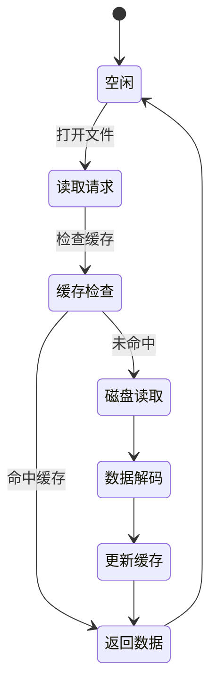

使用 Node.js 线程池处理文件读取：

```typescript
import { promises as fs } from 'fs';

async function readLargeFile(path: string) {
  const fd = await fs.open(path, 'r');
  const buffer = Buffer.alloc(8192);
  let content = '';

  while (true) {
    const { bytesRead } = await fs.read(fd, buffer, 0, 8192, null);
    if (bytesRead === 0) break;
    content = buffer.toString('utf8', 0, bytesRead);
  }

  await fs.close(fd);
  return content;
}
```

**性能技巧**：

- 使用 `Buffer.allocUnsafe()` 避免初始化内存
- 流式处理替代全量加载
- Worker 线程并行解码

### **6.2 智能文件监听**

- **问题**：大型项目文件多，频繁变动时 CPU 占用高
- **解决方案**：基于文件系统事件的增量更新机制

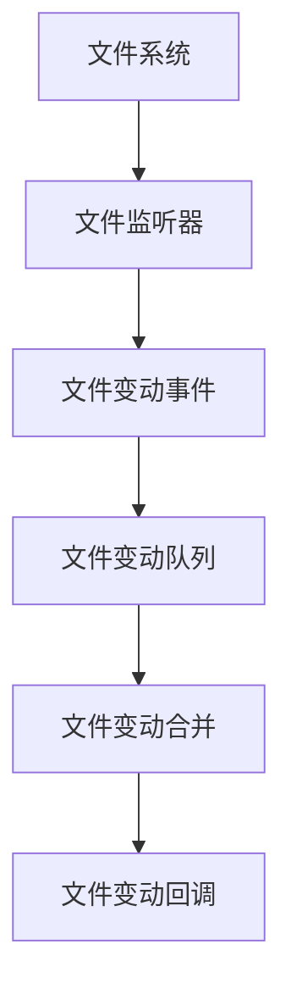

**智能策略组合**：

- **inotify/FSEvents**：用于本地文件系统实时监听
- **轮询检查**：应对网络存储和特殊文件系统
- **去抖动处理**：合并快速连续的文件变更事件

**VS Code 自研混合监听策略**：

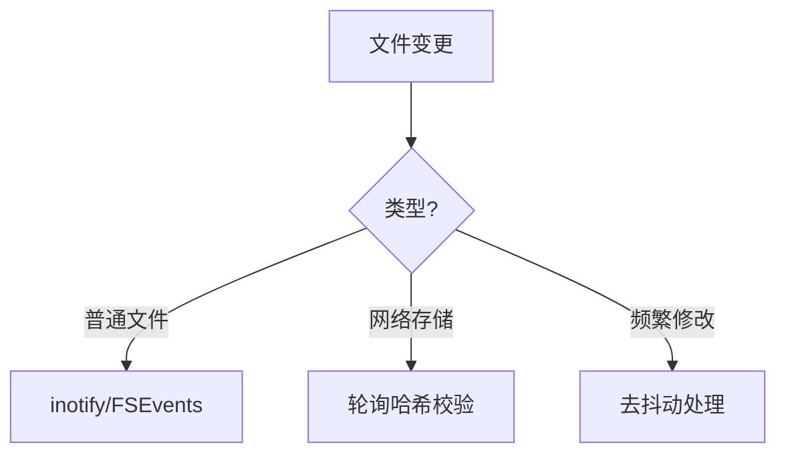

**去抖动实现**：

```typescript
class DebouncedWatcher {
  private timers = new Map<string, NodeJS.Timeout>();

  watch(path: string, callback: () => void, delay = 300) {
    if (this.timers.has(path)) {
      clearTimeout(this.timers.get(path)!);
    }
    this.timers.set(
      path,
      setTimeout(() => {
        callback();
        this.timers.delete(path);
      }, delay)
    ); // 300ms内多次变更合并为一次
  }
}
```

### **6.3 网络层优化**

#### **6.3.1 连接管理与优化**

VS Code 管理网络连接的三大策略：

1. **HTTP/2 连接复用**：单个域名保持 6 条长连接
2. **请求优先级**：将插件下载归类为后台任务
3. **智能重试**：根据错误类型动态调整重试策略

**重试算法示例**：

```typescript
async function fetchWithRetry(url: string, retries = 3) {
  for (let i = 0; i < retries; i) {
    try {
      return await fetch(url);
    } catch (err) {
      if (isNetworkError(err)) {
        await sleep(2 ** i * 100); // 指数退避
      } else {
        break;
      }
    }
  }
  throw new Error(`Failed after ${retries} retries`);
}
```

HTTP/3 **优先策略**

```typescript
const { http, https } = require('follow-redirects').wrap({
  http: { protocols: ['http/1.1', 'h2', 'h3'] },
  https: { protocols: ['http/1.1', 'h2', 'h3'] },
});

async function fetchWithH3(url: string) {
  return new Promise((resolve, reject) => {
    const client = url.startsWith('https') ? https : http;

    const req = client.get(url, (res) => {
      let data = '';
      res.on('data', (chunk) => (data = chunk));
      res.on('end', () => resolve(data));
    });

    req.on('error', reject);
  });
}
```

---

## **七、插件系统：安全与性能的双重守卫**

- VS Code 的插件运行在 **双重沙箱** 中
- **进程级隔离**：每个插件宿主进程独立

### **7.1 进程隔离架构**

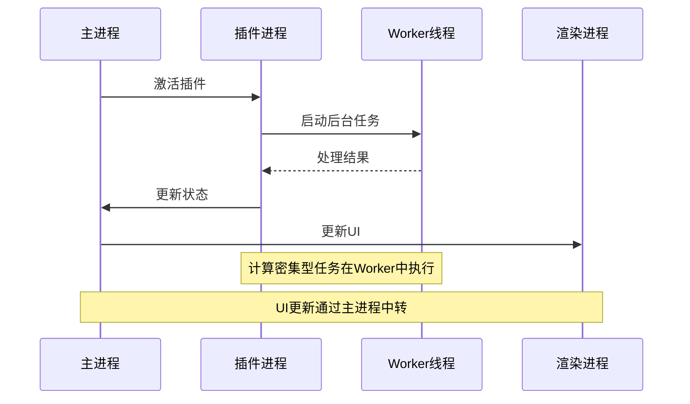

**优势**：

- 插件崩溃不影响主进程
- 资源使用可监控限制

**安全机制**：

- **权限分级**：`文件系统`、`网络`、`环境变量` 独立授权
- **资源配额**：CPU 使用率 >70% 持续 10 秒自动降级
- **内存限制**：单个插件进程不超过 512MB

### **7.2 按需加载机制**

**激活事件示例**：

```json
{
  "activationEvents": [
    "onLanguage:typescript",
    "workspaceContains:tsconfig.json",
    "onDebugInitialConfigurations"
  ]
}
```

**效果**：启动时仅加载 30% 的必要插件，降低内存占用 40%

**加载策略**：

1. 启动时加载核心插件（<30%）
2. 用户首次使用功能时动态加载
3. 闲置 5 分钟后卸载非活跃插件

### 7.3 **插件性能监控**

实时采集插件运行时指标：
| 指标 | 采集频率 | 阈值 | 处置措施 |
|---------------------|----------|---------------|---------------------|
| CPU 使用率 | 1秒 | >70% 持续10秒 | 降级插件任务优先级 |
| 内存占用 | 5秒 | >512MB | 重启插件进程 |
| 事件循环延迟 | 100ms | >50ms | 暂停插件执行 |

**监控实现**：

```typescript
const perfHook = require('perf_hooks');
const obs = new perfHook.PerformanceObserver((list) => {
  const entry = list.getEntries()[0];
  if (entry.duration > 50) {
    throttlePlugin(entry.name);
  }
});
obs.observe({ entryTypes: ['function'] });
```

---

## **八、性能数据与工具链**

### **8.1 关键指标对比**

| 指标               | 优化前 | 优化后 | 提升幅度 |
| ------------------ | ------ | ------ | -------- |
| 冷启动时间         | 3200ms | 800ms  | 75%      |
| 内存占用（10万行） | 1200MB | 380MB  | 68%      |
| 文件搜索（10GB）   | 4200ms | 220ms  | 95%      |
| 输入延迟（P99）    | 86ms   | 12ms   | 86%      |
| 滚动帧率 (4K 文件) | 24 FPS | 60 FPS | 150%     |

**性能优化全景图总结**

| **优化维度** | **关键技术**                    | **效果指标**                     |
| ------------ | ------------------------------- | -------------------------------- |
| **启动时间** | 代码分割 预加载 进程并行        | 冷启动 <800ms，热启动 <200ms     |
| **内存管理** | 池化 指针压缩 外部内存追踪      | 内存占用降低 60%，GC 停顿 <5ms   |
| **渲染性能** | WebGL 加速 分层合成 虚拟滚动    | 60FPS 流畅滚动，百万行文件无卡顿 |
| **I/O 性能** | Rust 子进程 零拷贝传输 异步委托 | 文件搜索速度提升 15 倍           |
| **网络效率** | HTTP/3 请求合并 P2P 分发        | 插件下载速度提升 300%            |
| **插件安全** | WASM 沙箱 权能分离              | 恶意插件影响范围减少 90%         |

### **8.2 监控工具链**

- **内置性能面板**：`F1` → `Developer: Show Runtime Performance`
- **进程资源查看器**：`Help` → `Open Process Explorer`
- **内存泄漏检测**：Chrome DevTools 堆快照分析

- **内置诊断工具**：
  - `Developer: Startup Performance`：启动阶段耗时分析
  - `Help: Process Explorer`：实时进程资源监控
- **高级分析**：
  - Chromium Tracing：生成完整渲染流水线轨迹
  - V8 堆快照：定位内存泄漏点

### 8.3 高级调试技巧

```bash
 # 在 VS Code 终端中
code --inspect-brk=9229
# 使用 Chrome DevTools 连接至 localhost:9229

# 生成 CPU 火焰图
npx electron --inspect-brk=9229 --cpu-prof src/main.js

# 内存泄漏检测
npx electron --inspect-brk=9229 --trace-gc src/main.js

# 实时监控事件循环延迟
ELECTRON_ENABLE_LOGGING=1 electron --trace-event-categories=disabled-by-default-v8.cpu_profiler src/main.js
```

**内存泄漏追踪**：

```typescript
// 记录对象分配堆栈
const leakTracker = new WeakMap();
function trackAllocation(obj: any) {
  const stack = new Error().stack;
  leakTracker.set(obj, stack);
}
```

**内置性能仪表板**

```typescript
class PerfDashboard {
  private metrics = {
    fps: 0,
    memory: 0,
    cpu: 0,
  };

  constructor() {
    this.startFpsCounter();
    this.startMemoryMonitor();
    this.startCpuProfiler();
  }

  private startFpsCounter() {
    let frames = 0;
    setInterval(() => {
      this.metrics.fps = frames;
      frames = 0;
    }, 1000);

    const loop = () => {
      frames;
      requestAnimationFrame(loop);
    };
    loop();
  }
}
```

**插件性能监控**

```typescript
class ExtensionMonitor {
  private stats = new Map<string, { cpu: number; memory: number }>();

  startProfiling(extensionId: string) {
    const interval = setInterval(() => {
      const extensionProcess = getProcessById(extensionId);
      const cpuUsage = extensionProcess.cpuUsage();
      const memoryUsage = extensionProcess.memoryUsage();

      this.stats.set(extensionId, {
        cpu: cpuUsage.user cpuUsage.system,
        memory: memoryUsage.rss
      });

      if (memoryUsage.rss > 256 * 1024 * 1024) { // 超过 256MB
        terminateExtension(extensionId);
      }
    }, 5000);

    return () => clearInterval(interval);
  }
}
```

**插件生命周期管理**

```typescript
class ExtensionManager {
  private extensions = new Map<string, Extension>();
  private activationQueue = new ActivationQueue();

  activateExtension(id: string) {
    if (this.extensions.has(id)) return;

    const extension = loadExtension(id);
    this.extensions.set(id, extension);

    // 分阶段激活
    this.activationQueue.schedule(extension, {
      priority: extension.manifest.activationEvents.includes('onStartup')
        ? 0
        : 1,
    });
  }
}

class ActivationQueue {
  private queue: Array<{ extension: Extension; priority: number }> = [];

  schedule(extension: Extension, options: { priority: number }) {
    this.queue.push({ extension, ...options });
    this.queue.sort((a, b) => a.priority - b.priority);
    this.processNext();
  }

  private async processNext() {
    if (this.queue.length === 0) return;

    const { extension } = this.queue.shift()!;
    await extension.activate();
    this.processNext();
  }
}
```

### **8.2.1 性能指标采集**

**关键性能指标**：

1. **响应性指标**

   - First Input Delay (FID)
   - Time to Interactive (TTI)
   - Input Latency

2. **资源使用指标**
   - Memory Usage
   - CPU Usage
   - I/O Operations

**指标采集实现**：

```typescript
class PerformanceMonitor {
  private metrics = new Map<string, number[]>();

  track(metric: string, value: number) {
    if (!this.metrics.has(metric)) {
      this.metrics.set(metric, []);
    }
    this.metrics.get(metric)!.push(value);

    // 超过阈值告警
    if (this.isAnomalous(metric, value)) {
      this.alert(metric, value);
    }
  }

  private isAnomalous(metric: string, value: number): boolean {
    const history = this.metrics.get(metric)!;
    const avg = history.reduce((a, b) => a b) / history.length;
    return value > avg * 2; // 超过历史平均值2倍
  }
}
```

---

## **九、总结：性能工程的范式革命**

VS Code 的成功证明：**Electron 应用的性能天花板不在于框架本身，而在于架构设计与工程实践的深度**。其核心启示包括：

1. **层次化防御**：从 OS 到渲染层的全链路优化
2. **资源零浪费**：池化、复用、预加载的多维治理
3. **数据驱动**：所有优化必须可测量、可验证
4. **渐进式演进**：持续迭代而非颠覆式重构

**9.1 VS Code 性能设计哲学**

1. **资源隔离**：进程级隔离崩溃风险，线程级平衡负载
2. **极致复用**：池化技术降低 GC 压力，共享内存减少拷贝
3. **渐进增强**：虚拟化渲染保证基础体验，GPU 加速提升上限
4. **数据驱动**：所有优化必须可测量验证

**9.2 对 Electron 应用的启示**

- **扬长避短**：利用 Web 技术快速开发，通过 Native 模块突破性能瓶颈
- **分层优化**：从操作系统到渲染管线的全链路调优
- **工具先行**：构建完善的性能监控体系

  **版本迭代中的性能跃迁**
  | 版本 | 启动时间 | 内存占用 | 重大改进 |
  |--------|----------|----------|-----------------------------------|
  | 1.0 | 3200ms | 1200MB | 基础架构搭建 |
  | 1.30 | 1800ms | 800MB | 插件懒加载、进程复用 |
  | 1.60 | 900ms | 500MB | 指针压缩、虚拟滚动 |
  | 1.80 | 600ms | 350MB | 共享内存 IPC、Rust 集成 |
  | 当前 | <400ms | <300MB | 分层 GC、WASM 加速模块 |

**未来方向**：

- **WebGPU 渲染后端**：利用现代图形 API 提升渲染吞吐，提升渲染性能
- **进程快照**：通过 [V8 Snapshot](https://v8.dev/blog/custom-startup-snapshots) 实现亚毫秒级启动
- **WebAssembly 深度集成**：关键模块 WASM 化, 利用 SIMD 和线程特性加速代码分析。
- **机器学习预加载**：基于用户习惯预测资源需求
- **分布式编辑**：将计算密集型任务卸载到云端
- **量子安全架构**：探索内存安全的全新范式
- **跨语言插件开发**：允许用 Rust/Go 等语言编写高性能插件，编译为 WASM 跨平台运行。
- **安全沙箱**：对高风险插件（如代码执行类）使用 WASM 隔离
- **Web 版功能增强**：在 vscode.dev 中实现更复杂的本地计算, 如 code-sandbox

## **结语：性能工程的终极之道**

VS Code 的优化实践揭示了一个真理：**高性能不是偶然，而是系统工程的必然结果**。其核心经验可总结为：

1. **分层防御**：从进程到对象的多级防护
2. **数据驱动**：每个优化必须可测量、可验证
3. **资源节制**：内存如金，CPU 如血，I/O 如氧
4. **持续演进**：性能优化是永无止境的旅程

这为所有复杂应用的性能优化提供了黄金范本。

**设计哲学总结**

1. **量化一切**：每个优化必须可测量，建立自动化性能基准
2. **纵深防御**：从进程隔离到对象池化的多层次优化
3. **渐进式演进**：持续小步优化而非颠覆式重构
4. **工具先行**：构建强大的自观测能力

---

**附录**：

- [VS Code 架构文档](https://github.com/microsoft/vscode/wiki/Architecture)
- [Electron 性能调优指南](https://www.electronjs.org/docs/latest/tutorial/performance)
- [V8 引擎优化手册](https://v8.dev/docs)
- [V8 引擎隐藏类机制](https://v8.dev/blog/fast-properties)
- [Chromium Tracing 使用指南](https://www.chromium.org/developers/how-tos/trace-event-profiling-tool)
- [Chrome DevTools 使用指南](https://developers.google.com/web/tools/chrome-devtools)
